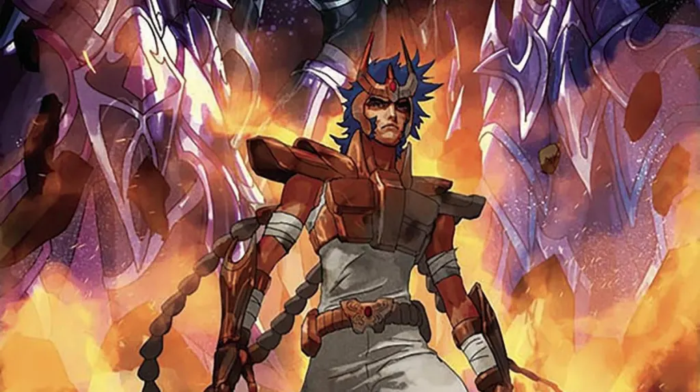

Para muitos, Cavaleiros do Zodíaco é sinônimo de nostalgia, com suas batalhas épicas e aberturas inesquecíveis que marcaram os anos 90. Contudo, o que transforma essa obra em um clássico atemporal vai muito além das armaduras brilhantes. A verdadeira força da saga está na rica mitologia por trás de Cavaleiros do Zodíaco, um pilar que sustenta cada confronto e a jornada de seus heróis, tornando a história universalmente poderosa.

Essa base mitológica funciona como uma ponte entre o Ocidente e o Oriente, e é exatamente essa fusão que a torna tão genial. As lendas da Grécia Antiga se encontram com a espiritualidade do budismo, e os mistérios do cosmos se conectam diretamente com a astrologia que conhecemos. São essas referências mitológicas e astrológicas, cuidadosamente entrelaçadas, que fazem a história de Atena e seus cavaleiros ressoar de forma tão familiar e impactante em diferentes culturas.

Pensando nisso, preparamos uma análise completa para desvendar essas camadas de inspiração. Ao longo deste artigo, vamos explorar a forte influência da mitologia grega na criação dos deuses e antagonistas, o papel central dos signos na personalidade dos Cavaleiros de Ouro e os conceitos orientais que dão alma à energia do Cosmo.

## Uma Mistura Rica de Mitologia e Culturas

O universo criado por Masami Kurumada para Cavaleiros do Zodíaco é um verdadeiro caldeirão mitológico, onde diversas referências se encontram. A série mistura:

*   **Mitologia grega**
*   **Elementos do budismo e outras tradições orientais**
*   **Conceitos da astrologia e esoterismo**

Quem assiste pode até pensar que tudo foi criado da cabeça do roteirista. Mas muitos dos deuses, cavaleiros, e até os enredos têm raízes em histórias antigas, de milhares de anos atrás.

## A Mitologia Grega como Espinha Dorsal de Cavaleiros do Zodíaco

A espinha dorsal da série é, sem dúvida, a **mitologia grega**. A deusa Atena, os 12 Cavaleiros de Ouro protegendo as casas do zodíaco, Hades, Poseidon… tudo vem direto do Olimpo!

No anime, Atena reencarna como Saori Kido. Ela lidera os cavaleiros para proteger a Terra das forças do mal. O interessante é que, na mitologia grega, Atena também era uma deusa da guerra (além da sabedoria), o que combina perfeitamente com a proposta da série.

Outro exemplo? Os 12 Cavaleiros de Ouro guardam as 12 casas do zodíaco, referentes às constelações que conhecemos na astrologia. Mas a origem dessas constelações também vem da mitologia grega por exemplo, Sagitário é inspirado no centauro Quíron, um sábio mestre dos heróis.

### Deuses como antagonistas

Conforme a história avança, novos deuses começam a desafiar Atena e seus cavaleiros. E esses deuses também têm raízes mitológicas:

*   **Poseidon**: o deus dos mares, que tenta inundar o mundo como punição à humanidade.
*   **Hades**: o senhor do submundo, com o plano de mergulhar a Terra na escuridão.
*   **Hércules, Hypnos, Thanatos**: figuras menores da mitologia também aparecem como cavaleiros ou subordinados dos deuses principais.

A fidelidade a essas figuras mitológicas é algo que torna Cavaleiros do Zodíaco ainda mais interessante para quem curte história antiga.

## Astrologia: As Referências dos Signos nos Cavaleiros de Ouro

Não há como analisar as referências de Cavaleiros do Zodíaco sem mencionar o próprio zodíaco, peça central na construção dos seus personagens mais poderosos. Os signos têm papel central na série, principalmente na Saga do Santuário.

Cada Cavaleiro de Ouro representa um signo do zodíaco e, curiosamente, suas personalidades e poderes costumam ter alguma conexão com as características associadas aos signos. Por exemplo:

*   **Shaka de Virgem**: é calmo, meditativo e poderoso lembra o lado mais espiritual do signo de Virgem.
*   **Aiolia de Leão**: corajoso, intenso e com espírito de liderança bem a vibe leonina.
*   **Camus de Aquário**: tem poderes ligados ao gelo e uma fachada fria e racional como muitos aquarianos são vistos.

Isso cria uma conexão forte com o público, já que muita gente gosta de se identificar com seu signo.

## As Influências Orientais e o Conceito do Cosmo

Ainda que a base da série seja a mitologia grega, não dá pra ignorar as fortes **influências orientais**. Kurumada, o criador da saga, é japonês e isso aparece de várias formas na história.

Temos, por exemplo:

*   A ideia do **Cosmo**, uma energia interna que cada cavaleiro precisa despertar, lembra muito os conceitos de _chi_ (energia vital) e meditação do budismo e do taoismo.
*   Personagens como o Shaka, que aparece meditando com mudras e uma postura zen, claramente inspirados no budismo.
*   O próprio treinamento dos cavaleiros, que rola em ambientes isolados, lembra mestres orientais instruindo discípulos.

Esse toque oriental dá à história mais espiritualidade e profundidade. Afinal, os cavaleiros não vencem apenas com força bruta mas com domínio interior.

## Esoterismo e a alma do guerreiro

Outro aspecto interessante é o lado **esotérico** da série. Além da astrologia, muitas ideias do ocultismo e da espiritualidade estão presentes.

A noção do Cosmo, por exemplo, lembra conceitos como o chakra indiano e a aura. Cada cavaleiro precisa “elevar seu Cosmo ao máximo” para ultrapassar seus limites. E isso acontece, quase sempre, nos momentos mais emocionais e decisivos da história. Tipo aquele momento em que o Seiya está caído, lembra da Saori e... boom, Cosmo explode e tudo muda!

Quem nunca se emocionou nessa parte?

## Por que a Mitologia de Cavaleiros do Zodíaco Funciona Tão Bem?

A mistura entre mitologia grega, conceitos orientais e astrologia em Cavaleiros do Zodíaco funciona porque conversa com o nosso imaginário coletivo. São símbolos que atravessam gerações, cheios de significado. Ao invés de criar um universo do zero, Cavaleiros do Zodíaco pega símbolos que já fazem parte da nossa cultura e os transforma em algo épico.

Além disso, o anime conseguiu fazer com que cada cavaleiro tivesse uma história, uma personalidade e uma motivação. Isso gera identificação com o público e dá profundidade à batalha do bem contra o mal.

### Você já se viu em algum cavaleiro?

Seja pelo signo ou pela jornada pessoal, muita gente se vê refletido em um ou mais guerreiros da série. E é isso que torna Cavaleiros do Zodíaco tão apaixonante até hoje.

Independentemente da idade, ainda dá um arrepio ouvir “Levante-se, Seiya!” ou o solo de guitarra da abertura. A saga marcou e ainda marca corações com uma base mitológica que dá aula de criatividade e emoção.

## Muito além de um desenho

Cavaleiros do Zodíaco é muito mais do que um anime de luta. É uma obra rica em símbolos, mitologias e ensinamentos. E para os fãs que curtem astrologia, mitologia ou espiritualidade, sempre tem uma nova camada pra descobrir.

Então, se você é fã ou ainda não conhece essa pérola, vale revisitar ou assistir com outros olhos. Você pode se surpreender com a quantidade de **referências mitológicas e astrológicas** escondidas em cada episódio.

### Quer saber mais?

*   Livros sobre mitologia grega – Edith Hamilton e Joseph Campbell são ótimos começos
*   Ligações entre astrologia e comportamento dos signos
*   Documentários sobre mitologias antigas no YouTube e serviços de streaming
*   “[O Poder do Mito](https://amzn.to/4lkLrom)”, de Joseph Campbell – para entender por que mitos ainda falam tanto com a gente

E aí, qual o seu cavaleiro favorito? Qual mitologia te chama mais atenção? Comenta com a gente!