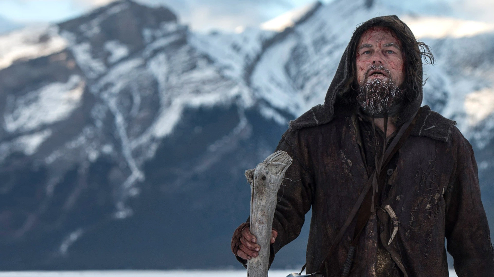
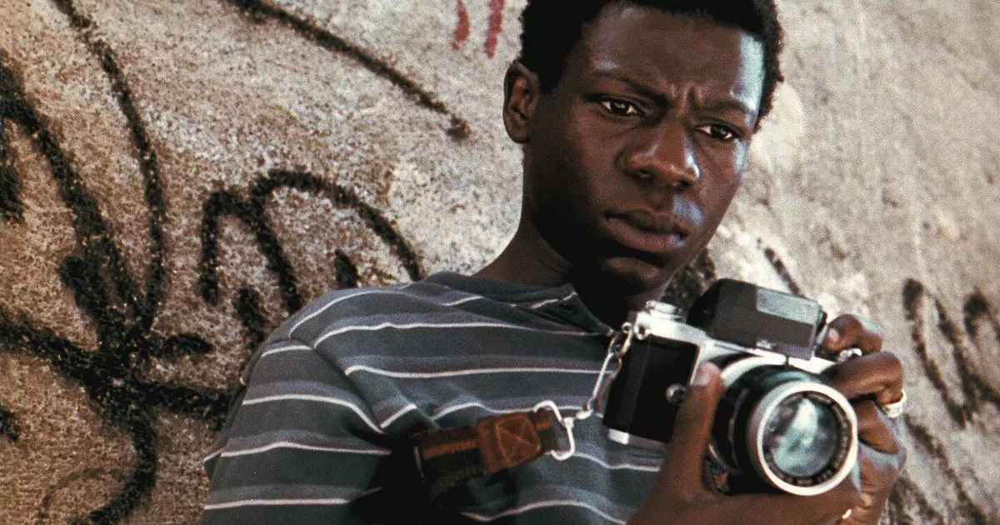
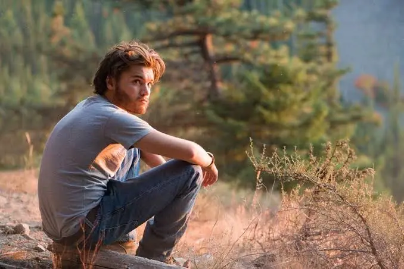
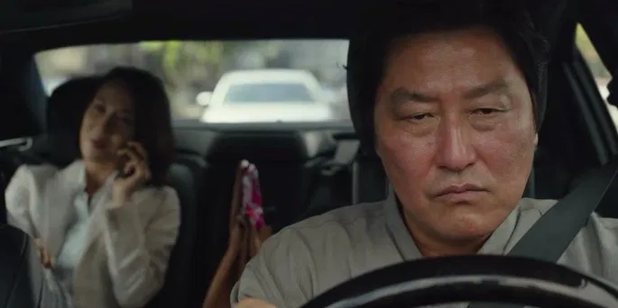
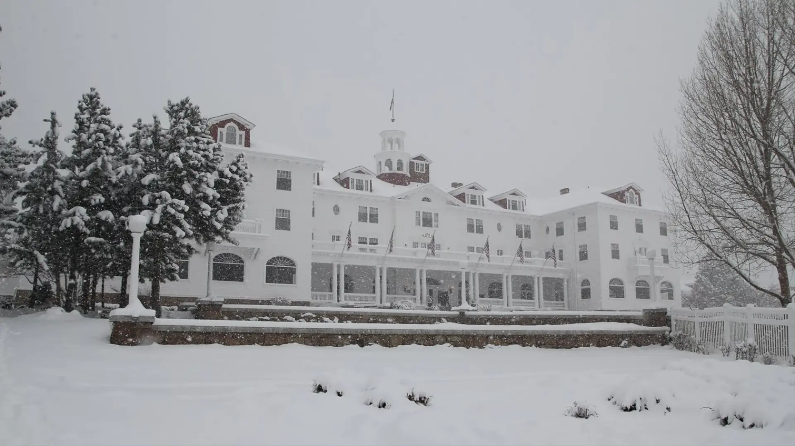

Sabe quando você assiste um filme e aquele cenário gruda na sua memória? O deserto infinito de Mad Max, a floresta sombria de A Bruxa de Blair, ou as favelas pulsantes de Cidade de Deus não estão ali por acaso. O meio ambiente no cinema é muito mais que um simples pano de fundo bonito ele molda emoções, intensifica conflitos e até carrega mensagens políticas e sociais.

Pensa comigo: seria possível sentir o mesmo desespero em O Regresso se Leonardo DiCaprio não estivesse naquele frio brutal? Ou entender a tensão de Parasita sem o contraste gritante entre a casa luxuosa e o porão miserável? Os melhores diretores sabem que cenários cinematográficos funcionam como personagens invisíveis, contando histórias sem dizer uma palavra.

Hoje, vamos explorar como o ambiente narrativo nos filmes transcende o visual e se torna elemento essencial na construção de histórias complexas. Você vai descobrir por que cidades, florestas e desertos não são apenas locações, mas ferramentas poderosas que comunicam emoções, críticas sociais e transformam completamente nossa experiência como espectadores.

## O cenário vai muito além do visual bonito

Imagina assistir a um filme como _O Regresso_ (2015), com Leonardo DiCaprio, sem aquele ambiente brutal e gelado. Perderia completamente o impacto, né? Ali, a natureza selvagem não é só um pano de fundo: ela coloca o personagem à prova o tempo todo, mostrando sua luta pela sobrevivência.

Isso é um ótimo exemplo de como o **cenário pode intensificar as emoções** da história. O frio, o vento, a solidão… tudo isso passa para gente como espectador um sentimento visceral. E olha que curioso: mesmo sem dizer uma palavra, o ambiente comunica muita coisa.

## Cidades grandes também são protagonistas

Se a gente sai da natureza e vai para as metrópoles, a coisa muda de figura, mas não perde a força. Pensa em cidades como **São Paulo ou o Rio de Janeiro**: quanta história cabe nesses lugares, né?

No cinema, cidades urbanas muitas vezes representam o caos, a solidão, ou até a desigualdade social. Um bom exemplo brasileiro é o filme _Cidade de Deus_ (2002). O morro, as ruas apertadas, os becos e vielas... Tudo isso constrói o clima tenso e cru da narrativa. A cidade ali pulsa como um coração em descompasso, vivendo o mesmo sofrimento que os personagens.

## Ambientes como reflexos de temas sociais

O lugar onde uma história se passa pode ser um espelho dos **problemas da sociedade**. Quer ver?

*   **Desertos e áreas isoladas**: costumam representar solidão, abandono ou reflexão, como vemos em _Na Natureza Selvagem_ (2007).
*   **Favelas e periferias**: geralmente exploradas em filmes que abordam temas como pobreza, violência e resistência, como _Quase Dois Irmãos_.
*   **Cidades futuristas**: como as de filmes distópicos, funcionam como críticas à tecnologia em excesso, à vigilância ou à perda de humanidade um bom exemplo é _Blade Runner_.

Esses ambientes ajudam a gente a entender o que está em jogo na narrativa. Às vezes, a gente sente que tá vivendo aquilo também, né?

## Quando o ambiente muda, a história muda junto

Já reparou como uma simples mudança de cenário pode transformar uma história completamente? É como trocar o fundo de uma pintura: o sentimento muda, o foco muda… tudo muda.

Um exemplo legal é o filme _Parasita_ (2019), vencedor do Oscar. O contraste entre os dois principais ambientes a casa luxuosa da família rica e o porão apertado da família pobre é essencial para construir a crítica social do filme. Os lugares falam, mesmo quando os personagens estão em silêncio.

E isso não vale só para filmes internacionais. No Brasil, produções como _Bacurau_ (2019) mostram que o sertão, muitas vezes retratado como esquecido, pode se transformar num espaço de resistência e luta.

Sabia que os diretores muitas vezes escolhem filmar em locais reais em vez de cenários montados justamente para **dar mais autenticidade ao ambiente**? Isso afeta até a atuação dos atores, que conseguem se conectar melhor com a história quando sentem o lugar à sua volta de verdade.

Além de tudo isso, o ambiente também pode funcionar como um espelho do que tá rolando **dentro** dos personagens. Quando um personagem tá triste ou confuso, por exemplo, é comum que o ambiente ao redor fique cinza, chuvoso ou sombrio.

Já reparou? É uma forma silenciosa de te mostrar como ele tá se sentindo sem precisar de muito diálogo.

Vamos pensar na animação _Divertida Mente_: quando a personagem principal se muda para uma cidade cinza e sem vida, ela sente saudade da antiga casa. E o cenário ajuda a gente a sentir isso também. É quase como se a tristeza morasse nas ruas daquela nova cidade.

## O ambiente como guia da narrativa

Muitos filmes também usam o ambiente para **mudar o rumo da história**. Tempestades, apagões, neblina, fogo, enchentes… tudo isso pode mudar completamente o que vai acontecer, criando obstáculos inesperados ou oportunidades novas.

No suspense e terror, isso é muito comum. Filmes como _O Iluminado_ mostram hotéis no meio do nada, rodeados por neve, que deixam tudo mais claustrofóbico e assustador.

Isso importa porque o ambiente ajuda a gente a **sentir a história na pele**. Ele não é só um lugar bonito para olhar ele conversa com a gente, coloca perguntas, causa tensão, alívio e faz a emoção vir com tudo.

Se a história fosse contada em outro lugar, será que causaria o mesmo impacto? Provavelmente, não.

## Como isso vale para outras áreas sociais e culturais?

No fundo, filmes são reflexos da sociedade. E quando eles escolhem cuidadosamente seus cenários, estão também fazendo **uma declaração sobre como vemos o mundo**. Seja criticando a desigualdade social, homenageando culturas locais ou apontando os perigos da tecnologia, o ambiente é uma ferramenta poderosa para esses comentários.

Inclusive, esse uso criativo dos espaços pode gerar debates muito ricos depois que o filme acaba. Que tal prestar mais atenção nisso no próximo filme que você assistir?

Agora que você sabe como os **ambientes nos filmes viram personagens**, nunca mais vai ver uma cena da mesma forma. Seja o sertão brasileiro, uma floresta nevada ou uma grande metrópole, tudo ali tem um propósito.

Assista com esse novo olhar. Repare nas cores, nos sons, nas paisagens. E pergunte-se: _o que esse lugar quer dizer para mim?_

### Quer saber mais?

*   **Livro:** [A Linguagem Cinematográfica](https://amzn.to/3Jzh1Rm), de Marcel Martin — para quem quer entender como tudo no cinema comunica.
*   **Filme:** O Labirinto do Fauno — mistura de fantasia e guerra com um cenário de tirar o fôlego.