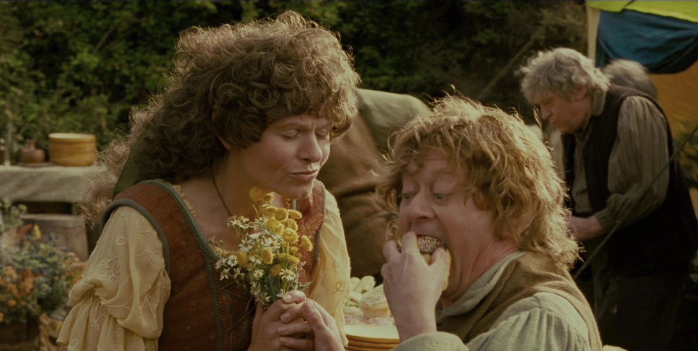
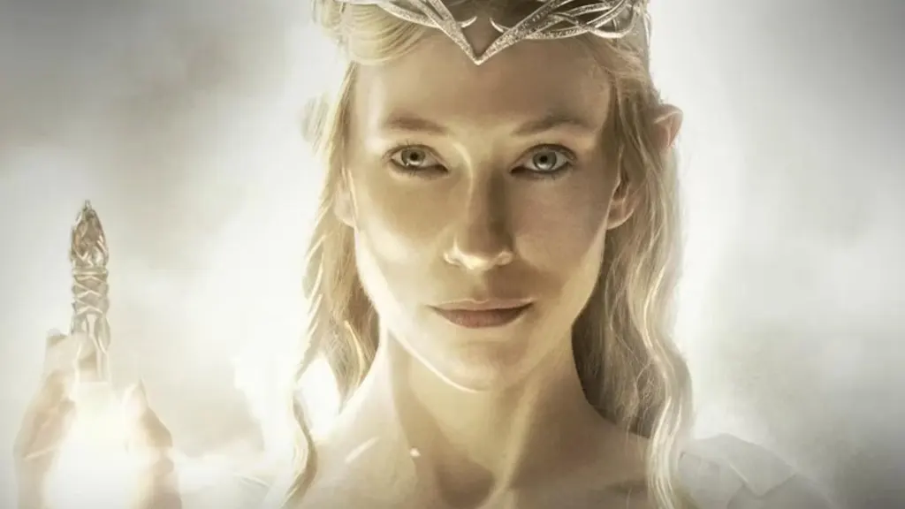
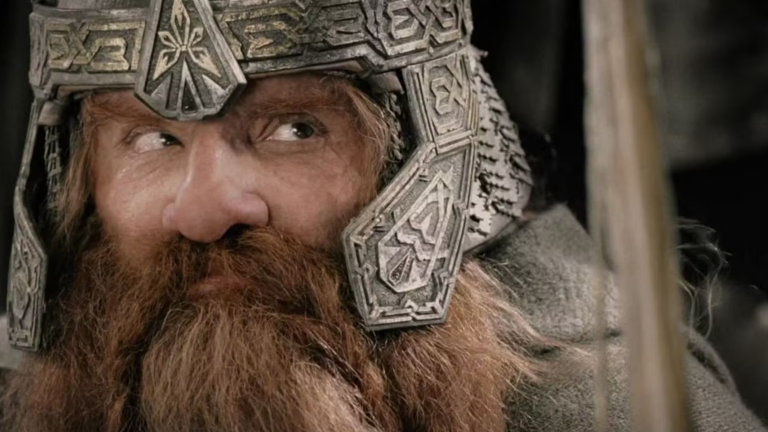
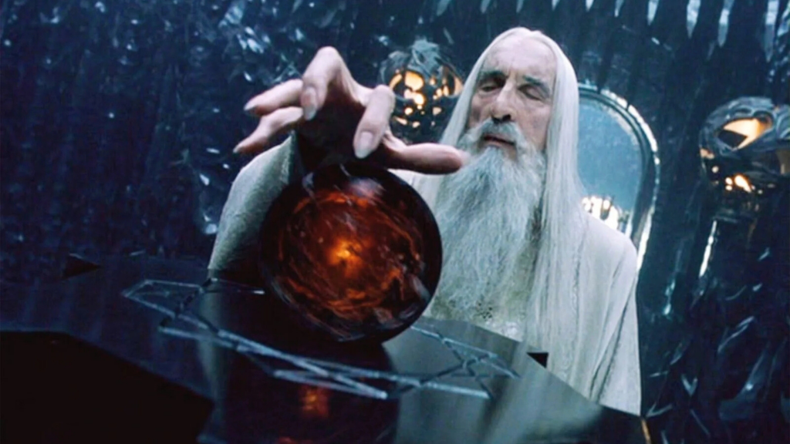
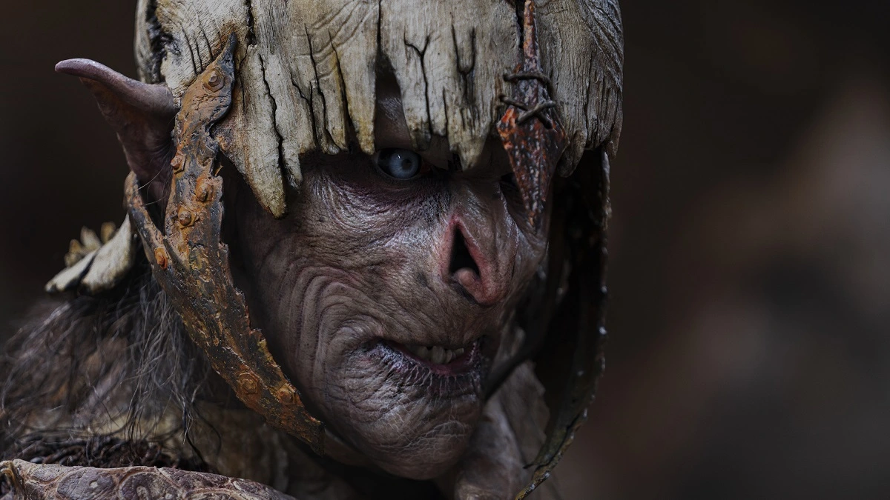
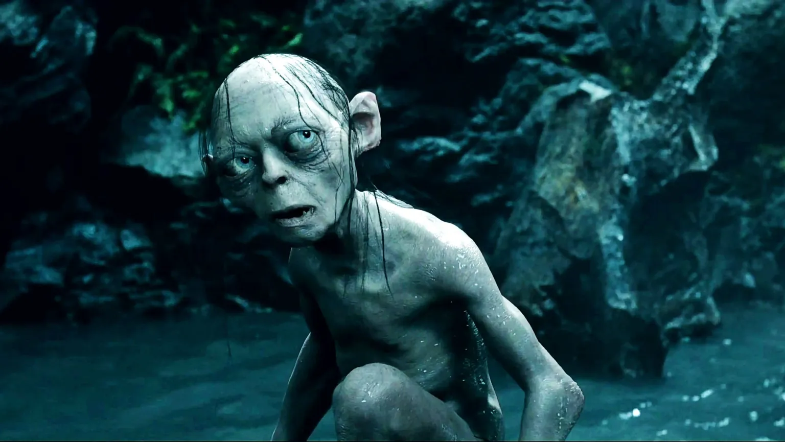

No universo de **O Senhor dos Anéis**, a comunicação é feita por corvos, palantíri e águias gigantes. Mas e se a solução fosse mais simples? E se existisse **internet na Terra-Média**? Imagine Gandalf mandando um "você não passará!" por áudio no WhatsApp ou Frodo postando uma selfie a caminho de Mordor.

A forma como usamos a tecnologia diz muito sobre nossa cultura. Os Hobbits seriam os reis do Instagram de comida, os Elfos teriam canais de meditação no YouTube e os Orcs... bem, eles seriam os trolls do Twitter. A chegada da internet na Terra-Média não seria apenas uma atualização tecnológica, mas uma revolução cultural.

Vamos fazer exatamente essa viagem divertida, imaginando como cada povo da Terra-Média usaria as redes sociais e a tecnologia moderna. Prepare seu pão lembas e conecte-se ao Wi-Fi de Valfenda, pois vamos descobrir como seria o feed de notícias de Frodo, Galadriel e até de Sauron.

## Lifestyle e Comida no Condado

Os hobbits são conhecidos por sua paixão por comida, festas no campo e uma boa vida tranquila. Agora, imagina só o feed do Instagram do Sam? Foto de brunch com pão lembas, selfie no jardim florido e story da fogueira ao som de música folk (com certeza o Frodo tocando violão!).

Se a internet chegasse ao **Condado**, dá pra apostar que os hobbits seriam os reis do conteúdo de lifestyle. Os principais aplicativos usados por eles seriam com certeza:

*   **Instagram:** Para mostrar hortas, receitas e aniversários com mesas cheias de petiscos.
*   **Pinterest:** Com tutoriais de como decorar buracos com flores e guirlandas naturais.
*   **Facebook:** Para manter contato com os amigos das outras vilas, trocar receitas e marcar reuniões do clube do chá.

Ah, claro! Os hobbits também teriam um grupo no WhatsApp chamado "Fofocas do Condado". Dizem que a Tia Margarida adora espalhar notícias do Bilbo...

## Conteúdo Místico e Sofisticado

Os elfos são todos sofisticados, misteriosos e super conectados à natureza. Se eles tivessem internet, com certeza seria **fibra óptica mística**, movida a luz de estrelas e energias élficas. Muito mais rápida que 5G!

Os elfos, como os de Lothlórien e Valfenda, teriam um gosto refinado online. Nada de TikTok dançante ou memes com letras engraçadas. A vibe deles seria mais assim:

*   **Spotify:** Tocando harpas élficas, sons da floresta e trilhas relaxantes.
*   **Medium:** Onde escrevem textos filosóficos sobre o tempo, a natureza e a vida eterna.
*   **YouTube:** Canais com vídeos de meditação, canto élfico e história das antigas eras.

É claro que Galadriel seria influencer. Ela daria conselhos estilo "coach da luz interior", postaria vídeos com filtro de aura brilhante e seria dona de uma newsletter chamada "Luz de Valinor".

## Lives de Forja e Fóruns de Batalha

Se tem um povo que saberia lidar com **infraestrutura digital**, esse povo seria o dos anões. Afinal, eles já dominam túneis, escavações e até construíram Moria, que é praticamente um Wi-Fi subterrâneo de tão complexo.

Provavelmente, os anões seriam responsáveis por instalar a rede de fibra da Terra-Média. Mas também teriam seus próprios interesses. Imagine o que rolaria nos aplicativos dos anões:

*   **LinkedIn:** Para mostrar seus projetos de mineração, arquitetura e forja avançada.
*   **Twitch:** Lives forjando espadas e ferramentas, com trilha sonora pesada no fundo.
*   **Reddit:** Fóruns sobre as batalhas passadas e tópicos técnicos tipo “Como forjar mithril em casa”.

Thorin com certeza teria um podcast semanal chamado "Barba, Pedra e Glória", onde entrevistaria outros líderes anões e contaria suas histórias no campo de batalha. Imagina o carisma?

## Palantíri Conectados e Grupos Secretos

Os magos da Terra-Média, como Gandalf e Saruman, não precisariam de computadores comuns. Eles usariam **Palantíri conectados ao Wi-Fi arcano**. Isso mesmo: aquelas bolas mágicas que funcionam tipo um Skype pré-histórico só que com foco nos riscos do lado negro da rede.

Gandalf, por exemplo, teria um grupo privado com os outros magos onde discutiriam assuntos importantes como:

*   **Ameaças crescentes no servidor Mordor**
*   **Atualizações mágicas no sistema de feitiços**
*   **Fake news de Sauron**

Ah! E tem um detalhe super importante: Saruman seria aquele amigo que compartilha link do site duvidoso e acaba clicando em malware do Olho de Sauron sem querer.

## Mordor: Orcs Como os Trolls da Internet

Se você acha que até aqui tudo parece ideal demais, lembre-se que sempre existe “aquele cara” na internet: os haters. E em Mordor, os orcs seriam exatamente isso. Trolls, literalmente.

Eles estariam sempre comentando em posts dos elfos com “#elfobabacas” e criando threads tóxicas no X (Twitter) sobre como a sombra deve dominar todos os trend topics. (Alguém cancela o Sauron, por favor?)

Inclusive, o app preferido deles seria:

*   **X (Twitter):** Perfeito para surtos rápidos, discussões acaloradas e ameaças veladas.

Além disso, teriam grupos no Discord para planejar invasões de servidores élficos. Tudo sob o comando de Sauron, que provavelmente teria um canal no YouTube com vídeos estilo “DOMINE o mundo com 3 táticas!”

## Gollum: o primeiro viciado em internet da Terra-Média

Ah, não dá pra terminar sem falar dele: Gollum. Esse aí seria o típico usuário que vive em cavernas (literalmente). Passa horas obcecado com uma única coisa: seu **precioso**.

Na versão digital, o Anel seria como um celular de última geração. Com brilho obsessivo, design sedutor e totalmente viciante. Gollum viveria grudado na tela, fazendo vídeos no TikTok como:

_“Minha rotina bipersonalidade ft. meu precioso”_.

Ele também seria famoso nos Reels por seus vídeos dramáticos, do tipo “Você também fala sozinho toda hora?”

Apesar da diversão, não dá pra não lembrar que se existissem redes sociais na Terra-Média, elas também trariam seus próprios desafios. Privacidade, fake news, vício digital... Sauron provavelmente teria um algoritmo supermaligno que vicia todo mundo no feed eterno da escuridão.

Ou seja, até numa versão mágica da internet, ainda precisamos de equilíbrio e de Gandalf pra dar um sabão de vez em quando!

## Um Wi-Fi para todos governar

No final das contas, imaginar a **Terra-Média conectada** é uma forma divertida de pensar como tecnologia e cultura se misturam. Cada povo com seu jeitinho, mostrando que até no mundo de fantasia as redes serviriam não só pra comunicação, mas pra expressar identidade, contar histórias e (claro!) espalhar uns memes pelo caminho.

E você, qual povo seria na internet da Terra-Média? Já se imaginou como um influenciador hobbit ou quem sabe um streamer anão?

### Quer saber mais?

*   [Tolkien Gateway](https://tolkiengateway.net) – Enciclopédia sobre tudo da Terra-Média
*   [MiddleEarth.com](https://middleearth.com) – Fãs e curiosidades do universo de Tolkien