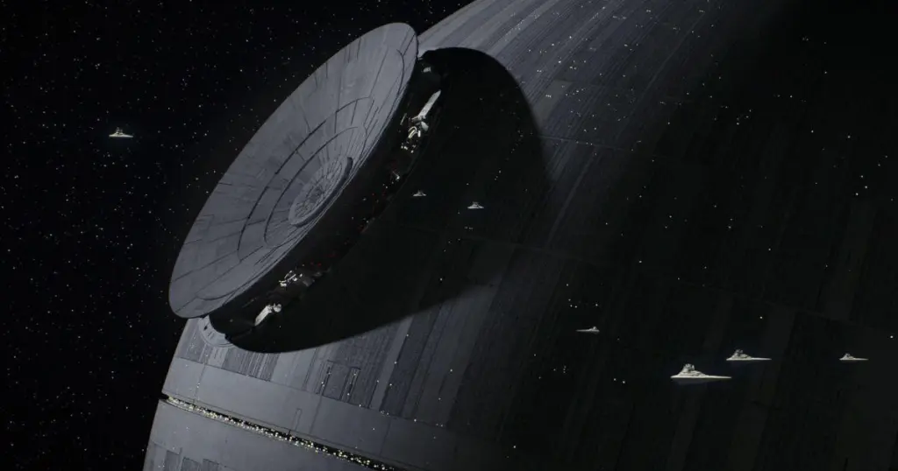
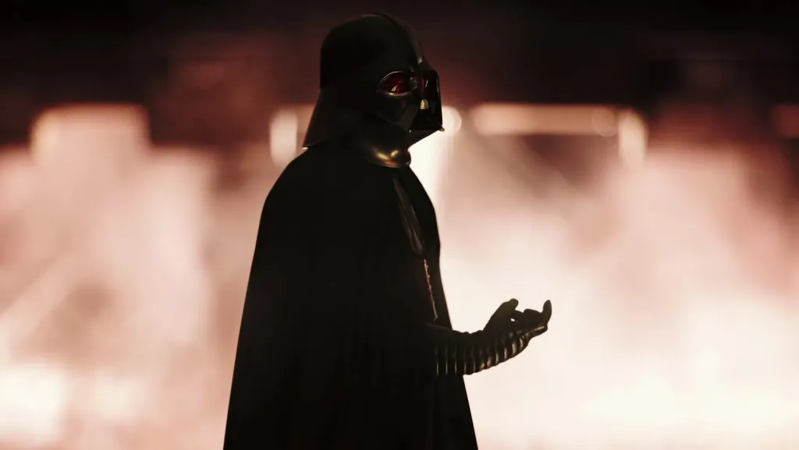
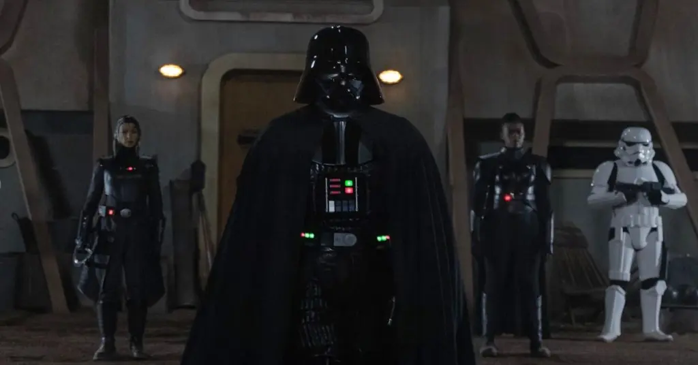

Ele é um dos vilões mais icônicos da cultura pop, o executor implacável do Império Galáctico em Star Wars. Mas se tirarmos a ficção de lado por um momento e aplicarmos as leis do nosso mundo, uma pergunta surge: **Darth Vader poderia ser julgado por crimes de guerra**?

A lista de acusações seria longa: cumplicidade na destruição de Alderaan, uso de tortura contra prisioneiros e a perseguição sistemática de rebeldes. Sob a ótica do **Direito Internacional Humanitário** do mundo real, suas ações não seriam vistas como meros atos de vilania, mas como violações graves que levariam qualquer líder a um tribunal.

Vamos colocar Darth Vader no banco dos réus. Analisaremos seus atos com base nas Convenções de Genebra, discutiremos se a defesa de "apenas seguir ordens" seria válida e se sua redenção final o absolveria. Prepare-se para um julgamento que atravessa galáxias.

## O Que São Crimes de Guerra Segundo a Lei Real?

Pra começar, vamos entender o que define um **crime de guerra**. Esse termo vem do **Direito Internacional Humanitário** ou seja, as regras pra quando o bicho pega e a guerra vira realidade. A ideia básica é proteger civis e prisioneiros, e tentar garantir o mínimo de humanidade mesmo em tempos de conflito.

Alguns exemplos de crimes de guerra incluem:

*   **Alvo intencional de civis** (como mulheres e crianças);
*   **Uso de tortura** em prisioneiros;
*   **Destruição desnecessária** de cidades ou infraestrutura sem justificativa militar;
*   **Executar combatentes que se renderam**.

Essas são algumas das práticas proibidas pelas **Convenções de Genebra** (sim, aquelas que a gente ouve mencionar em filmes de guerra), e são base para julgar crimes no **Tribunal Penal Internacional**.

## Acusação #1: Cumplicidade na Destruição de Alderaan

Vamos ao ponto mais chocante: **Darth Vader estava a bordo da Estrela da Morte quando Alderaan foi destruído**. Mas será que ele pode ser responsabilizado por isso?

Oficialmente, quem apertou os botões foi o **Gran Moff Tarkin**. Mas Vader estava presente, sabia da ação e **nada fez para impedir**. No mundo real, isso se chama **cumplicidade**.

Alderaan era um planeta pacífico, sem defesas. Destruí-lo foi claramente uma **violação do princípio da proporcionalidade**, já que **atingiu milhões de civis inocentes**. Imagina se um país da vida real jogasse uma bomba atômica numa cidade inteira alegando que queria capturar um grupo rebelde?

Em termos de direito internacional, isso seria julgado como um dos crimes mais **graves contra a humanidade**.

## Acusação #2: O Uso Sistemático de Tortura

Se tem uma cena difícil de esquecer em “Uma Nova Esperança” é quando Vader interroga a princesa Leia com a ajuda de um droide sinistro. Ali, ele **usa a força e ameaça física** para puxar informações algo bem comum na forma como o Império lida com seus prisioneiros.

Nas leis da Terra, tortura é absolutamente proibida. E isso vale inclusive em situação de guerra! Mesmo prisioneiros capturados em combate têm direitos assegurados. A ONU não ia olhar isso com bons olhos.

Aliás, o uso sistemático de tortura por parte do Império poderia ser considerado como **crime de guerra em larga escala**. Com Vader sendo uma das figuras principais e participando ativamente, sua **responsabilidade direta** nesse ponto seria enorme.

## A Defesa de Vader: "Apenas Segui Ordens" é Válida?

Uma coisa que a gente sempre escuta é que Vader “só estava seguindo ordens do Imperador”. Será que isso o inocentaria?

No Tribunal de Nuremberg, após a Segunda Guerra Mundial, vários oficiais nazistas usaram esse argumento. A Corte foi bem clara: **seguir ordens não é desculpa para crimes de guerra**. Se você sabe que está cometendo um crime, a responsabilidade é sua também. Não dá pra botar toda a culpa no chefe.

Ou seja, se Darth Vader fosse levado a julgamento, a desculpa de “estava só cumprindo ordens” **não ia colar**.

**+ Leia mais:** [5 vezes que os vilões dos games tinham razão](/5-vezes-que-os-viloes-dos-games-tinham-razao/)

## A Redenção Final: Isso Anularia os Crimes de Guerra?

Agora vem a pergunta que dá nó na cabeça de muita gente: **e o final do Retorno de Jedi? Vader se redime e mata o Imperador. Isso o inocentaria?**

Essa é uma questão complexa. Do ponto de vista humano, o ato final mostra arrependimento. Mas juridicamente, **um gesto nobre não apaga anos de crimes contra milhões de seres vivos**.

Pode contar a favor? Talvez. Se fosse julgado, o tribunal poderia considerar isso como atenuante na hora de definir a pena. Mas **não aboliria todas as acusações**.

## Como funcionaria um julgamento intergaláctico?

Vamos imaginar que existe, tipo, uma **ONU dos planetas**. Ela teria sua própria corte internacional para julgar crimes graves, semelhante ao Tribunal Penal Internacional da ONU aqui na Terra.

Vader seria levado à corte, teria um julgamento justo com advogado de defesa e tudo. Seriam analisadas provas, testemunhos e a extensão dos danos causados.

Aliás, outros membros do Império também poderiam estar na mira. Afinal, não foi só ele que tomou decisões cruéis. Mas com certeza, **Vader seria um dos principais réus**.

## O Veredito Sobre Darth Vader

Além de nos dar muitos sabres de luz e batalhas épicas, **Star Wars também serve de reflexão sobre poder, responsabilidade e justiça**. Pensar em como Vader seria julgado nos ajuda a entender a importância das leis internacionais e como elas existem pra tentar evitar horrores como guerras injustas e tratamento desumano de pessoas.

No fundo, fica aquela lição Jedi clássica: com grande poder, vem uma grande responsabilidade... Opa, frase errada, universo errado? Pode até ser, mas cabe direitinho aqui também.

**Darth Vader, no nosso mundo, provavelmente seria julgado e condenado por crimes de guerra graves**, incluindo a destruição de Alderaan, tortura de prisioneiros e cumplicidade em ações genocidas. Mesmo com sua redenção tardia, a justiça galáctica não perdoaria tão facilmente.

Mas claro, essa é só uma brincadeira usando o universo de Star Wars como pano de fundo pra discutir temas sérios do nosso mundo.

### Quer saber mais?

Confira essas sugestões de leitura pra se aprofundar:

*   **Convenções de Genebra** – disponível no site da Cruz Vermelha Internacional;
*   **[Direito Internacional Humanitário Descomplicado](https://www.icrc.org/pt/document/o-que-e-o-direito-internacional-humanitario)** – artigo do Canal Ciências Criminais;
*   **“[Star Wars and International Law](https://opiniojuris.org/2024/10/28/fourth-annual-symposium-on-pop-culture-and-international-law-jurisdiction-in-star-wars-andor-twail-perspectives-and-current-lessons-for-a-galaxy-not-so-far-away/)”** – ensaio acadêmico (em inglês) com análises mais profundas.

Curtiu esse post? Compartilha com seus amigos fãs de Star Wars e me diz: você acha que Darth Vader deveria ser preso ou merece uma segunda chance?