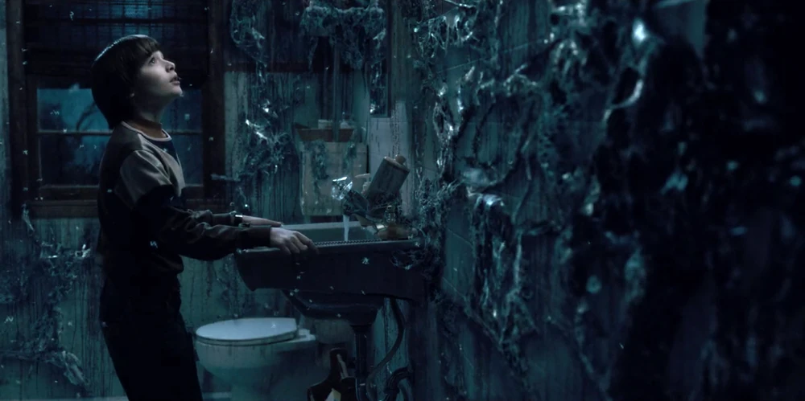
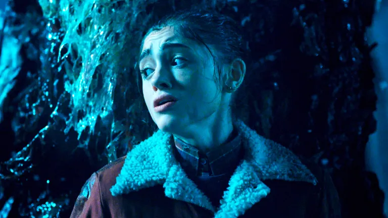
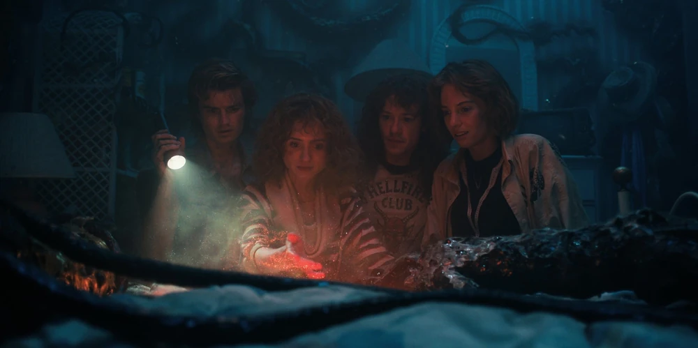
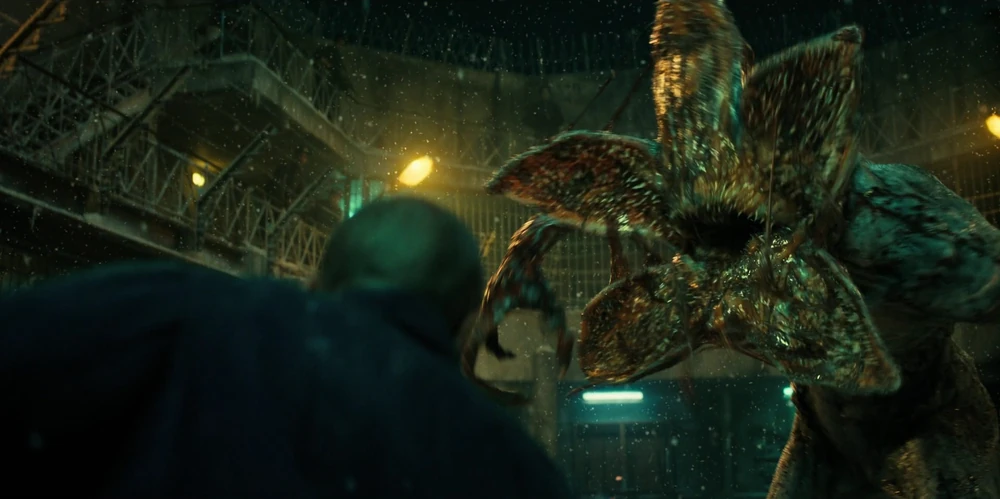
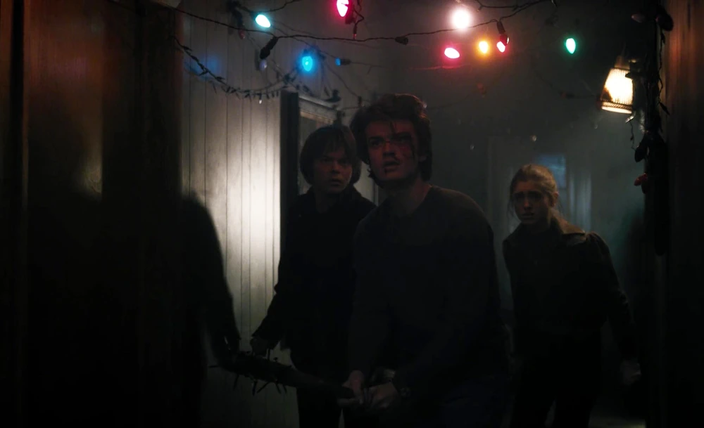
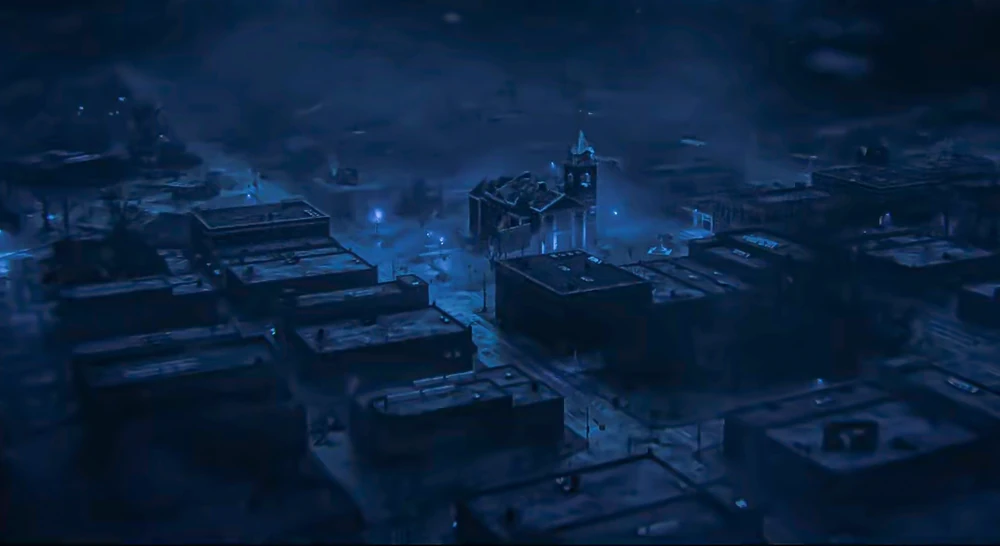
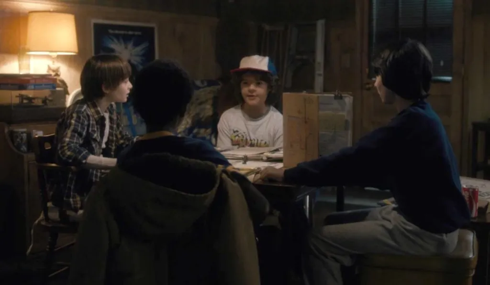

O Mundo Invertido de Stranger Things é provavelmente um dos cenários mais assustadores e fascinantes da cultura pop recente. Essa dimensão paralela sombria, repleta de criaturas aterrorizantes como o Demogorgon e Vecna, conquistou milhões de fãs ao redor do planeta. Mas você já parou para pensar no que faria se, de alguma forma bizarra, acabasse preso nesse lugar hostil e repleto de perigos?

Imagine a situação: você está lá, sem superpoderes estilo Eleven, cercado por névoa tóxica, esporos flutuantes e monstros famintos espreitando cada movimento seu. Parece roteiro de pesadelo, né? Mas calma todo bom nerd sabe que conhecimento é poder, e preparação faz toda a diferença entre virar herói ou virar lanche de Demodog.

Neste guia de sobrevivência no Mundo Invertido, vamos mergulhar em estratégias práticas, curiosidades científicas sobre dimensões alternativas e dicas inspiradas em RPG, videogames e, claro, na própria série.

## O que é o Mundo Invertido (Upside Down)?

No universo da série, o Mundo Invertido é uma "versão sombria" da nossa realidade. Até parece o mundo real visto por um vidro quebrado, coberto de fungos, névoa e um silêncio ameaçador. Ele existe em paralelo ao nosso mundo e é habitado por criaturas como o temível Demogorgon, o Devorador de Mentes e um tal de Vecna (que tem zero empatia, diga-se de passagem).

Mas cientificamente falando, o conceito faz referências às teorias de **universos paralelos** e **dimensões alternativas**. A série se inspira fortemente nesse lado da física quântica, claro, com uma bela dose de licença poética.

## Estratégias de sobrevivência no Mundo Invertido

Sobreviver ao Mundo Invertido exige mais que coragem você precisa de estratégias dignas de uma campanha hardcore de D&D, onde cada decisão pode significar vida ou morte. Então se liga nas dicas:

### 1. Movimentação estratégica: como escapar do Demogorgon e outras criaturas

O Demogorgon e outras criaturas do Mundo Invertido detectam presas através de movimento e vibração, então dominar a arte da movimentação silenciosa é essencial para sobrevivência. Se você ficar parado, vira alvo fácil.

**Dica nerd:** Lembra do Tiranossauro Rex de Jurassic Park? Então... o esquema é parecido. Evite movimentos bruscos, mas também não fique congelado. Tente se mover de forma silenciosa e estratégica.

### 2. Equipamentos essenciais: proteção contra esporos e atmosfera tóxica

A atmosfera do Mundo Invertido parece tóxica e cheia de partículas biológicas (aqueles esporos voando por todo lado). Levar uma máscara ou usar um lenço sobre o nariz e a boca pode ajudar mesmo que a ciência da série seja meio vaga nisso.

E se puder, bota seu look radiante de “Explorador de Masmorras Pós-Apocalíptico”: jaqueta impermeável, calça resistente e tênis de corrida. Estilo + sobrevivência sempre andam juntos.

### 3. Audição aguçada dos monstros: técnicas de movimentação silenciosa

Os monstros, especialmente o Demogorgon, têm a **audição super aguçada**. Qualquer barulhinho de lata caindo ou respiração mais pesada pode te transformar em marmita.

**Quer um truque?** Carregue alguma tralha que possa arremessar longe para distrair os monstros. Serve pedra, garrafas e etc.

### 4. Táticas de combate: improvisando armas e defesas no Mundo Invertido

Seja esperto como o Steve (sim, ele apareceu com um taco de baseball cravejado de pregos. Ícone!). Use objetos ao redor para se proteger, criar obstáculos ou improvisar armas.

*   **Escudos:** portas, armários ou até as folhas grossas cobertas de limo.
*   **Armas:** pedaços de madeira, canos, ferramentas e sim, um bom taco sempre ajuda.
*   **Rastreamento:** observe pegadas, detritos ou marcas estranhas — podem indicar presença de criaturas.

### 5. Comunicação entre dimensões: métodos para contato com a realidade

Lembre do clássico pisca-pisca da Joyce Beyers? Comunicação é tudo. Se der, leve aparelhos que funcionem com baterias ou sinais alternativos. Interferência por lá é forte, mas alguma conexão pode te salvar.

Vale até testar métodos criativos como:

*   Códigos de luz (inspirado no alfabeto na parede)
*   Sinais sonoros leves
*   Referências nerds compartilhadas (é sério, combinar um “código geek” com seus amigos pode salvar todo mundo)

## Guia tático: locais seguros e rotas de fuga no Upside Down

Conhecer os princípios básicos de navegação e sobrevivência em dimensões alternativas pode aumentar drasticamente suas chances de escapar vivo do Mundo Invertido.

### Evite lugares abertos

Diferente do que parece, não é em espaços fechados que você está mais em perigo. No Mundo Invertido, florestas, ruas e campos são usados principalmente por predadores que patrulham em silêncio. Busque **locais com múltiplas saídas** e fique sempre atento ao redor.

### Não ande sozinho

Em qualquer boa história dos anos 80, grupo unido é grupo vivo! Assim como nos Goonies ou na própria galera de Hawkins, andar em equipe aumenta as chances de escapar e lidar com ameaças variadas.

### Tenha um plano de fuga

Antes de explorar (ou tentar escapar), defina rotas de fuga. Imagine que está montando um mapa mental como nos RPGs. Saber por onde correr pode fazer toda a diferença quando a coisa apertar.

Pense como um personagem de D&D: use inteligência, habilidade e coragem. Essas são as suas fichas principais.

## Você iria ao Mundo Invertido?

Agora diz aí, corajoso(a): teria coragem de entrar no Mundo Invertido para salvar um amigo? Ou só de pensar em Demodogs você já corre?

Se você é do time que encara qualquer missão nerd pelo bem do grupo, parabéns! Você já subiu de nível nesse RPG da vida real. Conhecimento é seu XP. Quanto mais você souber, mais chance tem de sobreviver.

Sobreviver ao Mundo Invertido é o desafio definitivo para qualquer fã de Stranger Things mas com este manual de sobrevivência, você está mais preparado que 99% das pessoas.

Com estratégia, conhecimento nerd, e um bom grupo de aliados, dá para escapar das garras dos monstros e ainda tirar uma boa história pra contar na mesa de RPG. O importante é estar preparado porque nunca se sabe quando um portal vai se abrir bem no porão da sua escola, né?

### Quer saber mais?

*   **[O Universo Numa Casca de Noz](https://amzn.to/47HBlJK)** — Stephen Hawking (pra entender mais sobre realidades paralelas)
*   **[The Duffer Brothers Interviews](https://www.denofgeek.com/tv/netflixs-stranger-things-creators-talk-80s-inspirations-influences/)**: bastidores sobre a criação do Mundo Invertido
*   **[Manual de Sobrevivência ao Apocalipse Zumbi](https://amzn.to/4icxacA)**, porque nunca se sabe…