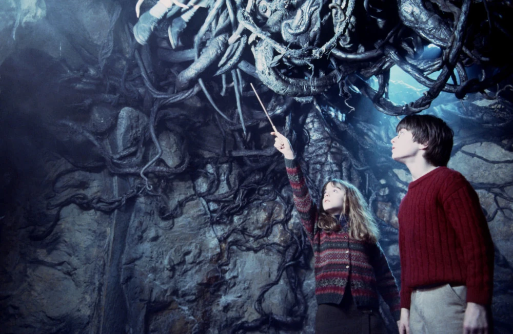
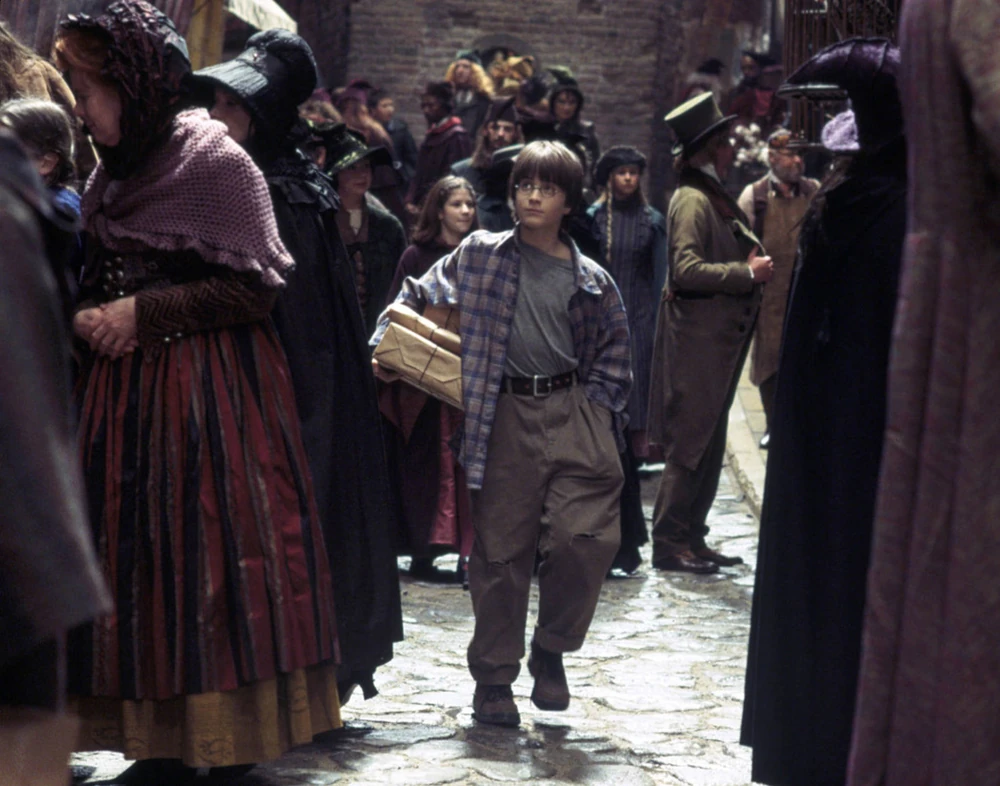
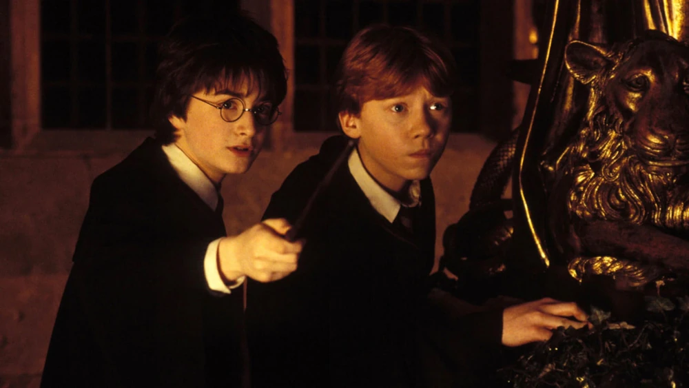

E se você, uma pessoa comum sem poderes mágicos, encontrasse uma varinha mágica perdida na rua? No universo bruxo criado por J.K. Rowling, trouxas são pessoas sem habilidades mágicas, basicamente todos nós da vida real. Mas o que realmente aconteceria se um trouxa tentasse usar uma varinha? Explosões, faíscas, ou absolutamente nada?

Pensa comigo: você está passeando pela Travessa do Tranco e encontra a Varinha de Sabugueiro caída no chão. Seus dedos tocam a madeira antiga, você sussurra "Wingardium Leviosa"... e então? A caneta na sua frente flutua majestosamente ou você apenas parece maluco falando sozinho?

Então hoje, decidimos explorar as teorias sobre trouxas e varinhas mágicas, combinando evidências dos livros e filmes com especulações lógicas sobre como funciona a magia no universo bruxo. Você vai descobrir se varinhas têm poder próprio, se elas escolhem seus donos, e quais seriam as consequências reais (ou hilárias) de um não-mágico tentar conjurar feitiços.

## O que é um “trouxa”?

No universo de **Harry Potter**, “trouxa” é a pessoa que **não tem habilidades mágicas** e nasceu de famílias também não-mágicas. É o pessoal do "mundo real", como eu e você. Já os bruxos têm a habilidade de canalizar magia através das varinhas. Mas será que a varinha mágica funciona sozinha, ou ela precisa da energia mágica do bruxo?

## A varinha tem poder ou é só um canal?

Uma dúvida comum nos debates entre fãs é se a varinha mágica tem poder próprio. No mundo mágico, ela é como um instrumento que **canaliza e potencializa a magia do bruxo**. Ou seja, a varinha por si só não faz feitiço algum, quem faz é o bruxo. Pensa assim: você pode ter uma raquete de tênis profissional nas mãos, mas se não souber jogar, dificilmente vencerá uma partida. O mesmo conceito vale aqui. A varinha sem alguém que saiba usá-la é basicamente um pedaço de madeira sofisticado (ainda que mágico).

## Já vimos trouxas usando magia?

Sim e não. Ao longo da saga Harry Potter, há pouquíssimos momentos em que brinca-se com essa linha. Por exemplo:

*   Em **"Harry Potter e a Câmara Secreta"**, o Sr. Weasley fica fascinado com objetos trouxas que ganham toques mágicos (como um carro que voa), mas nunca o contrário acontece.
*   Outro momento curioso é quando **Duda, primo do Harry**, presencia magia, mas nunca demonstra nenhuma capacidade de entender ou controlar aquilo.

Nunca vimos, de fato, um trouxa pegar uma varinha e sair lançando feitiços por aí. E tem um bom motivo para isso. Imagina que alguém como você ou eu encontra uma varinha mágica perdida em algum beco de Londres (quem sabe na Travessa do Tranco?). O que aconteceria se tentássemos usar? Possibilidades não faltariam...

### 1. Absolutamente nada

A hipótese mais provável é que **nada aconteceria**. A varinha até poderia reagir de forma instável, brilhando ou vibrando, mas sem lançar nenhum feitiço. Afinal:

*   A magia vem do bruxo, e não da varinha.
*   Um trouxa não tem energia mágica para alimentar a varinha.

Ou seja: seria como apertar o controle remoto da TV sem colocar pilhas.

### 2. Reações perigosas

Outro caminho (mais dramático, claro) seria uma reação descontrolada. A varinha poderia:

*   Soltar faíscas aleatórias
*   Explodir nas mãos do trouxa
*   Ativar feitiços antigos gravados nela (tipo feitiços de defesa contra ladrões)

Já pensou usar a varinha e acordar com um rabo de porco sem explicação? Pois é. Magia mal-encanada pode ser perigosa.

### 3. Conexão mágica inesperada

Num caso raríssimo, digamos que o trouxa tivesse um resquício mágico desconhecido (tipo um parente distante bruxo). Aí, talvez a varinha reagisse com alguma pequena faísca de magia. Seria como um carro velho pegando no tranco e falhando muito, mas tentando funcionar.

## Varinhas são inteligentes?

No mundo bruxo, as varinhas são quase entidades mágicas por si só. Elas escolhem seu dono, lembram-se de antigas lealdades e até se recusam a funcionar corretamente se não simpatizarem com quem as segura. Neste cenário, um trouxa tentando usar uma varinha poderia ser até "rejeitado" por ela com direito a uma faísca de aviso ou uma fuga do objeto das mãos da pessoa. Imagina a cena: você segura a varinha e ela simplesmente pula longe, como quem diz "você não é digno". Seria hilário.

Depois de tudo isso, fica claro que **uma varinha mágica nas mãos de um trouxa provavelmente não funcionaria**. Magia, no universo de Harry Potter, não é apenas uma ferramenta, mas parte da essência do indivíduo. Mas isso não nos impede de imaginar. Brincar com essas ideias é justamente o que torna o universo bruxo tão fascinante. Quem nunca olhou para um "pauzinho" e fingiu que estava lançando um feitiço como "Lumos" ou "Expelliarmus"? Se você pudesse usar uma varinha por um dia, qual feitiço gostaria de lançar primeiro? Conta pra gente nos comentários!

### Quer saber mais?

Se você curte mergulhar nesse tipo de teoria mágica, confira:

*   **[Pottermore](https://harrypotter.fandom.com/pt-br/wiki/Pottermore)** – O site fandom ainda traz curiosidades maravilhosas.
*   **Vídeos do canal "Caldeirão Furado" no YouTube** – Diversão garantida com teorias e análises da saga.
*   **Reddit/r/harrypotter** – Comunidade vibrante para quem ama discutir o universo mágico.