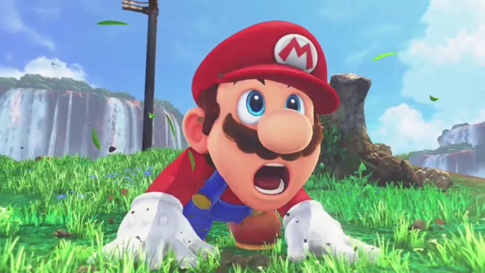

Ele corre, pula em tartarugas e quebra blocos com a cabeça. **Mario** é, sem dúvida, um dos personagens mais ativos dos games. Mas você já parou para pensar na ciência por trás de tanto esforço? **Quantas calorias o Mario gasta** em uma única fase para salvar a Princesa Peach?

A rotina do encanador mais famoso do mundo é uma mistura de corrida de obstáculos, parkour e pliometria. Seu gasto **calórico** seria digno de um atleta olímpico, transformando o Reino dos Cogumelos em uma verdadeira academia ao ar livre. Acredite, a energia gasta para esmagar um Goomba é maior do que parece.

Vamos fazer exatamente essa conta divertida. Analisaremos o gasto de energia de suas corridas e saltos, o impacto dos power-ups e compararemos seu esforço com esportes reais para descobrir **quantas calorias o Mario queima** em sua jornada. Prepare-se para ver o Super Mario com os olhos de um personal trainer.

## Mario: o atleta das terras do cogumelo

Antes de mais nada, vamos lembrar rapidinho quem é o Mario. Ele é um encanador italiano com um bigode inconfundível, que vive nas terras mágicas do Reino dos Cogumelos. O cara corre, pula, escala e ainda pisa em inimigos como se fosse coisa simples. Mas será que esse esforço todo dá mesmo calorias?

Bom, quem já passou da primeira fase de **Super Mario Bros.** sabe que não tem moleza. Pra cada buraco, tem um pulo. Pra cada inimigo, uma estratégia. E tudo isso com uma disposição de dar inveja até no atleta olímpico!

## A Ciência do Gasto Calórico em Atividades Reais

Pra deixar tudo mais claro, vamos trazer isso pro mundo real. Segundo estudos de fisiologia esportiva, uma pessoa de 70 kg gasta em média:

*   **Correndo levemente (8 km/h):** cerca de 500 calorias por hora
*   **Pulando corda:** aproximadamente 700 calorias por hora
*   **Fazendo exercícios intensos:** pode ultrapassar 800 calorias por hora

Agora, imagine o Mario fazendo tudo isso ao mesmo tempo! Em uma fase comum, ele corre e pula quase sem parar. Vamos brincar um pouco com os números?

### Calculando as Calorias que Mario Gasta por Fase

Em média, uma fase em um jogo clássico como **Super Mario Bros.** leva de 90 segundos a 3 minutos para ser completada. Vamos supor que ele passe 2 minutos por fase. E que ele faz isso por umas 8 fases por mundo (tem jogo com bem mais, mas vamos manter simples).

Mario provavelmente gasta umas **16 a 24 calorias por fase**, se considerarmos o esforço de correr e pular (algo entre o gasto de uma atividade ente moderada e intensa). Se ele joga por uma hora (como muita gente faz), a estimativa de gasto calórico pode chegar a **500 a 700 calorias ou mais**! É como uma boa sessão de spinning na academia.

**+ Leia mais:** [Qual seria a dieta ideal de um saiyajin?](https://nerdatico.com.br/qual-seria-a-dieta-ideal-de-um-saiyajin/)

## A Matemática por Trás dos Pulos do Mario

Agora pense comigo: quantas vezes você já apertou o botão de pulo em uma fase normal? É comum dar uns 50 a 80 pulos por fase. Olhando isso com olhos de fisiologista, é quase como um treino HIIT (aquela modalidade com exercícios intensos por intervalos curtos).

Vamos supor que cada pulo gaste **0,5 a 1 caloria** (dependendo da intensidade, claro). Em uma fase cheia de desafios, Mario poderia gastar de **30 a 80 calorias só pulando**. E isso sem contar quando ele treina o famoso “pulo giratório”, ou ainda as vezes que precisa ficar segurando o botão mais tempo pra fazer um salto longo.

## Sem contar os power-ups!

Ah, os **power-ups**... Quem nunca quis um cogumelo vermelho na vida real pra crescer uns centímetros, ou uma estrela pra sair brilhando e atropelando tudo?

Se pensarmos que o Mario ganha “poderes” como o traje de Tanooki que permite voar, ou a Flor de Fogo que o permite atacar de longe o gasto calórico muda de cenário. Quando ele plana, por exemplo, o esforço pode ser reduzido. Mas, ao usar essas habilidades, ele também se movimenta mais, aumentando o consumo de energia.

Quem joga frequentemente sabe: **ficar agachado, esquivar, correr até pegar velocidade máxima**… tudo isso exige equilíbrio, força e coordenação que, no mundo real, queimariam ainda mais calorias.

## Esmagar Inimigos: Um Exercício de Pliometria

Vamos combinar: esmagar Goombas e Koopas não é trabalho pra qualquer um. Saltar na cabeça dos inimigos exige tempo certo, precisão e força nas pernas (e no bigode também, por que não?).

Se no mundo real você pulasse sobre um bloco com a força exigida por Mario, estaria usando boa parte dos músculos do corpo. Isso se assemelha a um exercício de pliometria aqueles saltos explosivos que os treinadores de futebol usam.

Então sim, **o nosso encanador favorito provavelmente teria coxas de dar orgulho pro Cristiano Ronaldo**. E músculos nas panturrilhas que fariam qualquer personal trainer aplaudir de pé.

## O Treino de Mario vs. Esportes do Mundo Real

Pra ficar mais fácil visualizar, dá uma olhada nessas comparações:

*   **1 hora de Mario correndo e pulando em fases:** queima semelhante à de uma aula intensa de crossfit
*   **Pular como o Mario por 30 minutos:** equivale a subir escadas sem parar
*   **Correr em fases com bônus ou inimigos extras:** pode chegar ao nível de uma corrida com obstáculos

É ou não é um baita exercício?

## Se Mario joga, Mario sua!

É claro que no mundo dos games ele não parece cansar nunca. Mas trazendo pro mundo real, **Mario seria um verdadeiro atleta**. E, se ele fosse avaliar o número de calorias que queima por jogo, com certeza usaria um smartwatch desses de academia só pra conferir seu desempenho.

E você, já pensou quantas calorias queima por sessão de jogatina? Claro que fisicamente não gastamos tanto, mas e os nervos gastos no modo difícil? Isso também conta!

## Mario é um Atleta de Elite

Embora não sue no jogo, uma análise do seu gasto calórico mostra que Mario seria, na vida real, um atleta de altíssimo rendimento. Mesmo sem levantar peso ou fazer flexão, **Mario é um verdadeiro exemplo de preparo físico** (mesmo que digital). Imagina só se você pulasse tanto quanto ele em um dia! Com certeza daria pra comer aquele lanche sem culpa depois.

Agora você já sabe: jogar Mario não é só nostalgia é quase uma aula de fisiologia em movimento… pelo menos se for o próprio encanador que estiver fazendo todo esse esforço!

Até a próxima fase!