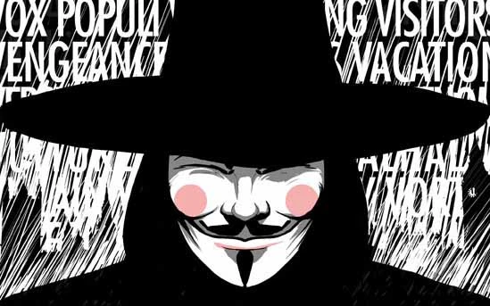
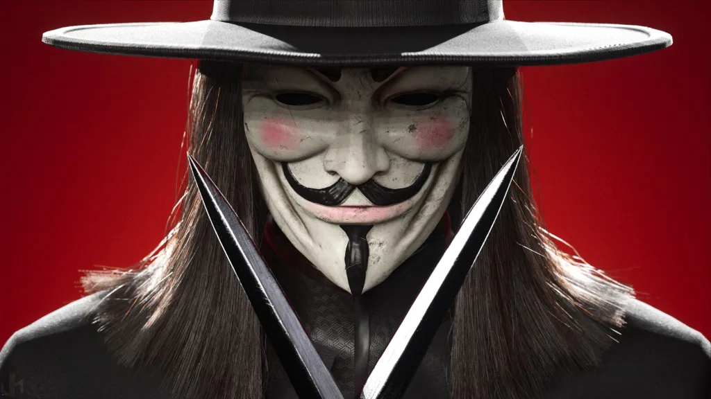
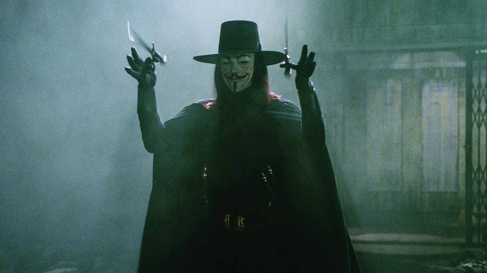
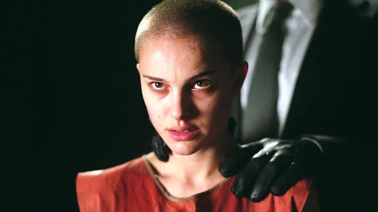

A máscara de Guy Fawkes, explosões simbólicas e um grito contra a opressão: V de Vingança marcou gerações tanto nos quadrinhos quanto no filme. Mas por trás da icônica imagem, existe um debate: a adaptação cinematográfica capturou a essência radical da obra original de Alan Moore ou a transformou em algo diferente?

Afinal, a revolução anarquista e crua das páginas de Moore se transformou em um espetáculo visual e emocional nas telas, suavizando algumas arestas. Essa adaptação foi uma traição à visão do autor ou uma forma necessária de levar a mensagem a um público maior, transformando a anarquia em um símbolo pop de resistência?

Hoje vamos comparar as duas versões de V de Vingança: o quadrinho denso e político versus o filme simbólico e acessível. Analisaremos as principais diferenças na abordagem dos personagens, da trama e da mensagem central para entender se temos uma revolução ou um espetáculo.

## O Quadrinho: A Revolução Anarquista de Alan Moore

Lançada nos anos 80, a história foi escrita por **Alan Moore** e ilustrada por **David Lloyd**. O cenário é um Reino Unido distópico, dominado por um governo fascista e controlado por uma vigilância constante. É nesse mundo que surge o misterioso "V" — um anarquista mascarado que decide derrubar o sistema, uma explosão simbólica por vez.

Mas não se engane: o **quadrinho é denso, político e radical**. Moore não queria apenas entreter, ele queria provocar. O personagem "V" é ambíguo, beirando o terrorista. Ele não é exatamente um herói pelo menos não no sentido tradicional. Isso faz parte do charme da obra: ela não entrega respostas fáceis.

E sabe o que é mais interessante? Tudo é pensado pra colocar o leitor pra refletir. A linguagem é pesada, cheia de referências filosóficas e históricas. E a arte? Escura, quase opressiva, pra reforçar o clima tenso do regime que V quer derrubar.

### Reflexões além do papel

Moore sempre disse que queria despertar o pensamento crítico. Pra ele, **a anarquia não é caos, mas liberdade plena**. A ideia era mostrar como o poder corrompe, e como o medo mantém as pessoas obedientes. Duro, né? Mas real.

Aliás, é impossível ler essa HQ e não pensar em situações do nosso dia a dia, especialmente quando a gente sente que o sistema não escuta quem realmente precisa ser ouvido.

## O Filme: O Espetáculo Simbólico das Wachowskis

Em 2005, o cinema recebeu sua versão de "V de Vingança", produzida pelas irmãs Wachowski (as mesmas de "Matrix") e dirigida por James McTeigue. E o resultado? Um filme visualmente marcante, com frase forte atrás de frase forte, como a clássica “_Ideias são à prova de balas_.”

Mas o clima é outro: o filme é mais emocional, com foco nas relações humanas e em uma **mensagem de esperança**. O personagem V continua sendo um rebelde, claro, mas agora com um toque mais "heróico". Evey, a protagonista vivida por Natalie Portman, ganha uma jornada de crescimento mais clara, mais "cinematográfica".

### Simbolismo em alta

Se no quadrinho a anarquia é a base, no filme a revolução vira quase um símbolo poético. A estética é impecável: a máscara de Guy Fawkes virou ícone (alô, Anonymous), as explosões são coreografadas com música e luzes. É quase um balé da revolta.

A trilha sonora épica, os discursos poderosos e o final que emociona garantem que o filme fique com você mesmo depois da sessão acabar. Mas será que essa suavidade não tira um pouco do peso da obra original?

## Quadrinho vs. Filme: As Principais Diferenças

Pra facilitar, aqui vai um resumo das principais diferenças entre as duas versões de **V de Vingança**:

*   **Tema central:** No quadrinho, o foco está na **anarquia e no pensamento político**. No filme, a ênfase vai para a **libertação individual** e o simbolismo da resistência.
*   **Personagem V:** Mais sombrio, misterioso e até cruel no quadrinho. Já no filme, ele é mais carismático e menos questionável.
*   **Evey:** Nos quadrinhos, ela tem um arco complexo e profundo. No filme, sua transformação é mais levinha e doce.
*   **Final:** A HQ termina com um clima de dúvida — será que deu certo? Já o filme fecha com uma cena inspiradora e um ar de vitória coletiva.

## Revolução Crua ou Esperança Cinematográfica?

Muita gente se emociona com o filme e se inspira com o discurso de liberdade. Outras preferem o soco na boca do estômago que o quadrinho entrega. E tá tudo bem. Os dois formatos possuem valor e cada um conversa com pessoas de formas diferentes.

Mas é interessante pensar: será que o filme precisou mesmo suavizar tanto a visão do Moore pra agradar o grande público? Ou foi uma escolha consciente pra adaptar as mensagens ao contexto atual?

Na minha opinião, o filme é uma bela porta de entrada pra conhecer a história. Mas o quadrinho entrega camadas que exigem mais do leitor e talvez, por isso mesmo, sejam mais impactantes.

## O Legado de V: Da Revolução Anarquista ao Símbolo Pop

Mesmo anos depois, "V de Vingança" continua atual. A máscara de Guy Fawkes virou símbolo de protestos ao redor do mundo do movimento Anonymous às ruas do Brasil em 2013. E isso mostra como a ficção pode influenciar o real.

Seja nas páginas da HQ ou na telona do cinema, a história de V nos faz refletir sobre controle, medo, resistência e, claro… coragem. Afinal, como dizia o próprio V:

> “O povo não deve temer seu Estado. O Estado deve temer seu povo.”

E aí, com qual versão você se identifica mais? Gosta mais da crítica crua do quadrinho ou da emoção épica do filme? Conta pra gente nos comentários!

### Quer saber mais?

Se você curtiu esse tema e quer se aprofundar, dá uma olhada nestas sugestões:

*   **Quadrinho [V de Vingança](https://amzn.to/47GtnjP), de Alan Moore e David Lloyd** - leia o original e tire suas próprias conclusões.
*   **[Artigo: Sobre Constitucionalismo e democracia](https://repositorio.ufmg.br/bitstreams/d19ad613-f696-48c6-b599-c4e8df34bb25/download)** - várias publicações trazem análises interessantes.

Curtiu o conteúdo? Então compartilha com seus amigos fãs de HQs, cinema e revolução. 