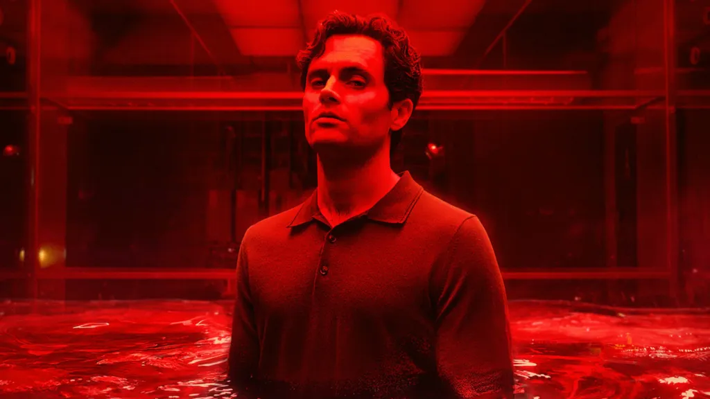

**Olá, você.** É impossível ouvir essa saudação sem lembrar dele: charmoso, inteligente, um romântico incurável que faria de tudo por amor. Mas também um predador emocional, um stalker e assassino.

A complexa figura de Joe Goldberg, protagonista da série You (Você), nos prende em um labirinto psicológico que levanta uma pergunta incômoda: quem realmente está no controle Joe, ou algo dentro dele? A narração constante, em que ele racionaliza cada ato hediondo como um gesto de proteção, revela uma mente fraturada.

Neste artigo, vamos mergulhar na **psicologia de Joe Goldberg**, explorando a linha entre escolha e compulsão, e por que, de forma assustadora, tantos de nós nos reconhecemos em fragmentos de seu comportamento.

## A ambiguidade de Joe: o herói que ele acredita ser

A psicologia de Joe Goldberg se revela na incapacidade de se ver como vilão. Em sua própria narrativa, ele é o herói incompreendido, o romântico injustiçado que só quer amar e proteger.
Mas por trás da fachada literária e do olhar sereno, se esconde alguém obcecado pelo controle alguém que acredita ter o direito de definir o que é melhor para o outro.

Essa distorção é típica de um tipo de narcisismo moral: Joe precisa se enxergar como “bom” para suportar a culpa. Ele não se acha malvado apenas “mal compreendido”. E é justamente essa autoimagem distorcida que o mantém preso no próprio ciclo.

## A voz interna: consciência ou mecanismo de defesa?

Ao longo da série, Joe conversa consigo mesmo. Ele narra cada pensamento, cria justificativas e distorce a realidade para que suas ações façam sentido. Essa “voz” parece ser sua consciência, mas também pode ser um mecanismo de defesa.

Freud chamaria isso de racionalização quando o ego cria explicações aceitáveis para comportamentos inaceitáveis. Ao narrar seus próprios crimes como se fossem gestos de amor, Joe evita encarar a culpa e reforça sua ilusão de controle.

Mas será que ele realmente tem controle? Ou apenas se convence de que tem?

## Serial killers e a ilusão do controle

Joe Goldberg se aproxima de arquétipos clássicos como Norman Bates (Psicose) e Dexter Morgan (Dexter). Todos compartilham o mesmo traço: **acreditam estar fazendo o que é certo**. 

A diferença é que Joe é um **vilão da era digital** alguém moldado pela hiperconectividade e pela cultura da vigilância. Vigiar virou fácil. Invadir a privacidade virou hábito. Joe é, de certo modo, um espelho extremo da era das redes sociais, onde acompanhar a vida alheia é parte da rotina.

Enquanto Bates é moldado pela repressão e Dexter pela necessidade de controle de sua sociopatia, Joe é movido por um romantismo deturpado: ele quer amar, mas só sabe fazer isso através da posse.

## A obsessão como vício

A forma como Joe lida com o amor se assemelha a um vício. Ele idealiza, persegue, conquista, sufoca e, inevitavelmente, destrói. Cada novo relacionamento é tratado como “a cura”, como se a próxima pessoa finalmente fosse “a certa”.

Mas, no fundo, ele está preso em um **ciclo dopaminérgico**, como qualquer vício: pequenas recompensas mensagens, olhares, sorrisos alimentam a obsessão, e a abstinência o leva à recaída.

Joe não controla o impulso; ele é controlado por ele. E isso nos faz refletir: até que ponto nossas próprias ações são conscientes? Quantas vezes somos levados por padrões mentais automáticos que nem percebemos?

## O Espelho Sombrio

“You” nos perturba porque nos faz reconhecer, em menor escala, algo de Joe em nós mesmos.
Quem nunca stalkeou alguém nas redes? Quem nunca interpretou demais uma mensagem e criou toda uma história na cabeça?

A série exagera, claro mas exagera algo real: o quanto a cultura atual romantiza a obsessão e o controle, disfarçando-os de “intensidade”.

Hoje, o amor possessivo aparece em músicas, filmes e memes como sinônimo de paixão. “You” apenas leva essa lógica ao extremo, revelando o que há de doentio por trás da idealização.

## Culpado ou Doente? O Dilema da Responsabilidade

Aqui está o ponto mais delicado: até que ponto um indivíduo mentalmente perturbado pode ser responsabilizado por seus atos? Joe exibe traços de narcisista sociopata, mas também de transtorno de apego. Ele busca conexão, mas destrói tudo o que toca.

Ele precisa de tratamento? Sim. Mas isso apaga o peso de seus crimes? De forma alguma. Entender Joe é diferente de justificá-lo. E é nesse ponto que ele se torna um personagem fascinante porque nos obriga a confrontar o limite entre empatia e julgamento.

## O confronto com a própria sombra

**SPOILER!!**

Na quarta temporada, a aparição de **Rhys Montrose** como uma espécie de alter ego é a manifestação simbólica do seu inconsciente, da parte que ele reprimiu por anos.

Essa é uma representação perfeita do **conceito de Sombra**, de Carl Jung o conjunto de impulsos, desejos e traços que negamos em nós mesmos, mas que continuam nos influenciando de forma inconsciente. 

Rhys é, portanto, o espelho que revela a verdade que ele passou a vida escondendo. E o mais interessante é que, no momento em que ele tenta matar esse alter ego, ele não o destrói ele o integra.

Ao aceitar que o “monstro” também faz parte dele, Joe alcança um novo tipo de controle: não o controle sobre os outros, mas a consciência sobre si mesmo.

Ele não se redime; ele apenas aceita o caos.

## Afinal, Quem Realmente Controla Joe Goldberg?

Talvez Joe nunca tenha estado no controle. Talvez o verdadeiro vilão seja a própria narrativa que ele cria para dar sentido ao caos dentro de si.

Ele não é apenas um monstro ou uma vítima é o retrato de alguém que tenta moldar o mundo para não encarar o próprio vazio.

Mas nós sabemos: o amor não é controle, nem obsessão, e muito menos perseguição.
E o preço de tentar controlar tudo é, ironicamente, perder o controle de si mesmo.

## Conclusão

A jornada de Joe em “You” é mais do que um suspense sobre crimes e relacionamentos. É um mergulho em como o ser humano lida com rejeição, carência, desejo de controle e interpretação do amor. A psicologia por trás do personagem é complexa e assustadoramente real em alguns aspectos.

Então, da próxima vez que assistir Joe Goldberg agindo como um “romântico apaixonado”, vale parar e pensar: **isso é amor… ou só outra prisão montada pela mente dele?**

### Quer saber mais?

*   [Psicologia Viva](https://www.conexasaude.com.br/blog/) – Textos sobre consciência e comportamento
*   [You na Netflix](https://www.netflix.com/br/title/80211991) – Assista à série e tire suas próprias conclusões