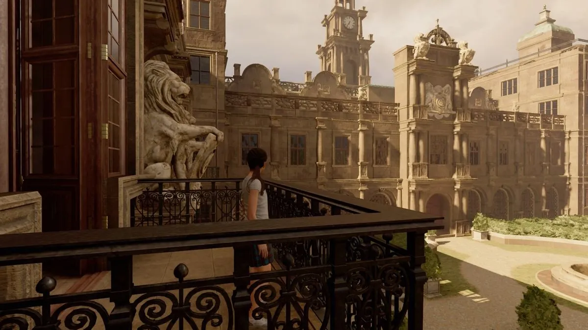
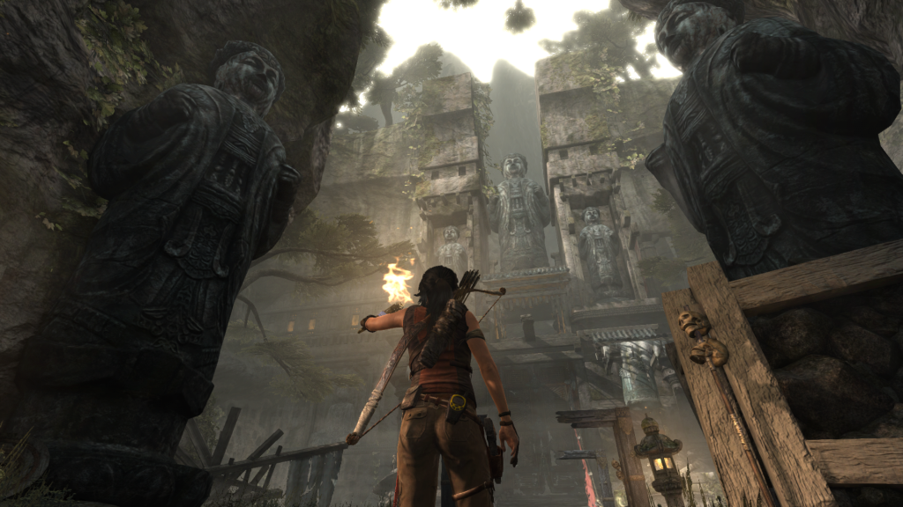
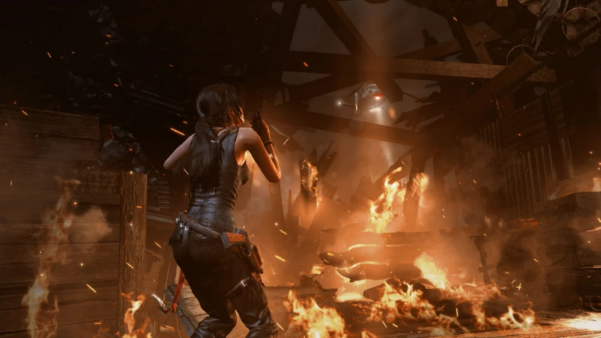

Desde que apareceu pela primeira vez nos videogames, Lara Croft se tornou um ícone da cultura pop e do universo gamer. A arqueóloga aventureira mistura inteligência, preparo físico extremo, coragem e muito estilo enquanto explora ruínas antigas e enfrenta perigos mortais ao redor do mundo. Mas por trás dessa vida cheia de ação, existe uma pergunta curiosa que pouca gente faz: quanto custa, de verdade, viver como a Lara Croft?

Em filmes, jogos e quadrinhos, a vida de aventureiro parece sempre glamourosa e empolgante. Quem nunca sonhou em viajar o mundo, descobrir segredos milenares e resolver mistérios históricos? Só que, fora da ficção, aventuras desse nível exigem dinheiro, preparo físico, equipamentos caros e um preço emocional que quase nunca aparece na tela.

Neste artigo, vamos colocar na ponta do lápis quanto custa ser a Lara Croft na vida real, analisando gastos com moradia de luxo, treinamentos intensivos, viagens internacionais e equipamentos de ponta. Além disso, vamos refletir sobre o custo invisível da aventura e discutir se vale a pena pagar esse preço. Spoiler: a conta não fecha nem com prêmio da Mega-Sena acumulada!

## Quanto custa a mansão da Lara Croft?

Vamos começar pelo básico: onde vive Lara Croft? Nada menos que uma **mansão inglesa**, com biblioteca, sala de armas, laboratório e, provavelmente, um campo de treinamento no quintal. Algo discreto, sabe?

Pesquisando propriedades similares no estilo da famosa Croft Manor, estamos falando de cifras que giram em torno de:

*   **£30 milhões ou cerca de R$ 200 milhões** (considerando o câmbio atual)

Isso sem contar manutenção, funcionários, segurança privada e, claro, o jardim impecável.

## O custo do preparo físico para ser a Lara Croft

Agora, luxo à parte, viver como Lara exige uma forma física quase sobre-humana. Ela escala montanhas, nada em águas geladas, corre por telhados e atira como ninguém. Para tentar chegar _perto_ disso, seria preciso:

*   **Personal trainer especializado**: R$ 3.000/mês (e esse é o valor base!)
*   **Aulas de artes marciais, parkour, escalada, mergulho e tiro**: mais R$ 5.000/mês
*   **Nutricionista, fisioterapeuta e acompanhamento médico**: em média R$ 2.000/mês

Ou seja, só para se manter em forma e com reflexos afiados, você estaria gastando mais de **R$ 10 mil por mês**.

## Quanto custam as viagens da Lara Croft pelo mundo?

As aventuras internacionais da Lara Croft envolvem passagens caras, logística complexa e despesas que vão muito além do turismo comum. Lara não fica parada. Um dia ela está no Camboja, no outro no Peru ou no Himalaia. E claro, tudo isso com estilo e de forma completamente autossuficiente. Vamos pensar nas despesas de uma dessas missões arqueológicas:

*   **Passagens aéreas internacionais (First Class, é óbvio!)**: R$ 40.000 por viagem
*   **Equipamentos de expedição**: roupas térmicas, mochilas especiais, bota de escalada, GPS militar, drone cerca de R$ 30.000 por missão
*   **Licenças, vistos e subornos (sim, acontece!)**: R$ 20.000 ou mais
*   **Equipe de apoio local (guia, tradutor, segurança)**: R$ 15.000

Então, em média, cada aventura da Lara custaria algo em torno de **R$ 100 mil a R$ 150 mil**. E isso em uma missão curta, sem muitos contratempos. Imagina quando tem helicóptero explodindo?

## Equipamentos de ponta dignos de espiã

Lara Croft nunca sai despreparada. Suas roupas são tecnológicas, suas armas são customizadas, e seus gadgets parecem saídos de um filme do James Bond. Veja só essa listinha da pesada:

*   **Dois pares de pistolas personalizadas**: cerca de R$ 70.000
*   **Arco composto de carbono com mira laser**: R$ 20.000
*   **Notebook ultrarresistente com software de criptografia**: R$ 25.000
*   **Relógio GPS de exploração**: R$ 5.000
*   **Equipamento de rapel, cordas dinâmicas e ganchos de escalada**: R$ 10.000

Ou seja, o “kit Lara Croft” básico ultrapassa facilmente os **R$ 130 mil**. E cá entre nós, ela perde esse equipamento com frequência...

## O custo emocional de viver como Lara Croft

Agora vamos falar do que não aparece na etiqueta de preço, mas custa e muito. Ser Lara Croft significa viver sob constante risco de morte, passar frio, fome, solidão e traumas enormes. Quem jogou qualquer game da franquia sabe como a personagem sai _literalmente_ em pedaços das missões.

**Cicatrizes, ossos quebrados, estresse pós-traumático, perda de entes queridos**... Tudo isso são consequências invisíveis, mas que impactam profundamente qualquer ser humano.

Claro que tudo isso contribui para a profundidade do personagem. Ela nos ensina que **o conhecimento tem seu preço**, e que a busca pela verdade pode deixar marcas permanentes. Uma reflexão poderosa, inclusive sobre a nossa própria vida.

## Vale a pena pagar o preço para ser a Lara Croft?

Com todos esses números em mãos, a pergunta inevitável é: **vale a pena?**

Se a gente considerar só o custo financeiro, ser uma Lara Croft da vida real pode ultrapassar os **R$ 250 milhões** facilmente. Mas, como toda boa jornada do herói (ou heroína, nesse caso), talvez o que vale mais não seja o que ela gasta, e sim o **que ela conquista**.

Ela descobre segredos antigos, enfrenta o impossível, sobrevive. É uma exploradora movida não por dinheiro, mas por paixão pelo conhecimento e pela história. Algo que muitos de nós, nerds e gamers de coração, também sentimos. Não é sobre ter uma mansão ou usar duas pistolas ao mesmo tempo. É sobre **curiosidade, coragem e resiliência**.

## Existe uma Lara Croft brasileira?

Agora vamos sonhar um pouco com a realidade do nosso quintal. Será que dá pra ser uma versão brasileira da Lara? Talvez não nos moldes milionários, mas você pode explorar lugares incríveis como:

*   **Chapada Diamantina** (BA) – Trilhas, grutas, cachoeiras e sítios arqueológicos
*   **Serra da Capivara** (PI) – Com arte rupestre milenar
*   **Petar** (SP) – Um mundo subterrâneo com centenas de cavernas

Com um bom planejamento, mochila nas costas e um espírito aventureiro, dá sim pra viver seu próprio “Tomb Raider” em solo nacional (e por um custo 200 vezes menor!)

Ser Lara Croft não é apenas questão de orçamento, equipamentos ou destino exótico. É sobre estar disposta a sair da zona de conforto para enfrentar o desconhecido. E, muitas vezes, pagar o preço com **tempo, esforço, saúde e até sofrimento**.

A mensagem que Lara deixa é clara: você pode até não ter uma mansão ou gadgets tecnológicos, mas nada impede que você seja um explorador da sua própria vida com suas batalhas, descobertas e glórias pessoais.

E aí, **topa essa aventura?**

### Quer saber mais?

*   [Wiki Tomb Raider: Lara Croft](https://tombraider.fandom.com/wiki/Lara_Croft)
*   Documentários sobre arqueologia e expedições (National Geographic, History Channel)
*   Jogos da franquia Tomb Raider (Square Enix)