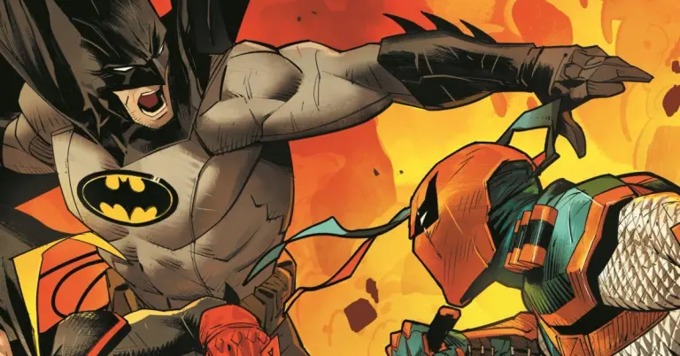
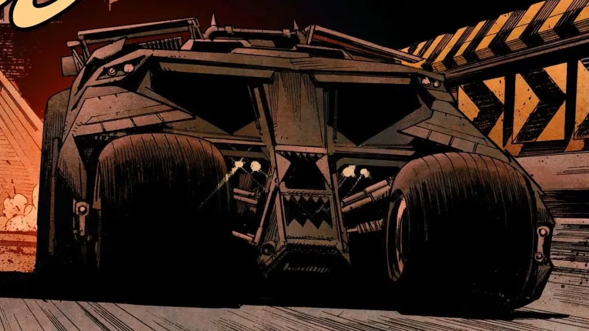

Você já parou pra pensar quanto o Bruce Wayne gastaria pra virar o Batman nos dias de hoje? Não estamos falando só do uniforme estiloso e dos gadgets tecnológicos. Estamos falando de **treinamento, veículos, armas não letais, manutenção da Batcaverna** e, claro, aquele lifestyle bilionário do nosso Cavaleiro das Trevas.

Neste post, vamos atualizar a conta com base na **inflação e nos preços de 2025**, imaginando quanto custaria ser o Batman hoje em reais, claro. Porque vamos combinar: a economia mudou desde a primeira vez que esse cálculo foi feito!

## Como chegamos a esse valor?

Antes de mais nada, é importante lembrar que estamos falando de uma versão **realista** do que o Batman faz. Nada de superpoderes. Tudo o que ele faz teoricamente pode ser aprendido, comprado ou construído com dinheiro. Muito dinheiro.

Pra montar esse orçamento, levamos em conta:

*   **Equipamentos táticos** e de proteção
*   **Treinamentos especializados** no exterior
*   **Veículos personalizados** (Batmóvel, Batmoto e Batnave)
*   **Manutenção e upgrades** da Batcaverna
*   **TI e suporte** (sistemas, IA, rastreadores, criptografia)

Agora vamos ao que interessa: quanto custa essa brincadeira?

## O uniforme tático do Batman

O traje do Batman não é só estiloso ele é uma verdadeira armadura. Com base em equipamentos militares e roupas usadas por forças especiais, um traje funcional e resistente poderia chegar a **R$ 350 mil**.

Isso inclui:

*   **Kevlar reforçado** contra tiros e facadas
*   **Capacete com visão noturna**
*   **Sistema de comunicação integrado**
*   **Bota com solado aderente** e sensores

E não se esqueça dos **gadgets**: Batarangues, gancho retrátil, bombas de fumaça... Estima-se mais uns **R$ 150 mil** com essas belezinhas.

## Treinamento: virar o Batman não é moleza

Bruce Wayne passou anos treinando com mestres ao redor do mundo. Imagine cursos intensivos em artes marciais, criminologia, táticas militares, investigação, e até ilusionismo.

Um pacote completo de formação estilo “Batman” poderia facilmente ultrapassar **R$ 1 milhão**, incluindo viagens internacionais, instrutores particulares e programas secretos.

### Treinamentos essenciais:

*   **Lutas marciais:** jiu-jitsu, krav maga, ninjutsu
*   **Detetive e análise forense**
*   **Parkour e escalada urbana**
*   **Tática militar e liderança**
*   **Treinamento psicológico:** controle emocional, tolerância à dor

Impressionante, né? E olha que nem incluímos as sessões de fisioterapia e recuperação muscular pós-correia de vilões de Gotham.

## O Batmóvel e outros brinquedinhos

Estamos falando de um carro blindado, com tecnologia de ponta, motor V8 (ou um motor híbrido super potente, se for uma versão mais consciente) e armamentos não letais como disparadores de EMP ou bombas de fumaça.

Um Batmóvel hoje custaria pelo menos **R$ 15 milhões**. Se quiser uma versão mais recheada, pode preparar uns **R$ 20 milhões**.

E não para por aí:

*   **Batmoto:** R$ 1 milhão
*   **Batnave (avião ou helicóptero customizado):** R$ 60 milhões

Incluindo combustível especial, manutenção e peças exclusivas, só o departamento de veículos consome uma verdadeira fortuna!

## Batcaverna: a base secreta

Uma base do nível da Batcaverna teria um sistema avançado de computadores, servidores, inteligência artificial, além de laboratório, centro médico e espaço para treinos.

Estimar tudo isso em termos reais daria algo por volta de **R$ 100 milhões**.

### O que está incluso?

*   Infraestrutura subterrânea à prova de invasões
*   Sistemas de segurança avançados com reconhecimento facial e criptografia
*   Servidor próprio com sistema operacional personalizado
*   Espaço para veículos, helicóptero e treinamento físico

Isso sem falar na conta de luz desse lugar todo. Imagina o consumo de energia de uma Batcaverna dessas em tempo integral?

## TI, comunicação e tecnologia customizada

Parte fundamental do trabalho do Batman é a **investigação digital**. O herói precisa de rastreadores, drone espião, linguagem de IA personalizada, além de criptografia de dados nível NSA.

Esse investimento todo gira em torno de **R$ 10 milhões**. Porque é claro que o Batman não vai usar um notebook de loja de varejo, né?

E isso precisa de manutenção constante, atualizações de segurança e backup. A Bat-Tech não pode falhar no meio da missão!

## Resumo da fatura: quanto custa ser o Batman em 2025?

Vamos somar tudo:

*   **Traje e gadgets:** R$ 500 mil
*   **Treinamento:** R$ 1 milhão
*   **Veículos:** R$ 81 milhões
*   **Batcaverna:** R$ 100 milhões
*   **Sistemas e tecnologia:** R$ 10 milhões

**Total estimado: mais de R$ 192 milhões!**

Isso, claro, considerando manutenção mínima. Afinal, atualizar equipamentos, trocar peças e manter tudo funcionando requer gastos anuais milionários.

A verdade é que, mesmo com esse investimento surreal, pouca gente teria o preparo físico e emocional para enfrentar perigos todas as noites. Bruce Wayne é uma mistura rara de determinação, trauma não resolvido e bilhões no bolso.

E aí, se você ganhasse na Mega da Virada, você montaria sua Batcaverna? Ou é melhor deixar isso pro Bruce mesmo?

### Quer saber mais?

*   [Site oficial da DC Comics](https://www.dc.com)
*   Vídeos no YouTube com breakdowns dos equipamentos do Batman
*   Documentários sobre armamento e veículos de forças especiais
*   Matérias sobre milionários bilionários excêntricos da vida real (tipo Elon Musk)

E aí, curtiu saber quanto custa ser o Batman? Compartilha este post com aquele amigo que já se acha o Bruce quando coloca uma roupa preta!