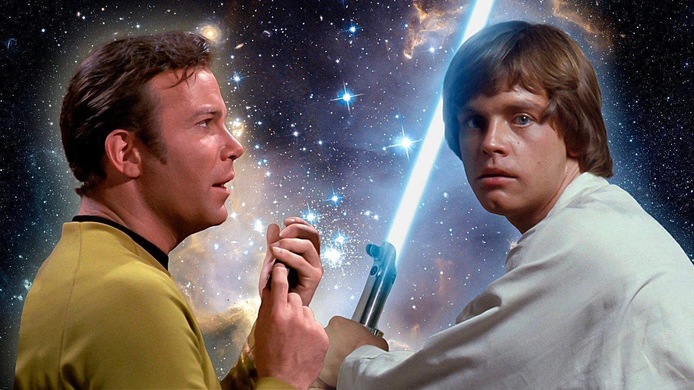

Se você é fã de ficção científica, com certeza já entrou nessa discussão: **Star Trek ou Star Wars?** Qual universo é melhor? Qual tem a história mais envolvente? Os personagens mais icônicos? Mas hoje, vamos abordar um outro ponto bem interessante: **qual das duas franquias apresenta uma visão de futuro mais utópica e desejável para a humanidade?**

Prepare-se para explorar galáxias distantes, onde rebeldes lutam contra impérios e cientistas desbravam o espaço em nome do conhecimento. No final, a pergunta permanece: **em qual desses universos você gostaria realmente de viver?**

## Antes de mais nada: o que é uma utopia?

Antes de comparar os dois mundos, precisamos entender o que é uma utopia. Basicamente, é uma visão idealizada de sociedade um mundo onde tudo (ou quase tudo) funciona perfeitamente. Justiça, igualdade, paz, desenvolvimento tecnológico e bem-estar para todos são elementos comuns numa utopia.

Dito isso… vamos ao duelo!

## Star Trek: um futuro baseado na razão e cooperação

Star Trek se passa centenas de anos no futuro, quando a Terra já não tem problemas como fome, pobreza ou guerras internas. A humanidade se uniu para formar a **Federação dos Planetas Unidos**, uma espécie de ONU intergaláctica, focada em **ciência, exploração e cooperação com outras espécies**.

### Por que a utopia de Star Trek atrai?

*   **Fim do dinheiro:** as necessidades básicas são supridas para todos, graças à tecnologia de replicadores. Ninguém precisa trabalhar por sobrevivência.
*   **Ciência acima da guerra:** a grande missão da nave Enterprise, por exemplo, é “explorar novos mundos, procurar novas formas de vida e novas civilizações”.
*   **Diversidade cultural:** muitas das tripulações são compostas por membros de planetas e raças diferentes, promovendo a inclusão.
*   **Progresso social:** coisas como racismo, machismo e homofobia praticamente deixaram de existir.

Ou seja, Star Trek aposta na ideia de que, apesar de todos os nossos problemas atuais, a humanidade pode evoluir e construir um futuro em que o **conhecimento, a empatia e a colaboração são os pilares da sociedade**.

**+ Leia mais::** [7 tecnologias do Star Trek que viraram realidade](https://nerdatico.com.br/7-tecnologias-do-star-trek-que-viraram-realidade/)

### Mas nem tudo são flores…

É claro que existe conflito em Star Trek. Inimigos como os Klingons ou os Borgs ameaçam a paz da federação, mas as histórias quase sempre tratam o conflito com uma abordagem ética, questionando **quais decisões são moralmente corretas** num cenário tão avançado.

Esse universo coloca mais ênfase em **filosofia, debate e evolução moral** do que em batalhas épicas (apesar de elas também aparecerem de vez em quando).

## Star Wars: uma galáxia em constante conflito

Agora, vamos para o lado mais explosivo da comparação. Star Wars é definitivamente mais caótico. O enredo se passa em uma **galáxia distante, muito tempo atrás** onde impérios galácticos surgem, jedis lutam com sabres de luz e rebeldes enfrentam opressores.

Apesar de muita ação e uma estética visual apaixonante, o universo de Star Wars está longe de ser uma utopia…

### Por que o universo de Star Wars encanta?

*   **Heróis épicos:** é o clássico bem contra o mal, onde personagens como Luke Skywalker, Leia e Han Solo lutam por justiça.
*   **Fascínio pelo desconhecido:** planetas exóticos, criaturas estranhas, ordens místicas… tudo parece tirado de um conto de fadas espacial.
*   **Força e destino:** a ideia de uma energia mística que conecta todos os seres vivos seduz qualquer fã de espiritualidade ou fantasia.

Star Wars cativa muito pelo emocional. Os personagens sofrem, têm dilemas éticos pesados e enfrentam decisões que mexem com o destino da galáxia inteira.

### Mas... que utopia é essa?

Na real, **não é uma utopia**. O universo de Star Wars é cheio de **autoritarismo, desigualdade e sofrimento**. A política é instável, a opressão é constante, e guerras são praticamente intermináveis. Ainda assim, há momentos de esperança e reconstrução como quando a Nova República surge após a queda do Império.

Muitos fãs gostam dessa abordagem mais "realista" e cheia de altos e baixos. Mas convenhamos: viver lá não seria nada tranquilo.

**+ Leia mais::** [A ética dos clones em Star Wars: são soldados ou escravos?](https://nerdatico.com.br/a-etica-dos-clones-em-star-wars-sao-soldados-ou-escravos/)

## Comparando os dois futuros: razão ou emoção?

Então, qual universo traz a melhor futuro?

Vamos comparar alguns pontos-chave:

*   **Qualidade de vida:** Star Trek, com certeza. Fome e guerra são coisas do passado.
*   **Tecnologia em prol do bem:** Star Trek usa a ciência pra melhorar vidas. Em Star Wars, a tecnologia parece mais voltada pra destruição.
*   **Religião e misticismo:** Star Wars tem a Força, que carrega uma vibe espiritual poderosa. Star Trek aposta na razão e na ética científica.
*   **Sistema político:** A federação de Star Trek é estável e democrática. Star Wars vive de impérios tirânicos e rebeliões.

Pegando nosso contexto aqui no Brasil, se estamos cansado de filas em hospitais, corrupção, desigualdade e violência, talvez a ideia de uma sociedade baseada em ciência e justiça social (mesmo que fictícia) como a de Star Trek seja muito mais atraente.

Mas, se você curte histórias emocionantes, onde **o bem precisa lutar com unhas e dentes para vencer o mal**, Star Wars pode ser sua escolha. É aquele drama que te prende do início ao fim, com personagens falhos e decisões difíceis.

## Então, qual é o seu lado?

No final das contas, tudo vai depender do que você valoriza mais. **Quer viver em um futuro pacífico, racional e próspero? Vai de Star Trek.** Prefere uma aventura épica cheia de drama e emoção? Star Wars é seu lar.

Mas fica a pergunta: será que a humanidade tem mesmo mais chance de construir uma federação intergaláctica colaborativa ou estamos mais próximos de cair num império tirano com sabres de luz?

## O futuro está em nossas mãos

Ficção científica serve não só pra entreter, mas também pra nos fazer **refletir sobre o presente**. Star Trek nos inspira a evoluir como civilização, enquanto Star Wars nos mostra que a luta por justiça é eterna.

Independentemente do universo que você prefere, ambos nos ensinam que o futuro não é apenas uma questão de tecnologia é sobre as **escolhas que fazemos hoje**.

### Leituras recomendadas:

*   [Memory Alpha – Wiki de Star Trek](https://memory-alpha.fandom.com/wiki/Main_Page)
*   [Star Wars Wiki – Universo expandido](https://starwars.fandom.com/pt/wiki/P%C3%A1gina_principal)

E você, em qual universo escolheria viver? Conta pra gente nos comentários!