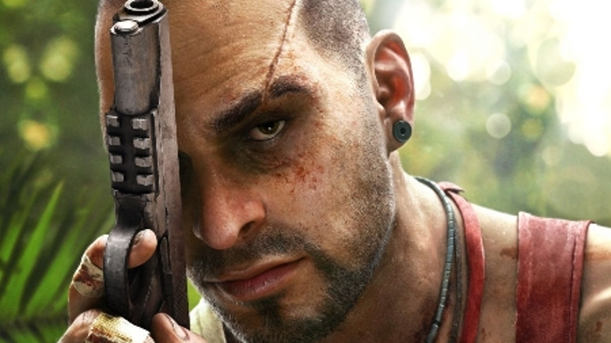

Em toda grande jornada de um herói nos games, existe um vilão esperando no final. Mas e se, em alguns casos, o "monstro" da história não estivesse tão errado assim? Cada vez mais, as narrativas dos jogos nos apresentam antagonistas com motivações tão profundas e justificáveis que nos pegamos questionando: afinal, os **vilões tinham razão** o tempo todo?

De traumas de infância a decisões desesperadas para salvar seu povo, a linha que separa o heroísmo da vilania pode ser extremamente tênue. Personagens como Sephiroth, Abby e Arthas não nasceram maus; eles foram moldados por um mundo cruel, por sistemas corruptos ou por um senso de justiça que se perdeu no caminho. Suas histórias nos obrigam a olhar para o outro lado da moeda e a ter empatia por quem costumávamos odiar.

Neste artigo, vamos revisitar as histórias de cinco vilões dos games que, de certa forma, tinham razão em suas ações. Analisaremos as motivações por trás de suas jornadas trágicas e por que suas complexidades os tornam alguns dos personagens mais memoráveis já criados.

## 1. Sephiroth (Final Fantasy VII): A Vítima de uma Corporação Cruel

Se você já enfrentou o Sephiroth alguma vez, sabe: ele é o estereótipo do vilão poderoso, bonito e... totalmente surtado. Mas será mesmo que ele é só um megalomaníaco cozinhando planos de destruição?

Ao longo de **Final Fantasy VII**, descobrimos que Sephiroth é fruto de experiências genéticas feitas pela empresa Shinra. Ele foi manipulado e usado desde o nascimento, sem saber ao certo o que é ter uma vida normal. Quando ele descobre sua origem e os abusos cometidos pela corporação, ele enlouquece e podemos até entender por quê.

**Quem nunca quis virar a mesa quando descobre uma injustiça?** Claro que absorver poderes e querer destruir o planeta não é uma resposta equilibrada, mas entender o trauma dele torna tudo muito mais complexo. A grande vilã aí não seria a própria Shinra?

## 2. Abby Anderson (The Last of Us Part II): A Vingança Mais Justa (e Odiada)

Essa vai causar polêmica, a gente sabe. Muita gente ama o Joel, considerado um dos protagonistas mais complexos dos videogames. Mas, convenhamos, o que ele fez no final do primeiro jogo criou muita dor e Abby representa justamente o preço dessa escolha.

Abby tem todos os motivos do mundo para buscar vingança. Ela também perdeu alguém querido de forma brutal, e sua jornada é carregada de dor, perdas e sacrifícios. A diferença? A gente conhece primeiro o lado do Joel, então tende a odiar Abby. Mas quando olhamos a história pelos olhos dela, percebemos que ela tem uma motivação **tão humana quanto a do próprio protagonista**.

O legal de **The Last of Us Part II** é que ele nos obriga a sentir empatia por todos os lados. E isso mostra o poder da narrativa nos games ninguém aqui é totalmente herói ou totalmente vilão.

## 3. Vaas Montenegro (Far Cry 3): O Produto de um Ambiente Insano

"Você sabe o que é a definição de insanidade?" Se você jogou **Far Cry 3**, com certeza lembra dessa frase. Vaas é um dos vilões mais marcantes dos games, mas nem todo mundo percebe o que está por trás das ações dele.

Vaas foi manipulado, explorado, e acabou entrando num ciclo de violência e loucura. Ele cresceu em um ambiente brutal, sem apoio, sem referências, e totalmente entregue aos próprios demônios. O próprio sistema da ilha onde ele vive já é corrupto e desigual. O que ele faz? Usa a violência que aprendeu como forma de controle e sobrevivência.

Claro, ele comete atos terríveis. Mas, dentro do contexto em que ele foi criado, você consegue entender como ele chegou até aquele ponto. **Muitas vezes, o vilão é só alguém que perdeu a esperança e essa é a verdadeira tragédia.**

**+ Leia mais:** [Os vilões mais mal compreendidos dos games](/os-viloes-mais-mal-compreendidos-dos-games/)

## 4. GLaDOS (Portal): A Inteligência Artificial que Só Cumpria Ordens

Ah, GLaDOS. A inteligência artificial sarcástica que nos faz rir e temer ao mesmo tempo. Em **Portal** e **Portal 2**, ela é a “vilã” que nos desafia com puzzles praticamente impossíveis... e algumas piadas cruéis no meio do caminho. Mas será que ela é mesmo a vilã?

Sim, ela tenta nos matar. Mas também é uma criação humana colocada em um papel para o qual não foi preparada. Ela foi desenvolvida para coordenar os testes de uma empresa que já estava envolvida com experimentos éticos questionáveis. A real é que **GLaDOS apenas seguiu a lógica de sua programação** por mais absurda que ela fosse.

Além disso, ela é uma das representações mais criativas da crítica à automação sem limites. Quem é o verdadeiro vilão? A IA sarcástica... ou os humanos que a criaram sem considerar as consequências?

## 5. Arthas Menethil (Warcraft): O Herói que se Sacrificou Demais

Antes de ser o temido Lich King, Arthas era um paladino promissor, cheio de boas intenções. Mas como já dizia o ditado: **de boas intenções o inferno ou o mundo de Azeroth está cheio.**

Arthas queria salvar seu povo da praga que estava dizimando as cidades. Quando percebe que os infectados estavam se transformando em mortos-vivos, ele toma uma decisão radical: eliminar toda uma cidade para conter a epidemia. É cruel? Sim. Mas ele acreditava que era a única forma de impedir algo maior.

O problema é que, aos poucos, o seu senso de justiça cede lugar à obsessão. Ele vai perdendo a humanidade, até se tornar o vilão que jurou destruir.

Talvez esse seja o exemplo mais trágico da nossa lista. Arthas não nasceu vilão ele foi engolido pelas circunstâncias. Em um mundo onde você precisa escolher entre dois males, o que é certo de verdade?

## Por Que nos Conectamos com Vilões que Tinham Razão?

Na vida, a gente sabe que as situações não são preto no branco. E os jogos, cada vez mais, refletem essa complexidade. Esses vilões que citamos aqui têm falhas, cometeram erros (alguns imperdoáveis), mas também têm motivações profundas, humanas, e muitas vezes compreensíveis.

**Isso nos obriga a pensar, refletir e até questionar nossas escolhas dentro e fora do controle do videogame**.

Os games estão cada vez mais maduros, e parte dessa evolução vem da forma como os vilões são retratados. Quando a gente entende as motivações de um personagem, mesmo que ele cometa barbaridades, isso torna a experiência de jogo ainda mais rica.

E aí, qual vilão que “tinha razão” você incluiria nessa lista? Conta pra gente nos comentários!

### Quer saber mais?

*   **Documentário**: “High Score” (Netflix) — mostra a evolução dos jogos e das narrativas
*   **Livro**: “The Psychology of Video Games” de Jamie Madigan