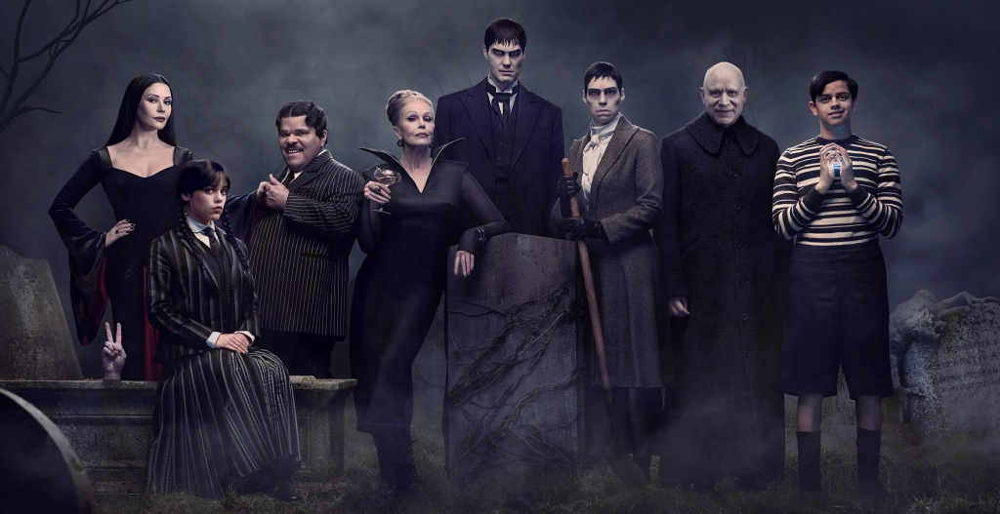
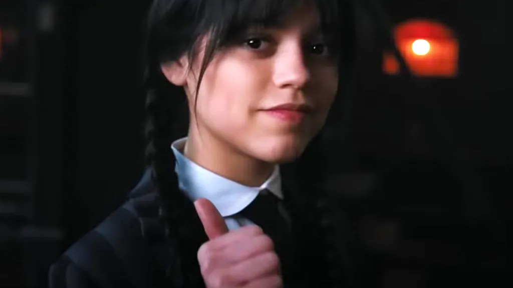
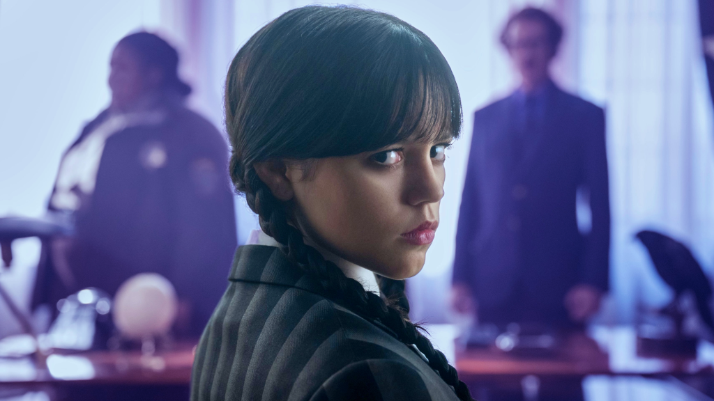

Com seu humor ácido, aversão a abraços e um olhar que parece atravessar a alma, **Wandinha Addams** se tornou um fenômeno cultural. Mas o sucesso da série da Netflix vai além do carisma sombrio; ela abriu uma conversa poderosa sobre **neurodiversidade**, fazendo com que milhares de pessoas se sentissem vistas e representadas em sua forma única de ser e pensar.

A lógica implacável, a dificuldade com interações sociais e os interesses hiperfocados da personagem espelham a experiência de muitos indivíduos no espectro autista ou com TDAH. A enorme **identificação com o estranho** que **Wandinha** representa nos mostra que o que a sociedade costumava chamar de "esquisito" é, na verdade, apenas uma forma diferente de existir no mundo.

Neste artigo, vamos analisar como a **representatividade em Wandinha** quebra estereótipos e valida a experiência neurodivergente. Exploraremos por que nos conectamos tanto com personagens fora do padrão e qual o impacto de ver o "estranho" finalmente assumir o papel de herói. Prepare-se para celebrar a beleza de ser diferente.

## O Que é Neurodiversidade? Um Conceito Essencial

Antes de falarmos de **Wandinha**, é fundamental entender o conceito de neurodiversidade. É um conceito que reconhece que existem diferentes formas de funcionamento neurológico ou seja, cada cérebro funciona de um jeito. Não existe um padrão único de "normalidade".

Ser neurodivergente significa que a pessoa tem uma maneira diferente de perceber, pensar ou processar o mundo. Isso inclui:

*   **Autismo**
*   **TDAH (Transtorno do Déficit de Atenção com Hiperatividade)**
*   **Dislexia**
*   **Síndrome de Tourette**
*   **Entre outros perfis cognitivos**

No passado, essas diferenças eram vistas apenas como "problemas" ou "transtornos". Hoje, com mais informação e empatia, a gente está aprendendo que **ser diferente não significa ser errado**.

## Wandinha Como um Retrato da Experiência Neurodivergente

A série **Wandinha** apresenta uma protagonista cujas características se alinham fortemente com a experiência neurodivergente, sem precisar rotulá-la. Ela não gosta de contato físico, é extremamente lógica, tem interesses específicos (alô, máquinas de tortura medievais!) e uma forma muito peculiar de se relacionar com o mundo.

Essas características fazem muitas pessoas neurodivergentes se enxergarem nela. Quem vive com autismo, por exemplo, pode se identificar com a forma direta de falar da Wandinha, ou com o desconforto que ela sente em ambientes com muita movimentação social como as festinhas de Nunca Mais.

E não precisa ser diagnosticado com algo para se sentir "diferente". Basta já ter sentido, em algum momento da vida, que você não se encaixava. E vamos combinar? Muitos de nós já nos sentimos assim.

**+ Leia mais:** [Deuses ou Humanos? O Dilema Moral dos X-Men](/deuses-ou-humanos-o-dilema-moral-dos-x-men/)

## A Força do "Estranho": De Wandinha a Luna Lovegood

A cultura pop está repleta de personagens que nos ensinam que ser estranho pode ser uma grande força. Além da Wandinha, temos:

*   **Sheldon** (de "The Big Bang Theory")
*   **Amélie Poulain** (de "O Fabuloso Destino de Amélie Poulain")
*   **Luna Lovegood** (de "Harry Potter")

Todos eles compartilham algo em comum: não seguem o que é considerado "normal". E por isso mesmo, despertam empatia, carinho e identificação.

Esses personagens nos fazem perceber que **ser diferente pode ser uma força**. E quando a gente vê isso estampado na tela, começa a olhar com mais aceitação também para nós mesmos e para os outros.

## A Importância da Representatividade Neurodivergente

Ver a **neurodiversidade** representada em personagens como Wandinha gera um sentimento de validação e pertencimento em quem sempre se sentiu diferente. Quando vemos nossos traços, comportamentos ou sentimentos representados em personagens da TV, dos filmes ou dos games, sentimos que não estamos sozinhos. Isso é especialmente importante para quem cresceu ouvindo que era “esquisito” ou “difícil”.

A **Wandinha** mostra que **não há problema em ser quem você é**. Ela não tenta mudar para agradar ninguém. E isso é poderoso!

Além disso, a série não transforma sua diferença em piada (como tantas fez no passado). Pelo contrário: ela é a protagonista, a heroína. E isso muda tudo.

## O papel da mídia em quebrar padrões

Pensando em séries de produções nacionais, ainda estamos caminhando quando o assunto é representatividade neurodivergente. Mas já vemos avanços. Personagens que mostram realidades diversas ajudam a quebrar preconceitos e abrir conversas importantes.

Quando o conteúdo é feito com cuidado, pesquisa e escuta ativa de pessoas neurodivergentes, o impacto é ainda mais positivo. A série **Wandinha** foi elogiada justamente por isso: por trazer complexidade e humanidade a uma personagem fora dos padrões, sem estereótipos bobos.

### Você já se sentiu "fora do lugar"?

Essa é uma pergunta poderosa. Se você já sentiu que não se encaixava, que era “estranho demais”, “sensível demais” ou “distraído demais”, saiba que você não está sozinho. E talvez por isso personagens como a **Wandinha** nos toquem tanto.

Na escola, eu sempre fui a "menina do mundo da lua". Preferia desenhar a participar de esportes. Era tímida, falava pouco e detestava barulho. Durante muito tempo achei que o problema era comigo. Hoje entendo que, na verdade, só funciono de outro jeito. E tudo bem!

## O Futuro da Representatividade Neurodivergente na Mídia

O sucesso de **Wandinha** sinaliza uma mudança positiva, onde a neurodiversidade ganha cada vez mais espaço e complexidade na cultura pop. Tem algo muito bonito acontecendo: cada vez mais produções estão incluindo personagens que fogem do estereótipo “perfeito”. Isso abre espaço para conversas mais reais, que envolvem saúde mental, diferenças cognitivas e empatia.

É claro que ainda há muito o que melhorar. Mas ver a Wandinha sendo abraçada pelo público como ícone da estranheza bonita é um passo promissor.

### Vamos valorizar o diferente

No fim das contas, a série só reforça um recado que deveríamos carregar sempre: **não precisamos ser iguais para nos conectarmos**. Aliás, é justamente na diversidade de jeitos, gostos, formas de pensar e sentir que está a riqueza da nossa humanidade.

E você, já se identificou com um personagem "fora do padrão"? Conta pra gente nos comentários! Vamos continuar esse papo.

### Quer saber mais?

*   **Série:** "Atypical" (Netflix) – sobre autismo e convivência familiar
*   **Documentário:** "Mind Explained: Transtornos Mentais" (Netflix)
*   **Podcast:** [Introvertendo](https://www.introvertendo.com.br/)– criado por autistas brasileiros