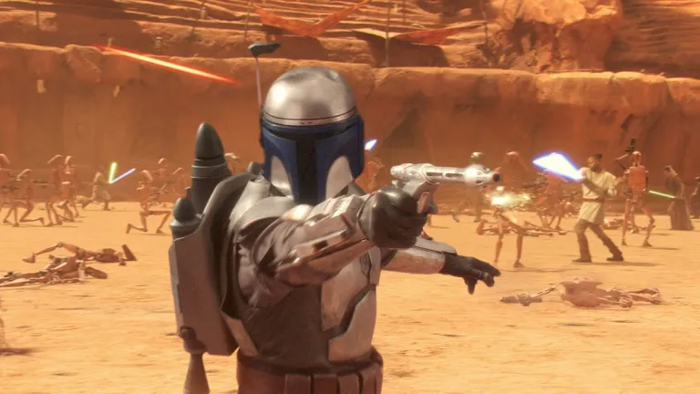
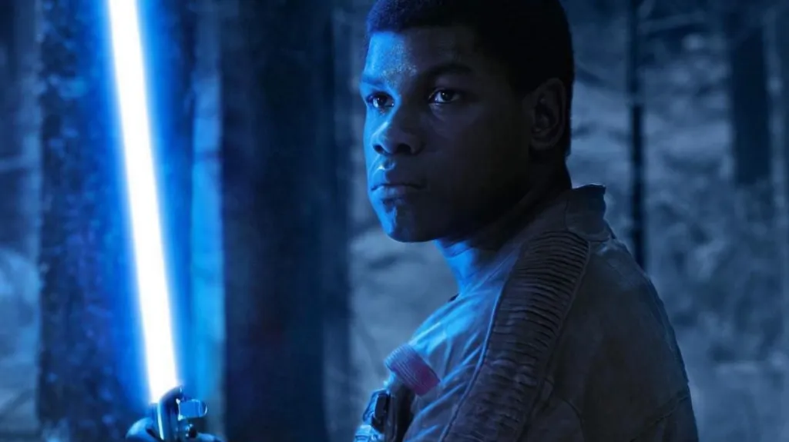
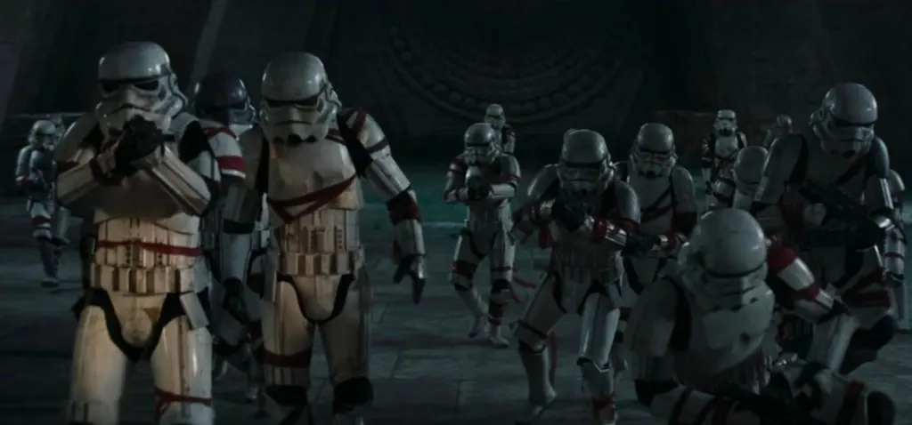

Eles são o exército sem rosto do Império Galáctico, os soldados de armadura branca que, nos filmes de **Star Wars**, parecem mais alvos móveis do que pessoas. Mas você já parou para pensar na **vida secreta dos stormtroopers**? O que se esconde por trás daqueles capacetes impessoais e da mira notoriamente ruim?

A maioria deles não nasceu clone; foram recrutados, doutrinados e transformados em engrenagens de uma máquina de guerra. Isso levanta questões profundas sobre sua psicologia: eles têm medos, sonhos ou arrependimentos? A obediência cega é uma escolha ou o resultado de uma vida inteira de manipulação pelo Império?

Hoje, vamos dar uma olhada além da armadura e investigar o lado humano dos stormtroopers. Analisaremos sua rotina, seus conflitos internos e o que personagens como Finn nos revelam sobre a complexidade de ser um soldado anônimo do Império. Bora descobrir?

## Quem São os Stormtroopers?

Para entender a **vida secreta dos stormtroopers**, primeiro precisamos ir além da imagem de soldados anônimos do Império. Todo mundo conhece os stormtroopers como lacaios sem rosto do imperador Palpatine. Eles seguem ordens, perseguem rebeldes e erram tiros com uma frequência questionável. Mas pra entender o comportamento deles, precisamos olhar de onde vêm.

### De clones a recrutas: a evolução da tropa

No começo lá na trilogia prelúdio, grande parte do exército era formado por clones criados a partir de Jango Fett. Com o tempo, o Império substitui esses clones por pessoas comuns recrutadas, muitas vezes à força. Isso mudou tudo.

*   Clones treinados desde cedo eram programados para obedecer sem questionar.
*   Recrutas humanos vêm de diferentes culturas e têm motivações variadas.

Essa mudança cria uma tropa mais heterogênea e muito mais complexa.

## A Psicologia de um Stormtrooper: Doutrinação e Conflito Interno

A psicologia de um stormtrooper é moldada por um ambiente militar rígido e uma doutrinação que começa na infância. Imagina você ser retirado da sua família ainda criança, crescer num ambiente militar rígido, e ser ensinado que o Império é a única forma de ordem no universo. É nesse clima que muitos stormtroopers são criados. O resultado?

### Lavagem cerebral disfarçada de disciplina

A doutrinação é pesada. Desde cedo, o discurso deles é sempre o mesmo: “rebeldes são terroristas, o Império é a paz, nosso dever é obedecer.” Isso acaba moldando a forma como eles veem o mundo.

Isso lembra muito certas realidades do nosso mundo, com jovens entrando em grupos radicais porque acreditam estar fazendo o certo. É a mistura de manipulação emocional com ausência de alternativas.

### Existem crises internas?

Spoiler: sim! Não é todo stormtrooper que aceita seu papel passivamente. Um ótimo exemplo é o **Finn**, do Episódio VII. Ele deserta justamente por não conseguir mais viver com os abusos cometidos pela Primeira Ordem, uma versão moderna do Império.

Mas e os outros? Será que também sentem culpa? Medo? Angústia?

Pensando bem, deve ser difícil dormir à noite depois de invadir uma vila cheia de inocentes só porque alguém mandou. Muitos stormtroopers provavelmente vivem com esse conflito interno, mesmo que silenciosamente.

**+ Leia mais:** [A ética dos clones em Star Wars: são soldados ou escravos?](/a-etica-dos-clones-em-star-wars-sao-soldados-ou-escravos/)

## Vida Cotidiana de um Stormtrooper

O universo expandido de Star Wars nos mostra que a vida secreta dos stormtroopers inclui uma rotina diária muito parecida com a de soldados reais. Será que eles descansam? Jogam sabacc com os colegas de turno? Ficam de papo no refeitório?

### Sim, stormtroopers têm uma vida fora da batalha

De acordo com materiais do universo expandido (livros, HQs e séries), descobrimos que muitos soldados imperiais têm uma rotina bem parecida com a de soldados reais:

*   **Treinamentos intensivos**
*   **Exercícios físicos diários**
*   **Momentos de lazer sob vigilância**
*   **Conexões entre tropas – formações de amizades e inimizades**

Isso tudo contribui para a formação da personalidade deles. Alguns se adaptam bem, outros se frustram e até desenvolvem traumas. Muitos stormtroopers, por exemplo, enfrentam o famoso **transtorno de estresse pós-traumático** (TEPT), assim como veteranos de guerra na vida real.

## Aspectos Sociais: Ser Stormtrooper é Só Obedecer?

A análise social revela o grande dilema dos stormtroopers: eles são apenas vítimas do sistema ou cúmplices conscientes dos atos do Império? Você já pensou em como a sociedade vê um stormtrooper? Será que suas famílias sabem onde eles estão? Se orgulham ou sentem vergonha?

Ser um stormtrooper é como ser parte de uma grande engrenagem. Não há espaço pra individualidade. Isso ajuda o Império a controlar tudo ninguém quer ser diferente quando ser diferente significa punição.

E pra piorar, eles são vistos pela galáxia como “os vilões da vez”. Isso impacta diretamente na autoestima dos soldados. Eles são o “braço armado” de um governo que muitos odeiam. Vira uma situação sem saída: eles seguem porque têm medo e acham que não há alternativa real.

### Teriam eles uma escolha?

Essa é uma questão polêmica...

Muitos já entraram tão jovens e foram tão doutrinados que mal conhecem outra opção. Outros até tentam fugir como vimos em várias mídias de Star Wars mas são raros. A maioria simplesmente aceita o papel que lhe dão.

Quantas vezes, na nossa vida, a gente também acha que “não tem escolha”? Seja num trabalho tóxico, seja num relacionamento ruim. A diferença é que a gente não usa uma armadura branca, mas muitas vezes também esconde quem realmente somos.

## O Lado Humano dos Vilões Anônimos

Os stormtroopers são muito mais do que simples vilões. São pessoas que foram moldadas por um sistema opressor. São vítimas e cúmplices ao mesmo tempo. É um paradoxo clássico.

E quando a gente começa a ver esse outro lado o lado humano fica mais difícil simplesmente apontar o dedo. A gente começa a se perguntar: o que _eu_ faria na mesma situação?

É como no nosso dia a dia: nem todo mundo que comete erros é mal intencionado. Às vezes, são pessoas presas num sistema que não dá espaço pra pensar diferente.

Os stormtroopers ganharam uma nova camada com essa análise. Por trás das armaduras brancas, há seres humanos reais, com conflitos internos, sonhos abandonados e uma sede por pertencimento. Isso nos faz lembrar que, mesmo num universo tão distante, as questões humanas continuam sendo muito parecidas com as nossas.

Já imaginou como seria sua vida se tivesse nascido no universo de Star Wars? Estaria do lado da Rebelião ou obedecendo ordens como stormtrooper? Vale a reflexão!

### Quer saber mais?

*   **Livro:** [Lost Stars – Claudia Gray](https://amzn.to/3VCoYI4)
*   **Série:** Star Wars: The Bad Batch (Disney+)

Até o próximo post, e lembre-se: a galáxia pode ser muito mais cinza do que apenas lado claro ou escuro da Força.