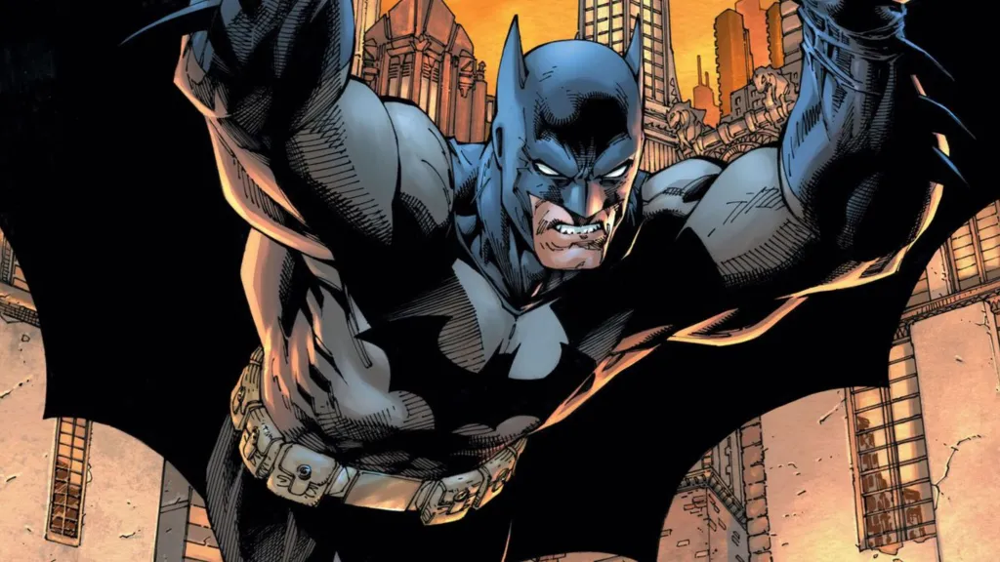

É o ciclo sem fim que assombra Gotham City: o Coringa comete atrocidades, o Batman o captura, ele escapa do Asilo Arkham e tudo recomeça. Essa dinâmica levanta uma das questões mais complexas e debatidas: a recusa do **Batman em matar o Coringa** é um ato de heroísmo supremo ou uma falha moral que custa inúmeras vidas inocentes?

Afinal, o que é mais **ético**? Manter-se fiel a um código moral absoluto de não tirar uma vida, mesmo que isso permita que o mal continue a prosperar? Ou tomar uma decisão drástica que, embora terrível, salvaria incontáveis pessoas no futuro? A resposta para essa pergunta coloca em rota de colisão duas das maiores correntes da **filosofia**, transformando um dilema de super-herói em uma profunda questão sobre a natureza da justiça.

Vamos aproveitar este tema e analisar a **ética do Batman** sob a lupa da Deontologia de Kant e do Utilitarismo de Mill. Exploraremos os argumentos de ambos os lados para entender as profundas implicações do código do Cavaleiro das Trevas. Prepare-se para decidir se o maior herói de Gotham é também, de certa forma, cúmplice de seu maior vilão.

## O Código Moral do Batman: Por Que Ele Não Mata?

A base de todo o debate sobre a ética do Batman está em sua regra de ouro: **ele se recusa a matar**. Segundo ele, tirar uma vida o tornaria igual aos criminosos que ele combate. Justo, né? Mas e quando o inimigo é o Coringa? Um cara que já matou centenas, torturou o Robin, e ainda consegue escapar da prisão como quem troca de roupa?

A lógica do Batman é clara: **ele acredita na justiça, não na vingança**. Para ele, quebrar esse código significaria cruzar uma linha que ele talvez nunca mais consiga desfazer. É como se o símbolo do morcego deixasse de representar esperança e virasse só mais um justiceiro violento.

**+ Leia mais:** [Quanto custa ser o Batman?](/quanto-custa-ser-o-batman/)

## O Dilema Ético: Deontologia vs. Utilitarismo

Para analisar se a decisão do Batman é ética, podemos recorrer a duas grandes correntes da filosofia moral que oferecem respostas opostas e que podem nos ajudar a entender esse debate:

### 1. A Visão Deontológica: Matar é Sempre Errado

A ideia aqui é simples: **o que importa são os princípios, não as consequências**. Segundo [Immanuel Kant](https://en.wikipedia.org/wiki/Immanuel_Kant), existe um dever moral que vale para todo mundo e ponto final. Ou seja: matar é errado, sempre. Não importa quem, nem o porquê.

Se aplicarmos isso ao Batman, ele age exatamente como Kant defende. Mesmo com todo o mal que o Coringa faz, **ele acredita que, ao matar, estaria violando um princípio fundamental**. E isso comprometeria sua própria identidade como herói.

### 2. A Visão Utilitarista: O Bem Maior Acima de Tudo

Já para [John Stuart Mill](https://pt.wikipedia.org/wiki/John_Stuart_Mill), a lógica é oposta: **a melhor ação é aquela que gera o maior bem para o maior número de pessoas**. Ou seja, se matar o Coringa salvaria dezenas (ou centenas) de inocentes, então talvez essa seja a escolha mais moral.

Do ponto de vista utilitarista, manter o Coringa vivo é uma irresponsabilidade. Ele já provou que vai continuar matando e, por mais que o Batman o capture, ele sempre volta. Nesse sentido, **a insistência do Batman em poupá-lo pode ser vista como uma forma de negligência**.

## A Relação Simbiótica: Batman Precisa do Coringa?

Além da **filosofia**, existe uma camada psicológica: a recusa do **Batman em matar o Coringa** pode estar ligada à dependência mútua entre eles. Hora de fazer uma pausa e refletir: por que o Batman simplesmente não dá um fim nisso? Será que ele precisa tanto do Coringa quanto o contrário? Alguns fãs já levantaram essa teoria: de que são duas metades da mesma moeda.

A verdade é que os dois são definidos um pelo outro. Enquanto o Batman representa a ordem e a justiça, o Coringa é o caos puro. **Será que Batman tem medo do que pode se tornar sem o Coringa como contraste?** Talvez o maior medo do Homem-Morcego seja perder o controle e virar aquilo que ele mais combate.

## E no mundo real, como seria?

Vamos trazer isso pro nosso cotidiano. Imagine que você é um policial ou um juiz, e precisa tomar uma decisão: seguir a lei ou abrir uma exceção perigosa para evitar um mal maior?

Esse tipo de dilema acontece muito mais do que a gente imagina. Por exemplo:

*   Uma pessoa pode invadir um sistema se for para salvar vidas?
*   Um líder pode sacrificar poucos para salvar milhares?

São dilemas parecidos com o que vemos nos quadrinhos, mas que mostram como essas escolhas não são preto no branco.

Em outros filmes e séries, esse debate também aparece. Em "O Justiceiro", vemos um vigilante que **mata sem pensar duas vezes**, seguindo a lógica do utilitarismo. Já no universo Marvel, o Capitão América sempre tenta manter sua bússola moral inabalável mais "kantiano", por assim dizer.

O interessante é que **esses dilemas refletem muito sobre a sociedade em que vivemos**. Afinal, quantas vezes somos levados a escolher entre certo e eficaz? Entre justiça e resultado?

## O Batman é Ético ou Negligente?

Não existe uma resposta única. Mas podemos dizer que:

*   **Do ponto de vista ético-deontológico**: o Batman está certo em manter seus princípios e se recusar a matar.
*   **Do ponto de vista utilitarista**: talvez ele esteja colocando vidas inocentes em risco por causa de um ideal.

O que você acha? Será que o Batman deveria abrir uma exceção e acabar com o Coringa de uma vez por todas? Ou será que sua força está justamente em continuar resistindo ao desejo de se tornar juiz, júri e executor?

Discutir se o Batman é ético ao não matar o Coringa é mais do que uma curiosidade nerd. É uma forma de pensar sobre o mundo real, sobre nossas escolhas e sobre os limites da moralidade.

Talvez seja por isso que o universo dos quadrinhos nos fascina tanto: porque ele traduz dilemas universais em tramas épicas, com heróis mascarados, vilões insanos e, claro, muita ação.

Então, da próxima vez que você abrir uma HQ do Batman ou assistir a mais um filme cheio de perseguições e bombas, lembre que, por trás da capa e da sombra, **existe um homem tentando navegar grandes dilemas morais** como todos nós.

### Quer saber mais?

Se curtiu essa discussão, dá uma olhada nessas referências para se aprofundar:

*   **“Fundamentação da Metafísica dos Costumes”** – Immanuel Kant
*   **“Utilitarismo”** – John Stuart Mill
*   HQ **“A Piada Mortal”** – Alan Moore
*   Filme **“Batman: O Cavaleiro das Trevas” (2008)**
*   Série **Batman: The Animated Series** – episódios com Arlequina e Coringa

E aí, de que lado você está: do Batman ou do utilitarismo do Justiceiro? Conta pra gente nos comentários!