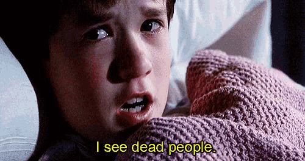
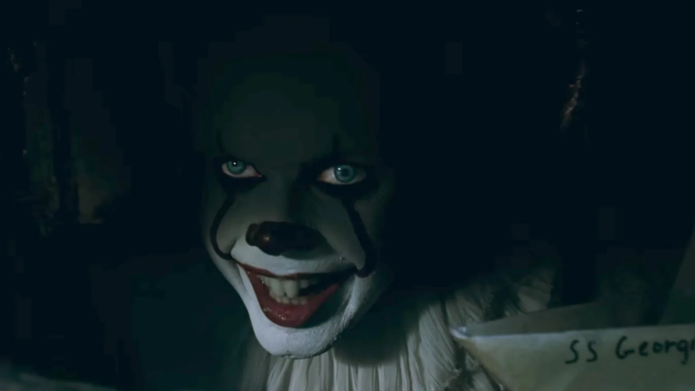

Um barulho no corredor escuro. Uma sombra que se move rápido demais. Os momentos mais arrepiantes do cinema de **terror** raramente mostram o monstro. Em vez disso, eles exploram algo muito mais profundo e universal: o medo do invisível. Filmes como _O Sexto Sentido_ e _A Bruxa de Blair_ são mestres em provar que aquilo que não vemos é infinitamente mais assustador.

Essa tática funciona porque dialoga diretamente com a nossa psicologia. Quando nosso cérebro não tem uma resposta visual para uma ameaça, ele preenche as lacunas com nossos piores medos, transformando nossa própria imaginação no verdadeiro vilão. É um truque que explora a ansiedade primitiva do medo do desconhecido e nos deixa vulneráveis.

Vamos mergulhar na **filosofia** por trás do **medo do invisível**. Analisaremos como grandes diretores usam o suspense para nos manipular, a conexão desse medo com o nosso folclore e por que essa sensação nos diz tanto sobre nós mesmos.

## O Medo do Invisível é Parte da Natureza Humana

Sentir medo do que não se vê não é apenas uma tática de cinema; é uma reação natural do cérebro humano ao desconhecido. Quantas vezes você já ficou com receio ao ouvir um barulho estranho em casa à noite? Mesmo sem ver nada, sua mente começa a imaginar mil coisas: “Será um ladrão? Um espírito? Um alienígena?”

Esse tipo de reação é algo **natural do ser humano**. Nosso cérebro é treinado para identificar perigos mas, quando não consegue ver ou entender o que está acontecendo, ele preenche as lacunas com imaginação. E, convenhamos, nossa imaginação é muito mais criativa (e assustadora) do que qualquer monstro de CGI por aí.

### O exemplo de O Sexto Sentido

Quem assistiu **O Sexto Sentido** provavelmente nunca esqueceu da famosa frase: “Eu vejo gente morta”. Mas o que torna esse filme tão perturbador não é só a revelação final ou os sustos. É a **ambiguidade** e o clima de tensão constante. O espectador nunca sabe quando algo vai acontecer e às vezes, nada acontece mesmo. Mas o medo já se instalou, porque o invisível está sempre ali, à espreita.

## Suspense vs. Susto: O Poder de Não Mostrar o Monstro

Os melhores filmes de terror entendem que o medo do desconhecido é mais eficaz do que mostrar o monstro logo de cara. Pense quantos filmes perderam o impacto quando revelaram a criatura na metade da história? O que antes era assustador vira algo meio bobo, como um bonecão de borracha mal feito.

Diretores como [Alfred Hitchcock](https://pt.wikipedia.org/wiki/Alfred_Hitchcock) sabiam disso há décadas. Em Os Pássaros (1963), a tensão é criada muito mais pelo que **não nos é explicado** do que pelas aves em si. Por que os pássaros estão atacando? Por que agora? Não saber a resposta deixa tudo ainda pior porque nossa mente busca sentido, e quando não encontra, ela cria as piores possibilidades.

**+ Leia mais:** [Lições de coragem de Lorraine Warren para superar o medo](/o-aprendizado-com-lorraine-warren/)

### O mistério é combustível do medo

Você já ouviu falar da “[teoria da incompletude](https://pt.wikipedia.org/wiki/Teoremas_da_incompletude_de_G%C3%B6del)”? A ideia é simples: nosso cérebro odeia quando falta uma peça no quebra-cabeça. Isso vale tanto para um filme quanto para uma conversa. E quando faltam informações, começamos a preencher os espaços com base nas nossas próprias vivências, medos e traumas.

*   **É por isso que cada pessoa pode ter medo de uma cena diferente.**
*   **É o nosso medo pessoal que toma conta da narrativa.**

É como brincar de esconde-esconde numa floresta. Você não vê ninguém, mas sente que algo está por perto. A ansiedade vai crescendo, porque você **sabe** que algo está lá, mesmo sem ver. E quando menos espera... nada acontece. Mas o coração já está acelerado.

## A Raiz Filosófica: O Medo do Desconhecido

Do ponto de vista filosófico, o invisível representa o desconhecido. E o desconhecido sempre foi motivo de inquietação para nós. Desde os tempos antigos, as pessoas tentam entender os fenômenos ao seu redor: relâmpagos, eclipses, doenças... Tudo precisava de uma explicação.

Quando não há explicação, surge o medo e muitas culturas começaram a criar mitos, lendas, seres sobrenaturais para preencher esse vazio. Pegando nossa  cultura local, temos vários exemplos clássicos:

*   **A Cuca**, que vem pegar as crianças que não dormem;
*   **O Saci**, que se esconde e apronta travessuras;
*   **O Corpo Seco**, um espírito assustador que ninguém viu, mas todo mundo teme.

Essas figuras do nosso folclore mexem com o mesmo medo que os filmes de terror modernos exploram: o de **não saber o que está lá fora**. Às vezes, o monstro nem está presente, mas o medo da sua existência já é o suficiente para mexer com nossa cabeça.

## Técnicas do Cinema Para Explorar o Medo do Invisível

Diretores de sucesso usam diversas técnicas, como sons ambientes e câmera subjetiva, para amplificar o medo do invisível no espectador. Veja alguns exemplos:

*   **A Bruxa de Blair:** o que mais assusta aqui é o que a gente **não vê**. A câmera tremida, os barulhos estranhos, a tensão crescente...
*   **O Enigma de Outro Mundo:** o “monstro” pode estar em qualquer um, mas ninguém sabe ao certo. O medo está no ambiente, nas expressões desconfiadas.
*   **Hereditário:** as presenças invisíveis, os cochichos, e aquele clima perturbador constante são muito mais eficazes do que qualquer cena gráfica.

Esses filmes brincam com a nossa expectativa, e fazem a gente esperar por algo. Às vezes, o que assusta mais é justamente o silêncio. Um corredor escuro, um passo na madeira... e nada acontece. Mas você ficou tenso, não ficou?

## Do Cinema à Vida Real: Nossos Medos Invisíveis

Além do **terror** no cinema, o medo do invisível se manifesta em nossas vidas através de ansiedades sobre o futuro e preocupações que não têm forma. Quantas vezes você já ficou preocupado com algo que **poderia acontecer**, mas não aconteceu? O medo do futuro, da solidão, da rejeição... são medos reais, mas muitas vezes não têm forma. São invisíveis, mas ocupam um espaço enorme em nossas emoções.

Esse paralelo ajuda a entender por que amamos (e tememos) narrativas que tratam o invisível com respeito. Elas falam com nossos medos mais humanos. Não é à toa que tanta gente se vê nos personagens desses filmes, mesmo sem ter passado por nada sobrenatural.

## O Terror Como um Espelho da Mente

O invisível nos obriga a encarar o desconhecido dentro de nós. Aquilo que escondemos, que evitamos pensar, que tememos confrontar. O terror psicológico especialmente aquele baseado em mistério e clima funciona como um espelho. Quanto menos o filme te mostra, mais você vê de si mesmo.

Da próxima vez que sentir aquele nervosismo assistindo a um suspense, lembre-se: talvez o maior medo **não esteja na tela, mas dentro da sua cabeça**. E tá tudo bem. O cinema está aí pra fazer a gente sentir mesmo que seja só aquele arrepio nas costas quando apaga a luz.

### Quer saber mais?

*   **“[O Medo: Uma História Cultural](https://amzn.to/4oX3m5J)”** – Joanna Bourke
*   **“[Alucinações](https://amzn.to/4nI7ci8)”** – Oliver Sacks (sobre percepção e o cérebro humano)
*   **Filmes: O Babadook, Hereditário, e O Homem Invisível (2020)**

E você, qual filme te deu aquele medo que não sai da cabeça? Conta pra gente aqui nos comentários!