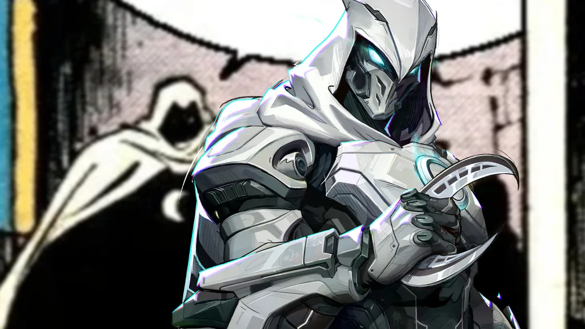

Diferente de muitos heróis da Marvel, a maior batalha do **Cavaleiro da Lua** não é contra um vilão cósmico, mas dentro de sua própria mente. A série estrelada por Oscar Isaac mergulhou de cabeça em um tema complexo e raramente explorado com tanto destaque: a saúde mental, especificamente o **Transtorno Dissociativo de Identidade (TDI)**.

A jornada de Marc Spector e Steven Grant para entenderem um ao outro e lidarem com um trauma profundo gerou debates importantes. A série conseguiu humanizar um transtorno estigmatizado, mas também flertou com estereótipos que associam condições mentais à violência. Isso nos leva a perguntar: quais são as verdadeiras **lições sobre saúde mental** que podemos tirar do **Cavaleiro da Lua**?

Neste artigo, vamos analisar a representação do **TDI** na série. Exploraremos os acertos da Marvel ao abordar o trauma, as críticas sobre a romantização da violência e por que a forma como a ficção retrata a **saúde mental** importa tanto.

## O Que é o Transtorno Dissociativo de Identidade (TDI)?

Para entender o Cavaleiro da Lua, primeiro precisamos saber o que é o Transtorno Dissociativo de Identidade (TDI), uma condição mental complexa. O TDI é uma condição em que uma pessoa possui duas ou mais identidades ou "personalidades" distintas, que assumem o controle do comportamento em momentos diferentes. Essas identidades podem ter **nomes, vozes, memórias e até gestos únicos**.

Muitas vezes, esse transtorno está ligado a traumas na infância. É como se a mente, como um mecanismo de proteção, criasse essas “versões alternativas” para lidar com situações insuportáveis. Parece coisa de filme, né? Mas é uma realidade para algumas pessoas.

## A Representação do TDI no Cavaleiro da Lua

Na série, conhecemos Marc Spector e Steven Grant duas identidades que coexistem no mesmo corpo. A forma como elas se relacionam, brigam entre si e descobrem sua existência ao longo da série é, sem dúvida, uma das partes mais marcantes da trama.

Steven, tímido e educado, é o completo oposto de Marc, um mercenário confiante e impulsivo. Aos poucos, a série vai revelando que essas personalidades são o reflexo direto de um **trauma muito forte do passado** algo que está fundamentado na literatura psiquiátrica sobre TDI. Ou seja, não é só invenção de roteiro, tem base real.

### Os Acertos: Humanizando a Saúde Mental

A série Cavaleiro da Lua acerta ao conectar o TDI a um histórico de trauma, humanizando a condição e promovendo a empatia. Como:

*   **Sensibiliza o público**: A série traz à tona uma condição pouco conhecida, fazendo muita gente pesquisar mais sobre o transtorno.
*   **Aprofundamento emocional**: Ao mostrar as dores e conflitos internos das personalidades, a trama humaniza o personagem, indo além do “herói psicológico alterado”.
*   **Mostra o lado traumático**: A origem do transtorno está conectada a momentos difíceis da infância, dando um contexto realista à dissociação.

Além disso, Oscar Isaac dá um show de atuação ao alternar entre Marc e Steven. A forma como ele muda o olhar, postura e até o sotaque é impressionante. Dá pra sentir que estamos vendo duas pessoas diferentes!

### As Críticas: O Risco de Estereótipos

Apesar do esforço da Marvel, a representação do TDI em Cavaleiro da Lua também levanta críticas e dúvidas importantes.

Historicamente, a ficção costuma associar transtornos mentais a comportamentos violentos ou imprevisíveis e isso pode reforçar estereótipos perigosos. Infelizmente, em algumas cenas, o Cavaleiro da Lua caminha por essa linha tênue.

Por exemplo, quando as personalidades entram em conflito ou quando uma assume o total controle em momentos de luta, pode parecer que pessoas com TDI representam perigo para os outros. E isso não é verdade. A maioria das pessoas com transtornos mentais é mais vulnerável à violência do que propensa a cometê-la.

**+ Leia mais:** [A neurodiversidade em Wandinha: por que nos identificamos com o estranho?](/a-neurodiversidade-em-wandinha-por-que-nos-identificamos-com-o-estranho/)

## Por que a Representação da Saúde Mental na Mídia é Importante?

Produções com o alcance do Cavaleiro da Lua têm um grande impacto na percepção pública sobre saúde mental, por isso a responsabilidade é enorme. Quando uma produção atinge milhões de pessoas, ela tem o poder de informar… ou desinformar.

Por isso, temas como **saúde mental** precisam ser tratados com cuidado, responsabilidade e empatia. Isso não significa que não podemos falar deles na ficção pelo contrário! Mas é importante trazer equilíbrio e colaborar com a desconstrução do preconceito.

E aqui vai uma provocação: imagine se mais heróis fossem mostrados lidando com suas questões emocionais e, mesmo assim, encontrando caminhos para superá-las. Isso não seria ainda mais inspirador?

## O impacto para quem vive com TDI

Para quem convive com o transtorno, ver uma representação como a do Cavaleiro da Lua pode ser um misto de sentimentos. De um lado, pode haver orgulho de ver algo tão pessoal ganhando visibilidade. Do outro, existe o medo do julgamento e da incompreensão.

É fundamental lembrar que cada caso é único. Nem toda pessoa com TDI vai ter múltiplas identidades com sotaques diferentes ou habilidades especiais. E, principalmente, não são todas violentas ou incontroláveis como muitas vezes o entretenimento sugere.

## As Lições que o Cavaleiro da Lua nos Deixa

Assistir Cavaleiro da Lua pode ser mais do que entretenimento. Pode ser um ponto de partida para conversas necessárias sobre saúde mental, trauma, empatia e aceitação.

A série nos ensina que **ninguém é definido apenas pelo que carrega**. Somos feitos de histórias, dores, escolhas e, sim, também de superações. Ver um "herói quebrado" é o reflexo perfeito de que todos temos nossas batalhas internas, e tudo bem não estarmos sempre bem.

O Cavaleiro da Lua deu um passo importante ao abordar o transtorno dissociativo de identidade numa grande produção. Ainda que não seja uma representação 100% perfeita, trouxe o tema pra roda e incentivou reflexões urgentes sobre saúde mental na cultura pop.

Que mais séries e filmes sigam esse caminho, com doses de entretenimento, sim, mas também com compromisso e respeito. E que nós, como espectadores, saibamos olhar além da ficção, entendendo que, na vida real, saúde mental é coisa séria e precisa de atenção, empatia e informação.

E aí, o que você achou da representação do transtorno em Cavaleiro da Lua? Vamos continuar esse papo nos comentários!