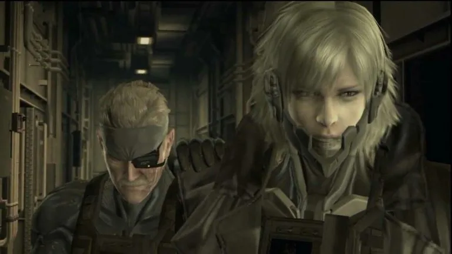
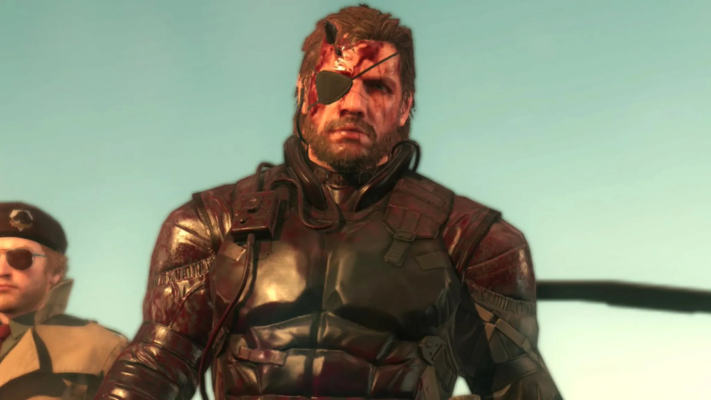

Quando se fala em Metal Gear, muita gente pensa imediatamente em espionagem, soldados armados até os dentes e longas missões furtivas. Mas reduzir a saga criada por Hideo Kojima apenas a um jogo sobre guerra é ignorar camadas profundas de crítica social, política e filosófica. Desde seus primeiros títulos, Metal Gear usa o conflito armado como pano de fundo para discutir poder, controle e o papel do indivíduo dentro de sistemas opressores.

Em um mundo onde guerras são transmitidas ao vivo, informações são manipuladas e narrativas moldam heróis e vilões, Metal Gear soa assustadoramente atual. A franquia antecipa debates modernos sobre fake news, militarização, perda de identidade e livre-arbítrio. Jogar Metal Gear hoje é quase como assistir a uma análise crítica da sociedade disfarçada de videogame.

Ao longo deste artigo, vamos mostrar por que Metal Gear não é só sobre guerra, explorando temas como o soldado como peça descartável, a guerra como negócio, o controle da informação e as questões de identidade presentes na saga. Também vamos entender por que esses assuntos continuam relevantes e como a franquia se tornou uma das obras mais filosóficas da história dos videogames. Preparado?

## O soldado como peça descartável em Metal Gear

Em Metal Gear, o soldado é frequentemente retratado como uma ferramenta usada por sistemas de poder. Desde o primeiro jogo com o **Solid Snake**, vemos como os personagens militares são usados como ferramentas em favor de interesses maiores e nem sempre nobres. 

No universo de Metal Gear, o soldado é alguém treinado e moldado para seguir ordens, quase como uma engrenagem de uma máquina. Mas e quando essa máquina funciona em favor de elites que manipulam os destinos do mundo? Aí mora a crítica poderosa do jogo. 

Solid Snake, Raiden e Big Boss vivem conflitos internos, muitas vezes questionando: _“Por que estamos lutando? Para quem?”_ Essas dúvidas mostram que os protagonistas têm consciência, mesmo sendo parte de um sistema que prefere a obediência ao questionamento. Se pararmos pra pensar, esse é um espelho da vida real. Quantos jovens são enviados para guerras em nome da “paz” ou da “segurança nacional”, sem saber exatamente o que está em jogo?

## Metal Gear e a guerra como indústria lucrativa

A saga Metal Gear apresenta a guerra não como necessidade, mas como um modelo de negócio altamente rentável. Em **Metal Gear Solid 4**, por exemplo, o mundo vive em um estado de guerra constante. Isso não acontece porque há inimigos reais em todo canto, mas porque a guerra virou um excelente modelo de negócio. 

Empresas privadas armam, oferecem exércitos e lucram com contratos milionários. Ou seja, quando a paz chega, o lucro acaba. Triste, né? Esse tema é tão atual que dá até arrepio. Basta ligar o noticiário pra ver como existem interesses por trás de muitos conflitos mundo afora. E aí, mais uma vez, Kojima nos convida a refletir: será que o mundo realmente quer a paz?

**+ Leia mais:** [Como aplicar o modo stealth dos games na vida real](/como-aplicar-o-modo-stealth-dos-games-na-vida-real/)

## Controle da informação em Metal Gear: quem decide o que é verdade?

Em um mundo onde fake news se espalham mais rápido que fofoca de condomínio, Metal Gear levanta uma pergunta essencial: **quem controla a informação?** Em **Metal Gear Solid 2: Sons of Liberty**, somos apresentados aos Patriots, um grupo secreto que manipula dados e filtra o que a população pode ou não saber. Lembra alguma coisa? Redes sociais, perhaps? Essa parte da história é simplesmente genial. O jogo foi lançado em 2001, muito antes de debates sérios sobre desinformação surgirem com força. 

Kojima já mostrava que informação é poder e que, se poucos controlam o fluxo de dados, a sociedade perde o direito de decidir com base na verdade. Um exemplo interessante é quando Raiden descobre que muitas de suas memórias são manipuladas. Ele não sabe em quem confiar e isso é uma crítica direta ao nosso consumo de informação. Afinal, você confia em tudo que lê por aí?

## Identidade e livre-arbítrio na narrativa de Metal Gear

Além dos temas políticos, a saga também mergulha em reflexões filosóficas. Um dos assuntos mais interessantes é o **conflito entre destino e escolha**. Big Boss, por exemplo, não queria ser o vilão. Ele foi moldado pelos traumas da guerra e pelas manipulações que sofreu. Ele é fruto de um mundo em que ser herói ou vilão depende mais da narrativa contada do que das ações. 

E o Solid Snake? Ele é um clone, criado para ser uma arma. Desde o seu nascimento, sua vida foi planejada. Mesmo assim, ele tenta se libertar e seguir seu próprio caminho. A mensagem é clara: mesmo quando tudo parece decidido, ainda é possível escolher. Esse papo pode parecer filosófico demais, mas, na prática, todo mundo já passou por isso. Quantas vezes você já sentiu que estava fazendo algo só porque era esperado de você? A saga nos lembra que a liberdade não é simples, mas é essencial.

## Por que os temas de Metal Gear ainda são tão relevantes?

Metal Gear não é apenas um jogo de ação stealth com uma trama maluca. Ele é uma obra que mistura **game design e crítica social** de um jeito que poucos jogos conseguem. E se você só jogou pensando nas batalhas e nos chefões estilosos, tudo bem. Mas talvez esteja na hora de voltar e ver com outros olhos. Com mais calma, mais escuta ou até mesmo com menos pressa, como quando você reassiste um filme antigo e percebe coisas novas. 

Esses temas guerra, manipulação de dados, identidade são mais atuais do que nunca. Em tempos onde tudo é rápido e a desinformação é moeda corrente, refletir sobre o que consumimos, em quem confiamos e por que lutamos, é um exercício essencial.

A saga é um convite para pensar, sentir e, por que não, questionar o mundo onde vivemos. E aí, qual jogo da série é o seu favorito? Já tinha parado pra pensar em tudo isso enquanto jogava? Se ainda não conhece, vale a pena dar uma chance. Afinal, às vezes, os maiores ensinamentos estão escondidos... _atrás de uma caixa de papelão_.

### Quer saber mais?

*   **Documentário "Hideo Kojima: Connecting Worlds"** – Uma ótima introdução ao pensamento do criador de Metal Gear.
*   **Podcast "Jogabilidade"** – Episódios especiais sobre as tramas complexas de Metal Gear.

Curtiu o conteúdo? Compartilha com aquele amigo apaixonado por jogos e conspirações. Até a próxima!