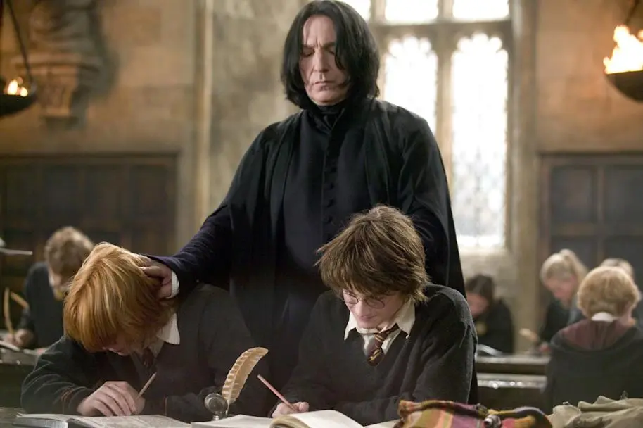
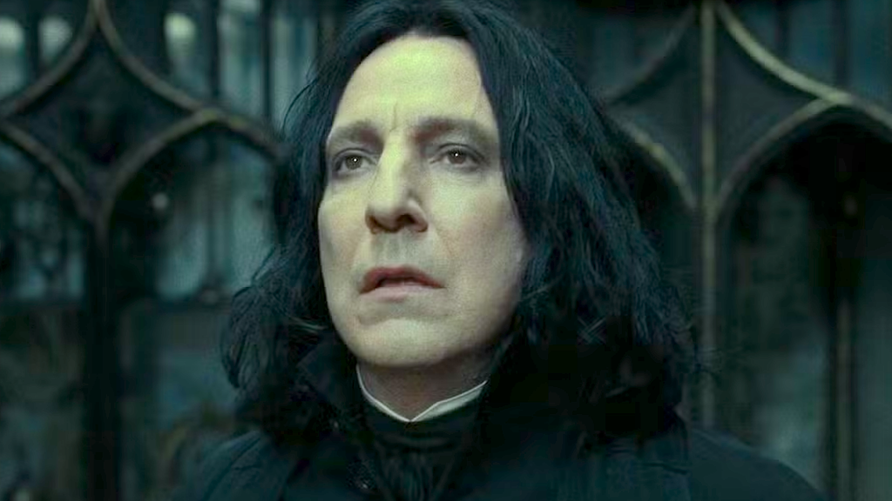

Entre todos os personagens do universo de **Harry Potter**, poucos causam tanta discussão quanto **Severo Snape**. Alguns o veem como um herói trágico, outros o enxergam como um vilão frio ou até como um mártir silencioso. Mas afinal, Snape era mesmo um herói disfarçado, ou suas ações revelam algo mais complexo?

## Quem é Severo Snape?

Snape é um dos personagens mais enigmáticos de **Harry Potter**. Professor de Poções (e depois de Defesa Contra as Artes das Trevas), ele sempre teve um comportamento distante, às vezes cruel, especialmente com Harry e seus amigos. Mas, ao longo da história, seu passado vai sendo revelado, o que muda completamente a forma como o enxergamos.

Se pensarmos somente pelas aparências, Snape parece ser um vilão clássico: cara fechada, roupas escuras, comportamento ríspido. Mas quem disse que dá pra julgar um livro pela capa?

## O agente duplo que enganou Voldemort

Vamos começar pelo lado heróico. Dumbledore confiava profundamente em Snape. E isso não era coincidência. O professor se tornou um **agente duplo**, fingindo lealdade a Voldemort enquanto, na verdade, trabalhava para protegê-lo.

O mais impressionante é que Snape manteve esse papel **por anos**, mesmo sabendo que viveria sob suspeita e sem reconhecimento. Quando descobrimos que ele vigiava Harry por amor à mãe do garoto, **Lílian Potter**, seu antigo amor, somos levados a vê-lo sob uma nova luz.

Talvez o maior gesto de heroísmo de Snape tenha sido esse: proteger o filho da mulher que amava, mesmo odiando o pai dele. Difícil, né?

Mas será que isso basta pra torná-lo um herói? A resposta não é tão simples. Ele fez muitas escolhas duvidosas, tratou alunos com crueldade e **não era exatamente um exemplo de gentileza**. Então, vamos explorar os outros lados dessa moeda.

**+ Leia mais::** [Snape é herói, vilão ou mártir?](https://nerdatico.com.br/snape-e-heroi-vilao-ou-martir/)

## O professor cruel e rancoroso

Quem não se lembra das aulas de Poções? A forma como Snape humilhava Harry, Neville e outros alunos não era apenas rigor era crueldade manifesta.

Mesmo que ele estivesse fingindo diante dos Comensais da Morte, certas atitudes pareciam reais demais. Ele foi **parcial**, **severo além da conta** e **vingativo**, principalmente quando se tratava de filhos de seus "inimigos" da época escolar, como Tiago Potter.

E vamos combinar: se Snape realmente se importava com Harry, como ele permitiu que o menino sofresse tanto? O amor por Lílian não poderia ter gerado mais empatia?

Snape carregou mágoas da adolescência por décadas. É como aquele colega que guarda ressentimento desde o colégio e revive essas tretas para sempre. A diferença é que ele tinha uma varinha nas mãos e manipulava poções perigosas...

## O sacrifício em nome de um ideal

E se a gente olhar por outro ângulo? Um **mártir** é alguém que sofre ou morre por uma causa, mesmo sem ser reconhecido.

Snape trabalhou nas sombras, odiado por muitos, sem esperar aplausos ou glória. Ele sabia dos riscos e, mesmo assim, aceitou a missão de proteger Harry até o fim. Isso sem contar o momento em que ele próprio arma, junto com Dumbledore, o plano de fingir sua lealdade matando o próprio diretor. Sim, matar Dumbledore foi parte de um acordo prévio. Quantas pessoas estariam dispostas a pagar esse preço?

No fim, ele morreu sozinho. Snape teve uma das mortes mais tristes da saga. Seu legado só foi revelado após sua morte, quando Harry mergulhou nas memórias dele. Aquela famosa frase: **“Always”** (“Sempre”) dita quando Snape revela que nunca deixou de amar Lílian é de arrancar lágrimas até do mais durão.

## Entre o bem e o mal

Snape personifica uma das questões filosóficas mais antigas: **as ações boas justificam atitudes ruins?** Ou, como diria Maquiavel: os fins justificam os meios?

Alguns diriam que sim. Outros, que ele se redimiu no final. Mas há quem não perdoe o comportamento abusivo, mesmo que motivado por algo maior.

O filósofo Friedrich Nietzsche acreditava que o ser humano é cheio de contradições, e que é nesses conflitos internos que crescemos. Snape é o exemplo perfeito disso. Ele é complexo, imperfeito, movido por amor e ódio ao mesmo tempo.

## Snape é herói, vilão ou mártir?

A resposta mais honesta? **Ele é os três**. E talvez seja por isso que gostamos tanto dele ele nos lembra que ninguém é 100% bom ou mau.

No fundo, Snape é humano. Cheio de falhas, mas também capaz de gestos grandiosos. Amargurado, mas leal. Frio, mas apaixonado. Ele é a prova de que a jornada importa tanto quanto o destino.

Não é à toa que Harry, ao batizar o filho, escolhe o nome **Albus Severo Potter** e diz: “Você carrega o nome de dois diretores de Hogwarts. Um deles era da Sonserina e foi, provavelmente, o homem mais corajoso que eu já conheci.”

Se formos sinceros, todos temos um pouco de Snape dentro da gente lutamos contra nossos medos, magoados pelo passado, tentando fazer a coisa certa, mesmo que nem sempre acertemos.

No final das contas, Snape nos ensina que coragem não é sempre vestir a capa de herói, mas sim continuar lutando, mesmo quando ninguém aplaude.

E você? Qual a sua opinião sobre o Snape? Herói, vilão ou mártir? Compartilha com a gente aqui nos comentários!