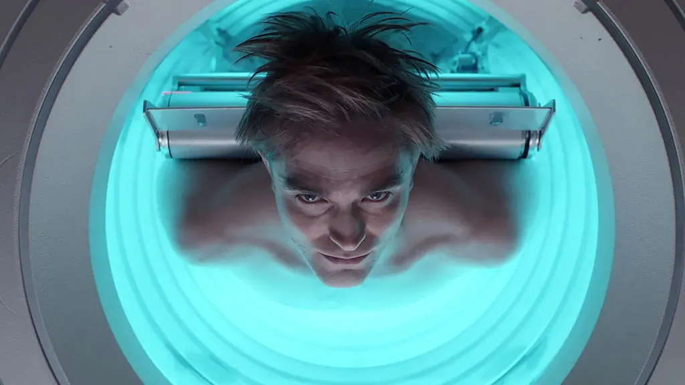

Você já parou pra pensar se sua vida poderia ser substituída como quem troca uma peça com defeito? Parece absurdo, né? Mas essa é justamente a provocação de **Mickey 17**, uma ficção científica que nos coloca de frente com uma ideia desconcertante: e se aceitássemos morrer... e sermos substituídos? No universo de Mickey 17, o protagonista é parte de um programa em que a pessoa morre e é clonada com lembranças e tudo! Voltando ao trabalho como se nada tivesse acontecido. A missão? Explorar planetas inóspitos, onde as chances de sobrevivência são mínimas. Ou seja, ele é considerado **dispensável**. Se algo der errado, tudo bem: é só criar outro. Mas calma, essa ideia de descartabilidade não está só na ficção hollywoodiana. Muitos **jogos de videogame** já exploraram esse conceito de forma criativa às vezes de forma mais sutil, às vezes escancarada.

## A morte como mecânica

Nosso mundo gamer está repleto de experiências que vão além de apertar botões. Alguns jogos nos fazem refletir sobre coisas profundas, como **identidade**, **propósito** e sim a **ética de ser descartável**. Aqui vão alguns exemplos pra brincar com sua cabeça:

### **Death Stranding: você carrega algo maior que você mesmo**

No jogo de Hideo Kojima, você é Sam Porter Bridges, um entregador num mundo pós-apocalíptico, solitário e destruído. Apesar de parecer mais um "simulador de carregar caixas" à primeira vista, o jogo narra o peso de cada vida e de cada conexão. A morte aqui tem consequências físicas e sociais, afetando o ambiente e a narrativa. E quando você morre... seu corpo vira uma bomba. Literalmente. Não dá pra ser substituído. Cada um é único. Mas dá pra sentir o contraste: em Mickey 17, morrer faz parte do cronograma. Já em Death Stranding, morrer tem um impacto devastador.

### **NieR: Automata – Robôs com alma?**

Imagine que você é um androide que enfrenta máquinas para proteger a humanidade... que já nem existe mais. Parece absurdo? Pois é. **NieR: Automata** vira sua cabeça do avesso. Os androides morrem, mas suas memórias são transferidas entre unidades. Há uma leveza na morte como apagar e reinstalar um software. Mas aos poucos, o jogo vai questionando: se as lembranças ficam, será que você ainda é o “mesmo” de antes? Mais do que isso, o jogo faz você se apegar aos personagens, entender suas emoções, seus traumas e desejos. Mesmo sendo robôs, são mais "humanos" que muita gente do mundo real. E aí vem a pergunta: se uma cópia de você existe, ela é **você**? Ou uma versão superficial?

### **Returnal: morrer para evoluir**

Em **Returnal**, você é a piloto Selene, presa num ciclo tenso de morte e recomeço num planeta alienígena. Cada vez que morre, o mundo muda mas você lembra de tudo. A mecânica do jogo gira em torno de morrer para avançar. Doloroso? Sim. Necessário? Também. Esse looping nos faz questionar: até onde vai nossa perseverança? Em um mundo onde falhar é inevitável, será que aceitar a morte como parte do progresso é uma evolução... ou resignação?

**+ Leia mais::** [Como criar um código de ética para seres imortais?](https://nerdatico.com.br/como-criar-um-codigo-de-etica-para-seres-imortais/)

## A vida real precisa de clones?

É aí que o papo esquenta. Claro que não temos estações para clonar gente ainda. Mas a pergunta continua válida: em um mundo que parece nos empurrar para a produtividade sem parar, será que, de certa forma, também não estamos sendo tratados como “dispensáveis”? Nas empresas, nas redes sociais, nas notícias que só duram 24 horas... parece que há sempre alguém novo pronto pra ocupar seu lugar. E você, como se sente nisso tudo?

## Somos mais do que peças substituíveis

A ficção científica serve justamente pra isso: criar paralelos com o nosso mundo e cutucar aquelas feridas que a gente prefere esconder. Mickey 17 é uma metáfora poderosa sobre **autoestima, identidade e propósito**. Ele nos obriga a pensar: se você fosse clonado a cada vez que morresse, o que realmente faria de você... você? Nos jogos, normalmente controlamos personagens que têm múltiplas vidas. Mas parar pra refletir sobre isso é um exercício intrigante. Se os games são espelhos da sociedade, será que estamos mesmo tão distantes de um mundo onde as pessoas se tornam apenas mais um número?

## **O valor da unicidade**

É importante lembrar: cada vida tem valor único. Não existe “você versão 2.0” com os mesmos traumas, aprendizados e histórias. Mesmo que a tecnologia avance e seja possível copiar nossos corpos ou mentes, a experiência humana é **irreproduzível**. Somos resultado de momentos, relações e escolhas que se acumulam ao longo do tempo. Além disso, o perigo de aceitar a lógica da descartabilidade está em nos afastar da empatia. Quando passamos a ver o outro como "substituível", corremos o risco de desumanizar as diferenças e perder o que há de mais precioso em viver: a conexão sincera com o outro.

Você pode até estar se perguntando: “Ok, mas o que isso tem a ver comigo, que só quero jogar e curtir um bom sci-fi?” Bom, além de serem ótimos temas pras conversas com amigos geeks, essas questões nos ajudam a:

*   **Refletir sobre nosso papel na sociedade**
*   **Pensar nas decisões que tomamos no trabalho, nos relacionamentos e até no mundo digital**
*   **Valorizar a individualidade (nossa e do outro)**

Assim, um simples jogo ou filme de ficção se transforma numa jornada interna, onde talvez a pergunta mais importante não seja se você aceitaria viver como um dispensável, mas sim: **o que faz você ser insubstituível?**

## Ainda bem que só tem um de você

Seja controlando androides, viajando em loops temporais ou assistindo clones enfrentarem dilemas éticos em planetas distantes, a reflexão continua válida: **Quem somos nós quando a morte deixa de ser o fim?** Num mundo cada vez mais automatizado, lembrar que somos únicos pode ser o verdadeiro ato de resistência. Se a ficção tenta nos convencer que a troca de corpos é algo natural, cabe a nós reforçar que a conexão humana, os sentimentos e nossa trajetória pessoal... não têm cópia. Nem backup. E isso é incrível.

E você, toparia viver como um dispensável... ou prefere ser insubstituível em sua própria jornada? Conta pra gente nos comentários! 👇