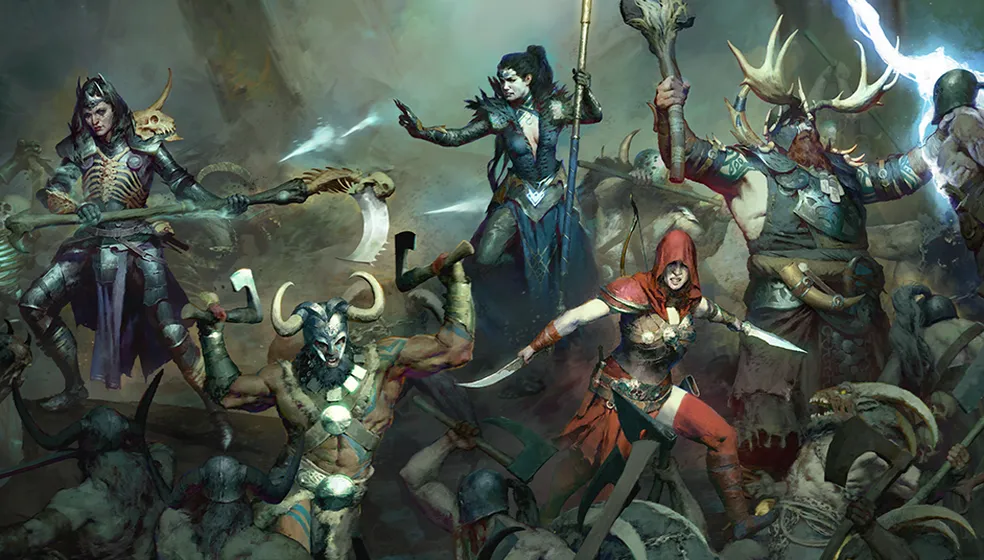

E se você pudesse transformar sua carreira profissional em um RPG épico, onde cada projeto completado te dá pontos de experiência e cada habilidade nova desbloqueada te aproxima da próxima promoção? O conceito de gamificação no trabalho não é apenas uma tendência moderna, é uma estratégia de desenvolvimento profissional que torna o crescimento na carreira mais tangível, motivador e, convenhamos, muito mais divertido do que aquele plano de carreira tradicional empoeirado (sim, estou falando do PDI).

Pensa comigo: em jogos como Final Fantasy, The Witcher ou até Stardew Valley, você vê claramente seu progresso: barra de experiência subindo, novas habilidades sendo desbloqueadas, chefões sendo derrotados. Agora compare com sua vida profissional: quantas vezes você já se sentiu trabalhando duro sem saber exatamente onde está ou quanto falta para "subir de nível"? É frustrante, né? Mas não precisa ser assim, não mais.

Neste guia completo sobre sistema de level up no trabalho, você vai aprender a aplicar mecânicas de RPG para impulsionar sua carreira de forma estratégica e mensurável. Vamos explorar desde como criar sua "ficha de personagem profissional" até estratégias práticas de gamificação que transformam entregas chatas em missões empolgantes e desafios impossíveis em bosses derrotáveis. Bora fazer seu upgrade de carreira!

## Por que pensar sua carreira como um jogo?

Vamos ser sinceros: acompanhar o ritmo de crescimento no trabalho pode ser frustrante. Às vezes, parece que você dá tudo de si e ainda assim não vê resultados. Mas se você aplicar elementos dos jogos ao seu desenvolvimento, tudo fica mais claro e mais divertido também!

**Nos games, seu progresso é visível:** você ganha EXP ao completar missões, desbloqueia novas habilidades, acessa áreas mais difíceis e, claro, fica mais forte. O mesmo pode acontecer com sua vida profissional, desde que você saiba como "medir" seu próprio progresso.

### O que é o sistema de level up na prática?

Basicamente, é uma forma de enxergar sua carreira como uma jornada com metas claras, experiências acumuladas e desenvolvimento contínuo. Veja abaixo como funciona essa ideia:

*   **Missões = Projetos e entregas importantes**
*   **Experiência = Conhecimentos adquiridos e feedbacks**
*   **Habilidades = Cursos, formações e competências técnicas ou comportamentais**
*   **Mentorias e alianças = Recursos que impulsionam sua jornada**
*   **Bosses = Grandes desafios ou obstáculos no trabalho**

Não é incrível como esse paralelo faz sentido? Com isso em mente, vamos aprender como transformar sua carreira em um verdadeiro RPG.

## 1. Crie seu personagem (autoavaliação)

Todo bom jogo começa com a criação do personagem. No mundo real, isso significa fazer uma autoanálise sincera. Quais são suas habilidades principais? Em que você se destaca? O que ainda precisa melhorar? Identificar suas competências técnicas e soft skills atuais é como criar a ficha do personagem antes de começar sua jornada de crescimento profissional.

Pergunte-se:

*   **Quais são minhas forças e fraquezas?**
*   **Que tipo de "classe" eu sou? Um líder estrategista? Um executor ágil?**
*   **Quais atributos quero melhorar no próximo nível? Comunicação? Visão estratégica?**

Essa etapa é fundamental para definir onde você está no seu "jogo da vida" e quais os caminhos para evoluir.

## 2. Estabeleça metas como se fossem missões

Sabe aquele prazer de completar uma missão num game e ganhar um troféu ou item especial? Isso também pode rolar na sua rotina profissional. A gamificação de objetivos profissionais funciona transformando metas abstratas em missões concretas com entregas claras e recompensas mensuráveis, exatamente como quest logs em jogos de RPG. 

Transforme seus objetivos em **mini desafios com recompensas**. Por exemplo:

*   **Objetivo:** Melhorar a comunicação em público
*   **Missão:** Fazer uma apresentação no próximo encontro da equipe
*   **Recompensa:** Reconhecimento, segurança em público e talvez um feedback positivo do gerente

Crie uma lista de missões semanais, mensais e até anuais. O importante é ter metas claras e alcançáveis.

## 3. Acumule experiência de verdade (EXP real!)

Acumular experiência profissional vai muito além de apenas cumprir horário, é sair da zona de conforto para desenvolver competências que realmente importam. Em jogos, os personagens ganham experiência ao vencer inimigos e completar missões. No mundo real, essa "EXP" pode vir de várias formas:

*   **Participar de projetos desafiadores**
*   **Assumir responsabilidades novas**
*   **Compartilhar conhecimento com colegas**
*   **Fazer cursos e ler sobre sua área**

Vale lembrar: só "marcar presença" no expediente não é o suficiente pra evoluir. Você precisa se expor a situações novas, sair da zona de conforto e aprender com erros e acertos. Cada experiência acumulada te deixa mais preparado para o próximo desafio e isso é exatamente o que te faz subir de nível.

## 4. Aprenda novas habilidades (upgrades importantes)

Todo RPG bom tem aquele momento de desbloquear uma nova habilidade que muda tudo. Quer um exemplo real? Aprender a resolver conflitos ou saber usar uma nova ferramenta da sua área pode te destacar. 

Investir em capacitação profissional através de cursos, certificações e desenvolvimento de soft skills é como desbloquear novas habilidades em um RPG, cada competência adquirida multiplica suas chances de promoção e sucesso. 

Algumas habilidades que valem o esforço:

*   **Comunicação interativa**
*   **Gestão de tempo**
*   **Negociação e liderança**
*   **Competências técnicas específicas (como programação, Excel, design, etc.)**

Você pode procurar cursos online gratuitos, vídeos no YouTube, podcasts ou mentorias internas na empresa. O importante é sempre estar em evolução.

## 5. Encontre mentores e aliados (todo herói precisa de companhia)

Nos games, é comum ter aliados que ajudam você a crescer. No mundo do trabalho, isso significa buscar mentorias, colegas que te inspiram ou até formar uma guilda, quer dizer, um grupo de apoio profissional!

Uma dica de ouro: **trabalhe seu networking**. Fazer conexões e trocar experiências com outras pessoas pode abrir caminhos que você nunca imaginou. Além disso, é sempre bom ter alguém te dando dicas ou apenas te ouvindo quando um “boss” da vida aparece. Aliados estratégicos que compartilham conhecimento, abrem portas e ajudam você a enfrentar desafios profissionais complexos.

## 6. Enfrente os bosses da vida real

Sabe aqueles momentos que parecem impossíveis? Uma entrega com prazo apertado, uma conversa difícil com o chefe, uma apresentação para a diretoria... Esses são os "chefões" do jogo da sua vida profissional.

A grande sacada é: **cada boss vencido te fortalece**. Você ganha mais confiança, visibilidade e, claro, experiência. E como em um bom game, fica mais fácil lidar com os desafios seguintes.

## 7. Mantenha um diário de progresso (sua ficha de personagem)

Que tal acompanhar sua evolução como em um jogo? Monte um "diário de jornada" onde você registra:

*   **Missões concluídas**
*   **Habilidades aprendidas**
*   **Desafios superados**
*   **Feedbacks recebidos**

Isso vai te dar clareza sobre quanto você já evoluiu e também te motiva a continuar. Além disso, é uma ótima ferramenta na hora de negociar promoções ou buscar novas oportunidades.

## Seja o protagonista da sua jornada

Enxergar sua profissão como um RPG pode transformar a forma como você se desenvolve no trabalho. Em vez de esperar pelas oportunidades, você passa a criar as suas próprias. Em vez de depender só do tempo, você usa estratégia, planejamento e esforço contínuo.

Cada dia é uma chance de ganhar EXP, desbloquear habilidades, enfrentar desafios e subir de nível. E o melhor: você é o protagonista dessa história.

**Agora, me conta:** qual será sua próxima missão?

### Quer saber mais?

*   [Harvard Business Review – Desenvolvimento de Carreira](https://hbr.org/)
*   [Coursera – Cursos para aprimorar habilidades profissionais](https://www.coursera.org/)
*   [LinkedIn Learning – Aprenda com profissionais de verdade](https://www.linkedin.com/learning/)