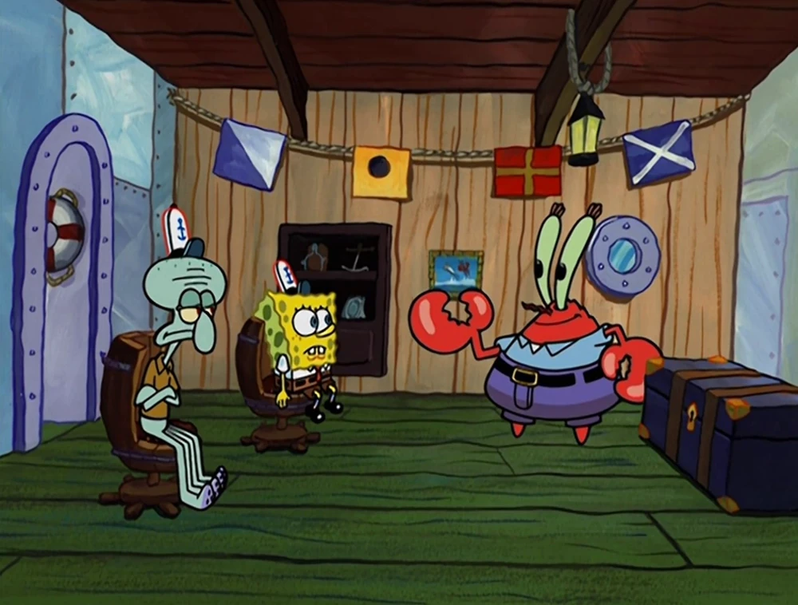
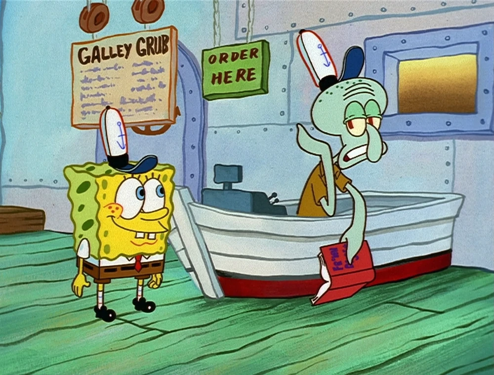
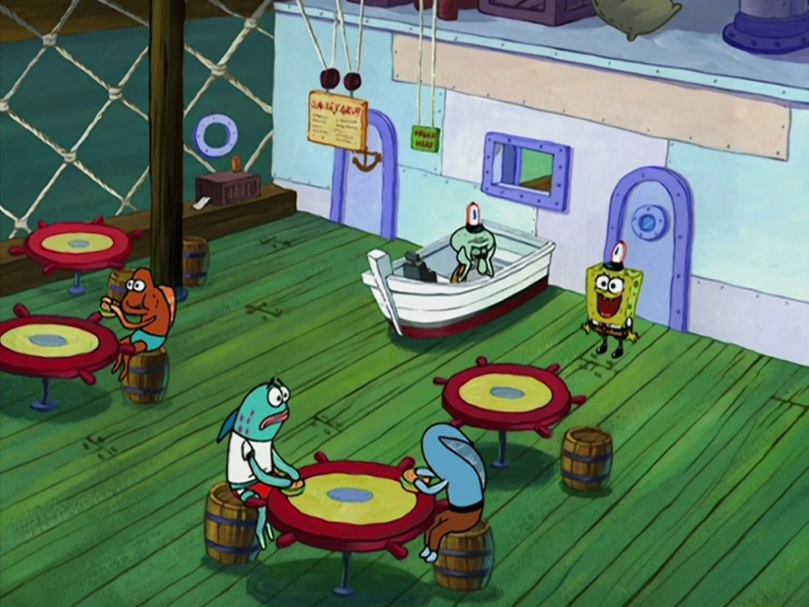
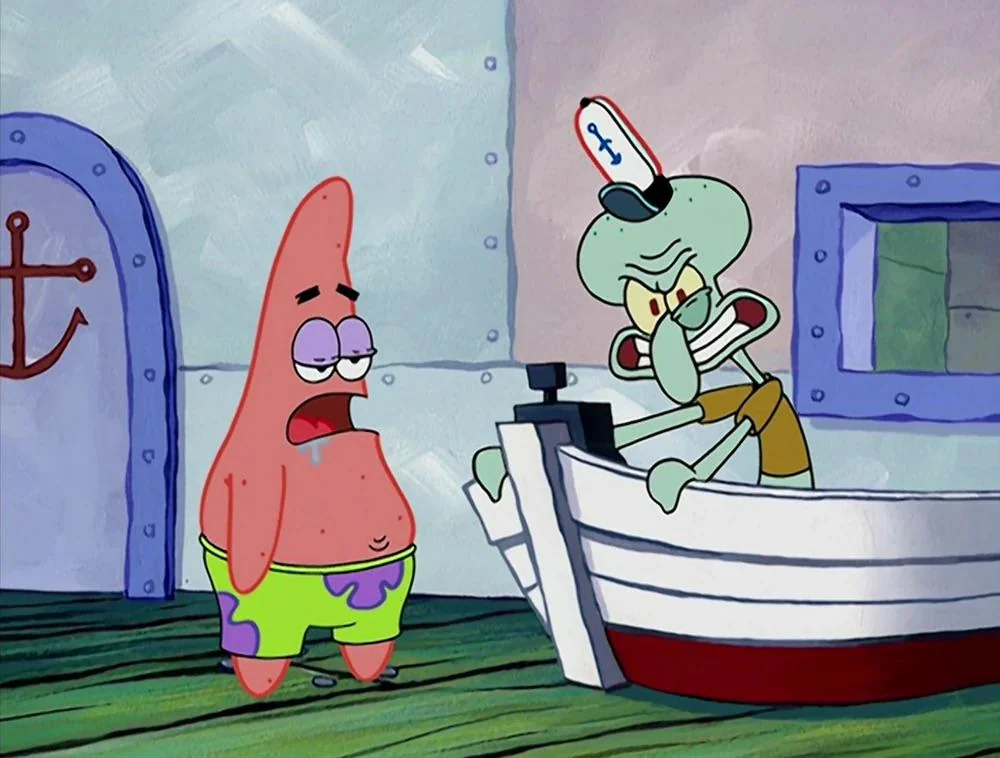

Lula Molusco é provavelmente o personagem mais realista de Bob Esponja e isso diz muito sobre a vida adulta. Diariamente, ele arrasta-se até o Siri Cascudo, detesta seu chefe Seu Sirigueijo, não suporta os colegas de trabalho e ainda assim permanece ali, preso numa rotina que claramente o sufoca. Essa situação absurda de um desenho animado reflete uma realidade dolorosa: milhões de pessoas ao redor do mundo vivem infelizes em seus empregos.

Sabe aquela sensação de acordar na segunda-feira já pensando na sexta? De olhar para o relógio a cada cinco minutos esperando o expediente acabar? Pois é, você não está sozinho jovem, você está vivendo no "modo Lula Molusco". O curioso é que, apesar da insatisfação profissional ser tão comum, poucas pessoas tomam atitudes concretas para mudar. Por que será que continuamos presos em empregos que drenam nossa energia e felicidade?

Hoje quero mergulhar no dilema existencial do Lula Molusco para entender por que tantas pessoas permanecem em trabalhos infelizes, explorando desde o medo de mudança até questões de saúde mental no trabalho. Você vai descobrir os motivos psicológicos por trás dessa armadilha, os impactos na sua vida e, principalmente, estratégias práticas para escapar dessa zona de conforto tóxica e finalmente buscar realização profissional.

## Um espelho da vida adulta

Lula Molusco pode até ser um personagem de desenho animado, mas sua rotina é absurdamente parecida com a de milhões de adultos mundo afora. Acordar cedo, pegar aquele trânsito, encarar um chefe mandão, lidar com clientes chatos, colegas irritantes e, mesmo infeliz, seguir repetindo isso dia após dia.

Se você se identificou, seja muito bem-vindo ao clube. A verdade é que **muita gente está vivendo no “modo Lula Molusco”**: trabalham por obrigação, não por prazer (confesso que não sei se isso é possível). E a pergunta que não quer calar é: **por que continuamos?**

## O medo que paralisa

Acho que uma das respostas mais comuns é simples e brutal: **medo de se arriscar**. Trocar de emprego, buscar um novo rumo profissional ou até empreender pode parecer por muitas vezes complexo e assustador. O desconhecido dá um frio na barriga. E, sinceramente, quem tem tempo ou dinheiro, para correr riscos quando os boletos não esperam?

Além disso o trabalho sempre foi associado à estabilidade, especialmente aqui no Brasil. Ter uma carteira assinada ou um emprego fixo é sinônimo de segurança para a maioria das pessoas. Mesmo que isso custe a sua saúde emocional e as vezes até física.

Será que vale a pena pagar esse preço? O Lula Molusco não parece feliz, mas ele tem um salário no final do mês. E por mais sofrido que seja, isso oferece um certo conforto. A rotina dele virou um lugar seguro. E a gente sabe como a **zona de conforto** pode prender a gente, mesmo quando ela não é confortável de verdade.

## A cultura do conformismo

No fundo acredito que existe uma ideia que foi sendo enraizada com o tempo: **trabalho não é lugar de felicidade, é obrigação**. Quem nunca ouviu aquele famoso “É trabalho, não é diversão”? Essa mentalidade faz com que a gente naturalize o sofrimento.

O Lula Molusco representa essa cultura do "fazer o que precisa ser feito", mesmo que isso signifique abrir mão da própria felicidade. Ele sonha em ser artista, quer tocar clarinete, viver de arte… mas nunca dá o passo. Por quê? Porque é mais fácil ficar onde está. Porque desistir do seguro pelo incerto assusta. E, se ele falhar? Melhor nem tentar.

Imagine se o Lula Molusco deixasse o Siri Cascudo. Talvez ele passasse dificuldade no começo. Talvez ninguém quisesse ouvir seu clarinete (com razão, talvez?). Mas ele teria tentado.

Essa é uma pergunta que assombra muita gente: **e se eu tivesse seguido meu sonho?** É a dúvida que paira quando estamos parados no trânsito ou presos numa reunião interminável. E se eu tivesse aberto aquele negócio? E se tivesse mudado de carreira? E se…

Quantas pessoas você conhece que desistiram dos sonhos por medo? Quantas estão infelizes no trabalho, mas continuam por falta de perspectiva ou coragem?

## O peso da saúde mental

Trabalhar em um lugar que te faz mal pode impactar diretamente sua saúde mental. **Estresse crônico, ansiedade, insônia, irritabilidade**… Tudo isso pode virar rotina.

Lula Molusco vive azedo, irritado e distante. Ele é quase uma caricatura dos adultos exaustos que vemos por aí. O pior é que muitas vezes essa sensação de infelicidade vira parte da identidade da pessoa.

O famoso “eu sou assim mesmo, cansado e estressado” vira muleta para não encarar que a vida pode e merece ser diferente.

Mas, será que há saída? Claro que sim! E não estamos falando de largar tudo da noite para o dia e ir morar na praia (mas se quiser, boa sorte!). Mas sim de começar aos poucos, com passos reais.

**Algumas dicas para sair do modo Lula Molusco:**

*   **Autoavaliação:** Reflita sobre o que te incomoda de verdade no seu trabalho.
*   **Planejamento financeiro:** Ter uma reserva te dá mais liberdade para mudar de área ou até se demitir, se for o caso.
*   **Capacitação:** Buscar cursos, treinamentos, ler sobre outras áreas pode abrir novas possibilidades.
*   **Rede de apoio:** Conversar com amigos e familiares ajuda a enxergar novos caminhos.
*   **Testar novos caminhos:** Comece pequenos projetos paralelos. Nunca se sabe onde isso pode dar.

**+ Leia mais:** [O que o Cavaleiro da Lua nos ensina sobre saúde mental?](/o-que-o-cavaleiro-da-lua-nos-ensina-sobre-saude-mental/)

## O Siri Cascudo pode ser só uma fase

Nem todo trabalho ruim precisa durar para sempre. Às vezes é só uma fase da vida. Um degrau, não um destino. O importante é entender que o **conformismo prolongado pode virar prisão**.

Infelicidade no trabalho pode ter impactos profundos na vida como um todo. Afinal, a gente passa boa parte do nosso tempo trabalhando. **Ficar preso em algo que te faz mal não é normal, nem inevitável.**

O Lula Molusco é engraçado porque exagera o que muitos de nós sentimos. Mas, tirando o humor da equação, ele nos dá um alerta importante: **não deixe sua vida parar no automático.**

Se você está infeliz no trabalho, questione-se. Comece pequeno. Olhe para dentro. Planeje. Mas não aceite a infelicidade como um preço a se pagar para sobreviver.

Talvez você não saia hoje do seu “Siri Cascudo”, mas reconhecer que ele não é o seu lugar já é um primeiro passo. E quem sabe, um dia, você possa tocar seu próprio "clarinete", do jeito que quiser.

### Quer saber mais?

*   [A coragem de ser imperfeito](https://amzn.to/47IjBwr) – Brené Brown
*   [Trabalhe 4 Horas por Semana](https://amzn.to/483pnKy) – Timothy Ferriss
*   Blog Vida Organizada (Thais Godinho) – sobre planejamento e propósito

_Quer continuar essa conversa? Compartilha com a gente nos comentários: você se sente como o Lula Molusco no seu trabalho?_