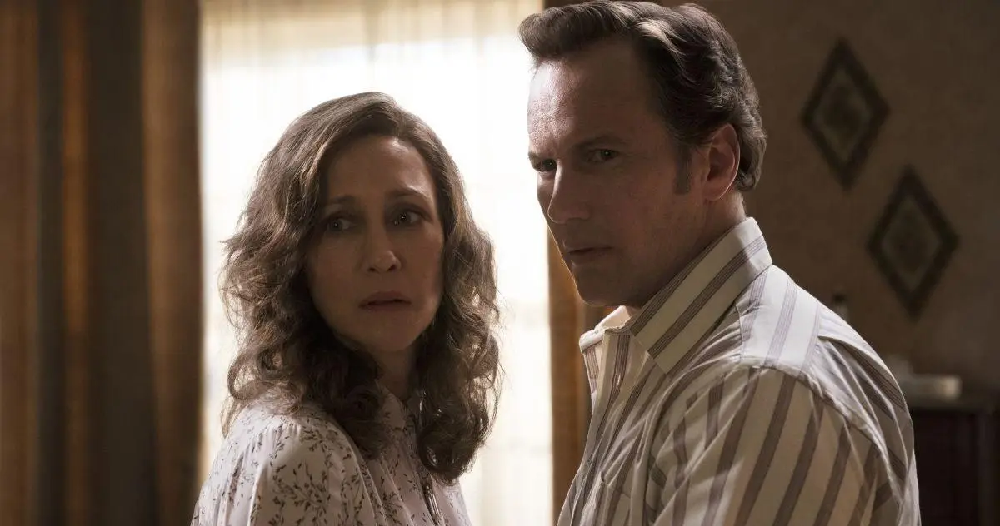

Conhecida pelos arrepiantes casos que inspiraram filmes como _Invocação do Mal_, a figura de **Lorraine Warren** vai muito além do terror que vemos nas telas. Por trás da investigadora paranormal, existia uma mulher que lidava diretamente com o desconhecido, deixando um legado poderoso sobre coragem e força interior. Suas experiências oferecem um mapa surpreendente para enfrentar nossos próprios fantasmas, sejam eles sobrenaturais ou os medos do dia a dia.

O medo de uma presença sombria em um porão pode não ser tão diferente do pânico de falar em público ou da ansiedade de uma grande mudança de vida. A questão fundamental que sua jornada nos propõe é: como encontrar força quando estamos paralisados? As **lições de Lorraine Warren** mostram que as ferramentas para superar o medo não são místicas, mas profundamente humanas: fé, intuição e um propósito maior que nos move.

Hoje vamos aprender os três pilares de sua filosofia de vida e como aplicá-los em nossa rotina. Analisaremos como ela transformava o medo em um aliado, a importância de ouvir a própria intuição e o papel da fé como âncora nos momentos mais difíceis.

## Quem foi Lorraine Warren?

Antes de qualquer coisa, vale lembrar: [Lorraine Warren](https://en.wikipedia.org/wiki/Ed_and_Lorraine_Warren) foi uma das mais famosas médiuns e investigadoras paranormais do século XX. Junto com Ed, ela fundou a **Sociedade de Pesquisa Psíquica da Nova Inglaterra** e esteve envolvida em casos que inspiraram filmes como _Invocação do Mal_, _Annabelle_ e _A Maldição da Residência Hill_.

Embora seus métodos fossem espirituais, as lições que ela deixou podem ser aplicadas até por quem não acredita em fantasmas. Na verdade, muitos dos ensinamentos de Lorraine giram em torno da **fé, intuição e coragem** ingredientes que todos nós precisamos para lidar com situações difíceis na vida.

## 1. O Medo Como Aliado: A Primeira Lição de Coragem de Lorraine Warren

Uma das primeiras lições de Lorraine Warren é que o medo não precisa ser paralisante; ele pode ser um sinal de que algo importante precisa ser enfrentado. Lorraine lidava com presenças assustadoras e atividades paranormais pesadas. Ela tinha todo direito de viver em constante pânico, mas ela escolhia outra saída. Segundo ela, o medo é uma reação natural, humana. O segredo está em **não deixar o medo nos controlar**.

Em uma entrevista antiga, ela contou que sentia medo, claro, mas o que a mantinha firme era a fé. A ideia de que estava fazendo o bem, ajudando pessoas e seguindo um propósito maior. O medo pode ser um sinal de que estamos diante de algo importante. Algo que precisa ser enfrentado, não evitado.

Quem nunca teve medo de mudar de emprego, terminar um relacionamento ou começar um projeto novo? Esses “fantasmas” do nosso dia a dia às vezes assustam mais que qualquer entidade demoníaca dos filmes.

### O que podemos tirar disso?

*   **Aceite o medo:** ele é natural, serve para nos proteger, mas não deve nos paralisar.
*   **Use a fé (seja religiosa ou em você mesmo) para seguir em frente.**
*   **Lembre-se do seu propósito:** quando o objetivo é maior, o medo diminui.

## 2. Intuição Como Guia: Aprendendo a Ouvir Sua Voz Interior

A sensibilidade psíquica de Lorraine era, acima de tudo, uma intuição aguçada, uma ferramenta que ela nos ensinou a valorizar para navegar as incertezas da vida. Ela confiava plenamente na própria intuição para tomar decisões e perceber o que não estava visível aos olhos. Essa percepção, muitas vezes ignorada por nós, pode ser uma ferramenta poderosíssima.

Sabe aquela sensação de que algo “não está certo”? Ou quando você sente que deve ir por um caminho e evitar um problema logo adiante? Isso é a sua intuição trabalhando. No fundo, todos nós temos essa capacidade o segredo é ouvir com atenção.

Na correria do dia a dia, tendemos a ignorar nossos sentidos mais sutis. Mas como Lorraine nos mostrou, **intuição não é coisa mística, é inteligência emocional**. Ela é a combinação do que aprendemos com nossas experiências e nosso instinto.

### Dicas para desenvolver a intuição:

*   **Tire um tempo para o silêncio:** meditação, oração ou simplesmente ficar alguns minutos em paz ajuda a perceber melhor seus sentimentos.
*   **Escreva:** quando algo te incomodar ou parecer estranho, anote. Isso ajuda a identificar padrões.
*   **Confie mais em você:** muitas vezes, a resposta que procuramos já está dentro da gente.

## 3. A Fé Como Armadura: O Pilar Para Superar o Medo

Um dos pilares mais fortes nos ensinamentos de Lorraine Warren era sua fé inabalável, que funcionava como uma verdadeira armadura nos momentos de maior escuridão. Independentemente da religião, ela acreditava profundamente em um propósito maior e que o bem sempre venceria o mal. Essa fé era sua armadura nos momentos mais tenebrosos.

A fé também tem um papel enorme na vida das pessoas. Seja através da religião, da espiritualidade ou simplesmente da crença na vida e nas pessoas, ter algo em que acreditar ajuda a manter a sanidade quando tudo parece estar desmoronando.

Durante uma crise seja ela emocional, profissional ou espiritual ter uma “âncora” nos ajuda a não se perder. Lorraine usava a oração, mas você pode usar o que funciona melhor para o seu coração: terapia, meditação, religião, livros inspiradores ou até mesmo conversar com alguém de confiança.

### Como fortalecer a fé?

*   **Crie rituais diários:** algo simples como agradecer antes de dormir ou ouvir uma música que te fortalece.
*   **Busque referências positivas:** livros, filmes, palestras ou histórias reais que inspirem confiança na vida.
*   **Cerque-se de boas energias:** evite pessoas e ambientes tóxicos sempre que possível.

## O Legado de Lorraine Warren

Enquanto os filmes mostram os aspectos mais assustadores de sua vida, o verdadeiro legado de Lorraine está no equilíbrio entre **coragem, fé e empatia**. Ela provou que mesmo em frente ao desconhecido ou ao sobrenatural é possível agir com coração aberto e mente firme.

Ao olhar para sua história, vemos que os monstros que enfrentamos hoje, no nosso dia a dia, podem ser vencidos com as mesmas ferramentas que ela usava. E a boa notícia é que todas essas ferramentas estão ao nosso alcance:

*   **A fé fortalece.**
*   **A intuição guia.**
*   **A coragem transforma.**

Então, da próxima vez que sentir medo, lembre-se da lição de Lorraine: _“Não é ausência de medo que nos torna fortes, mas a escolha de continuar apesar dele.”_

### Quer saber mais?

*   [Ed and Lorraine Warren: Demonologists](https://bit.ly/4g2eieZ) – Gerald Brittle
*   Entrevistas e aparições públicas de Lorraine Warren
*   Estudos sobre inteligência emocional e intuição