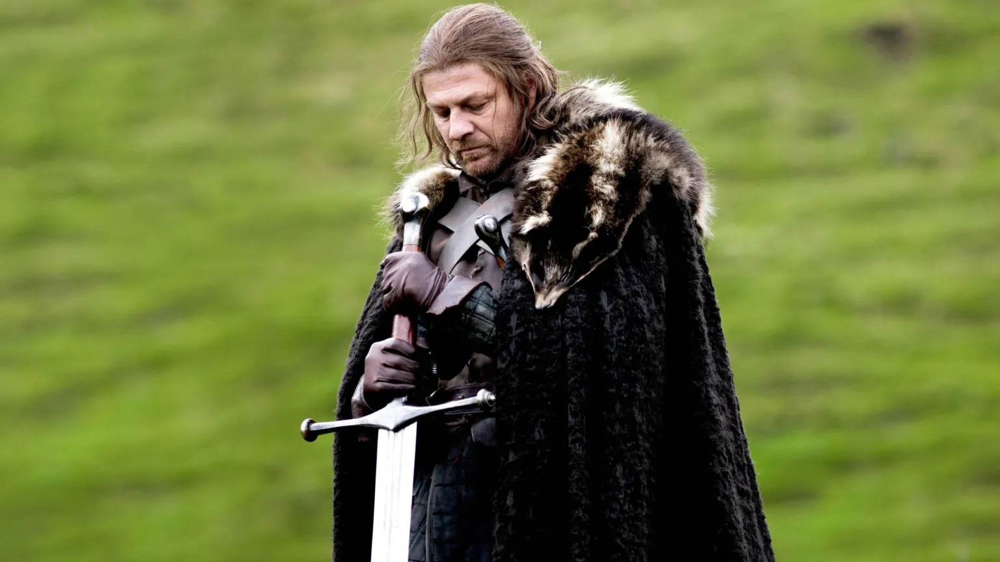
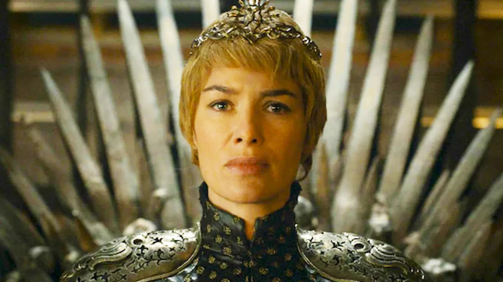
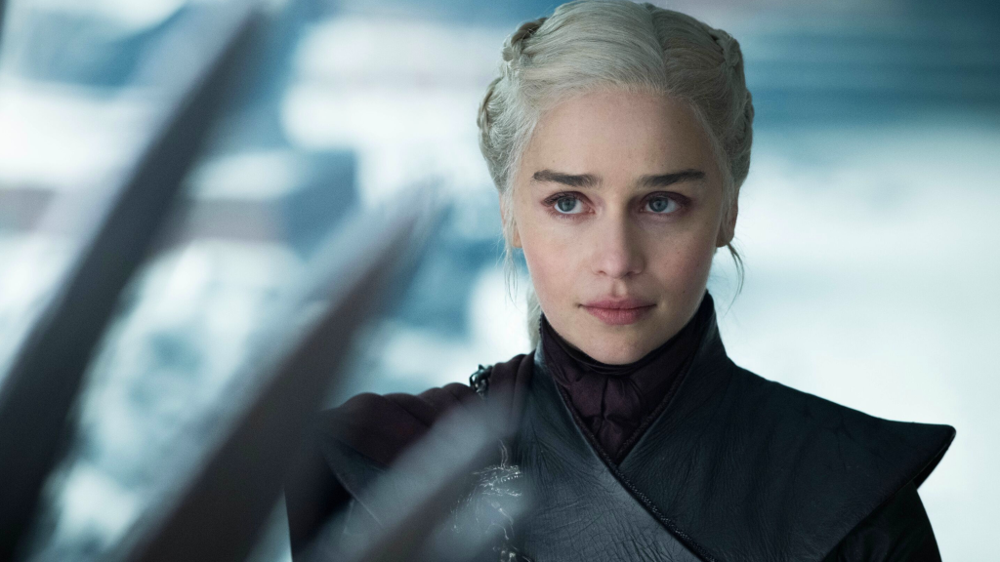
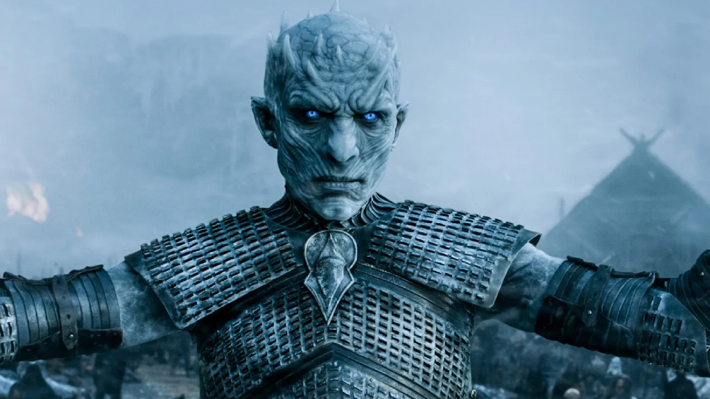

Dragões e zumbis de gelo podem roubar a cena, mas o verdadeiro coração de **Game of Thrones** sempre foi a complexa e brutal disputa pelo poder. A série, baseada na obra de George R. R. Martin, é uma aula sobre estratégia, influência e a natureza humana, nos mostrando que o Trono de Ferro é apenas um símbolo para uma guerra muito mais profunda e silenciosa.

O que a ascensão de Mindinho, a resiliência de Tyrion ou a trágica jornada de Daenerys podem nos ensinar? A filosofia de Game of Thrones revela que o poder não é apenas força ou autoridade; é uma teia complexa de alianças, informação e, acima de tudo, percepção. É um jogo que todos nós jogamos, em menor escala, em nossas vidas diárias.

Neste texto, vamos decifrar as principais lições sobre poder que Game of Thrones nos ensina. Analisaremos as estratégias dos maiores jogadores de Westeros e como seus acertos e erros podem ser aplicados em nossa carreira e vida pessoal.

## O poder está nos olhos de quem o vê

Se tem uma frase que resume bem a complexidade do poder em Game of Thrones, é a do Mindinho: _“O caos não é um fosso. O caos é uma escada.”_ e ele sabia muito bem como escalar essa escada.

O personagem começa sem um sobrenome nobre, sem terra ou exército, mas mesmo assim manipula reis e famílias poderosas usando apenas sua **astúcia, informações e timing**. Ele entendia que o verdadeiro poder não está necessariamente nas armas ou nas coroas, mas na **capacidade de influenciar os outros**.

Isso faz a gente pensar: quantas vezes já vimos alguém subir na carreira, ou virar referência em algum assunto, sem ser o mais forte ou tecnicamente o melhor? O segredo, muitas vezes, está na forma como essa pessoa se posiciona, se comunica e faz alianças.

## Quem tem o poder: quem manda ou quem obedece?

Lembra da famosa cena entre Cersei e o Alto Pardal? Ou quando Tyrion desafia Joffrey com palavras afiadas e inteligência? Momentos como esses mostram que o poder não é estático ele muda de mãos o tempo todo.

Cersei Lannister, por exemplo, nos mostra como o poder pode ser conquistado através do medo e da imagem. Já Daenerys tenta equilibrar justiça e força, mas será que isso sempre dá certo?

No fim das contas, a gente percebe que não basta ter autoridade. É preciso sustentar essa posição com estratégia, carisma ou, em muitos casos, com puro medo.

### Algumas lições que aprendemos com esses personagens:

*   **O medo é uma ferramenta poderosa** – Cersei que o diga.
*   **Respeito é mais duradouro que o medo** – mas geralmente, mais difícil de conquistar.
*   **Vulnerabilidade pode ser explorada** – vide Ned Stark que pagou com a cabeça por confiar demais.
*   **Alianças são estratégicas** – como quando Jon Snow e Daenerys se unem contra o Rei da Noite.

**+ Leia mais:** [George R. R. Martin entregou o final ou se arrependeu?](/george-martin-entregou-o-final-ou-se-arrependeu/)

## O poder da informação: o trunfo de Tyrion

Tyrion Lannister talvez seja o maior exemplo de como a inteligência pode ser mais poderosa que uma espada. Sem grande estatura física ou habilidade em combate, ele usa o conhecimento como sua principal arma. É como aquele amigo que sempre sabe tudo de todos e resolve os problemas com uma boa conversa (ou chantagem).

E no mundo real? Saber se comunicar bem, entender os bastidores das situações e ter jogo de cintura social pode abrir mais portas do que qualquer diploma pendurado na parede. **Informação é poder**; saber usá-la, mais ainda.

## Quando poder e ambição se confundem

Daenerys começa sua trajetória como uma líder libertadora, mas ao longo do tempo, suas decisões mostram como o poder pode corromper até quem tinha boas intenções. E Jon Snow? O típico herói relutante, que tem o apoio de muitos, mas não deseja o trono o que o torna, ironicamente, ainda mais desejado como rei.

Isso nos leva a uma reflexão: **o quanto a ambição deve guiar nossas ações?** Será que queremos o sucesso por um ideal ou apenas pelo sentimento de conquista? O equilíbrio entre poder e propósito é delicado e em Westeros, quem perde esse equilíbrio, perde a cabeça.

### Quando o poder sobe à cabeça...

*   **Personagens como Joffrey e Daenerys nos ensinam que o poder sem empatia pode virar tirania.**
*   **Já Ned e Jon nos mostram que valores também têm um preço alto.**

## O que podemos aplicar?

Você pode até não estar disputando um trono de ferro, mas no dia a dia, todos enfrentamos pequenas “batalhas pelo poder”: no trabalho, nas relações pessoais, nos grupos sociais.

Veja algumas lições práticas que a série nos deixa:

*   **Networking é tudo** – Conhecer as pessoas certas pode abrir caminhos, como fazem as alianças em Westeros.
*   **Informação vale ouro** – Esteja bem-informado e saiba quando e como usar esse conhecimento.
*   **Ouça antes de falar** – Muitos personagens se deram mal por agir rápido demais, sem escutar conselhos.
*   **Seja estratégico** – Às vezes, a melhor jogada é esperar o momento certo, como faz o Varys.

**+ Leia mais:** [House of the Dragon: é possível governar sem queimar tudo?](/house-of-the-dragon-e-possivel-governar-sem-queimar-tudo/)

## Game of Thrones é mais do que fantasia

A série pode ter muitos elementos sobrenaturais, mas o que a torna tão fascinante é como ela reflete verdades universais sobre poder, ambição, relações humanas e escolhas difíceis.

Ao observar como Cersei manipula, como Tyrion argumenta, ou como Daenerys perde o controle, a gente entende que o **poder não é só sobre mandar nos outros**. É também sobre **saber a hora certa de agir, ouvir e recuar**.

E por mais que o trono seja de ferro, o poder é algo muito mais **fluido e subjetivo** do que parece. Quem sabe, pensando como um personagem de Westeros, a gente não começa a jogar melhor o nosso próprio jogo?

## Quer saber mais?

Se você curte esse tipo de análise, dá uma olhada nesses temas para ler mais:

*   **[A Guerra dos Tronos](https://amzn.to/46Ajoed)** – o primeiro livro da saga de George R. R. Martin
*   **Podcasts como o “Podbook” e o “Nerdcast”** – para discussões nerds com bom humor e profundidade