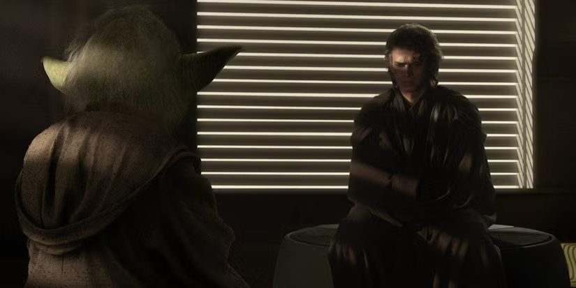
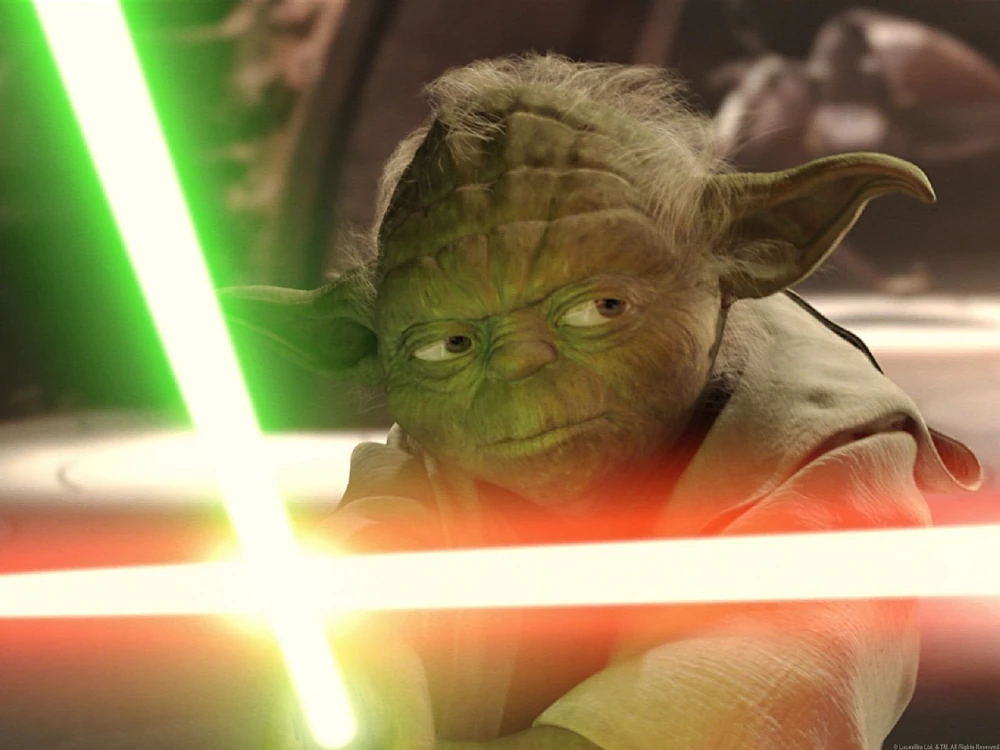

Mestre Yoda é sem dúvida um dos personagens mais icônicos de Star Wars, mas sua verdadeira natureza sempre gerou debates apaixonados entre fãs. Será que o poder de Yoda vinha principalmente da Força que ele dominava com maestria, ou sua maior arma era a sabedoria milenar acumulada em quase 900 anos de vida? O que realmente torna alguém poderoso em qualquer universo, habilidades sobrenaturais ou profundidade mental?

Desde sua primeira aparição em O Império Contra-Ataca, o "baixinho verde" conquistou gerações não apenas com acrobacias de sabre de luz, mas principalmente com frases filosóficas que transcendem a ficção científica. "O medo leva ao lado sombrio" não é apenas uma citação nerd famosa é praticamente um mantra de autoconhecimento. Mas e se Yoda fosse mais um filósofo zen-budista disfarçado de Jedi do que propriamente um guerreiro místico?

Neste texto, quero explorar no universo Star Wars para analisar o equilíbrio entre poderes da Força e inteligência emocional que tornou Yoda lendário. Você vai descobrir por que autocontrole, sabedoria ancestral e filosofia jedi podem ser superpoderes tão valiosos quanto telecinese, além de entender as lições práticas que esse mestre milenar tem para nossa vida, mesmo sem usar a Força.

## O que é a Força?

Antes de mergulhar nos poderes de Yoda em si, precisamos entender **o que diabos é a Força**. No universo de Star Wars, a Força é uma energia mística que conecta todos os seres vivos. Com ela, é possível:

*   **Mover objetos** com a mente (telecinese)
*   **Antecipar movimentos** em combate
*   **Sentir emoções** e intenções de outros seres
*   **Curar corpos ou preservar vidas** (isso em casos mais raros)

Os Jedi aprendem a usar a Força de forma equilibrada, enquanto os Sith a usam com base na ira, no medo e no poder. Mas e o Yoda? Onde ele entra nisso tudo?

## Yoda: o Jedi mais sábio de todos os tempos?

Muita gente conhece o Yoda pelos efeitos especiais, aquelas lutinhas malucas e saltitantes que ele fazia dos anos 2000 em diante. Mas, se olharmos mais de perto, notamos que sua mais poderosa arma **não era o sabre de luz**, nem seus pulos. Era sua **sabedoria**.

Yoda viveu por quase 900 anos (isso mesmo: **900!**) e, nesse tempo, treinou gerações de Jedi. Ele era tipo o vovozinho do universo Jedi, sempre com um conselho profundo na ponta da língua. Como esquecer de frases como:

> “O medo é o caminho para o Lado Sombrio. O medo leva à raiva. A raiva leva ao ódio. O ódio leva ao sofrimento.”

Yoda era praticamente um guru espiritual. Alguém que via o mundo (e a galáxia) de forma diferente, mais ampla. Ele entendia que, antes de lutar, era preciso **compreender, refletir e agir com equilíbrio**.

**+ Leia mais:** [Como aplicar o método Jedi de foco no dia a dia](/como-aplicar-o-metodo-jedi-de-foco-no-dia-a-dia/)

## Autocontrole: o poder invisível de Yoda

Se você já assistiu aos filmes mais antigos, principalmente a trilogia clássica, deve ter percebido que o Yoda **raramente usa a Força de forma grandiosa**. Ele prefere ensinar, observar e orientar. Ou seja, é como aquele professor que não grita na sala de aula, mas que com um simples olhar já impõe respeito.

Isso porque ele sabia que o **verdadeiro poder estava no controle sobre si mesmo**. Em vez de agir por impulso, Yoda sempre tomava decisões com calma. E isso, convenhamos, é bem mais difícil do que sair por aí dando cambalhotas com um sabre verde fluorescente.

Pensa em alguém que passou por séculos de batalhas, viu amigos morrerem, aprendeu com erros (inclusive o erro gigante de confiar demais na República), e mesmo assim **não se entregou ao desespero**. Esse era o Yoda.

Mas ele usava a Força também. Ele era um dos mais habilidosos usuários da Força já vistos, tanto em batalhas físicas como mentais. Um dos momentos mais lembrados é em **“Ataque dos Clones”**, quando ele enfrenta o Conde Dookan.

Ali, a gente vê o velhinho virar praticamente um ninja, saltando, desviando de ataques e mostrando que, quando precisava, **botava pra quebrar**.

Além disso, ele tinha uma profunda conexão com a Força. Meditação, contemplação e percepção do fluxo da vida eram parte constante da sua rotina. Em outras palavras, se alguém podia ser chamado de "zen", era o Yoda.

**+ Leia mais:** [A vida secreta dos stormtroopers](/vida-secreta-stormtroopers/)

## Sabedoria versus poder: qual é o mais forte?

Essa é uma pergunta que se estende pra além do universo nerd. A gente mesmo, no nosso dia a dia, lida com essa balança entre **ser forte fisicamente e ter força interior**. Yoda era um mestre nessa reflexão.

Ele não queria derrotar inimigos com força bruta. Seu objetivo era entender os ciclos da galáxia, manter o equilíbrio e ensinar a próxima geração a não cair nos erros do passado. No treinamento de Luke Skywalker, Yoda não começa com lutas. Ele começa com disciplina mental, ética e autoconsciência.

Yoda compreendia que o maior inimigo nem sempre está do lado de fora, mas dentro de nós: **nossos medos, inseguranças, raiva e ambições**.

Yoda é um espelho da filosofia oriental, dos [mestres zen-budistas](https://zenvaledossinos.org/zen-budismo/), e até daquele tiozinho do interior que sempre tem uma frase sábia na ponta da língua. Em tempos de ansiedade e decisões por impulso, talvez Yoda nos ensine que:

*   **Sabedoria vale tanto quanto força física**
*   **Autocontrole é uma forma poderosa de resistência**
*   **Antes de agir, pense, observe e sinta**

Até mesmo na vida real, nos momentos em que o estresse parece dominar tudo, lembrar do olhar calmo do Yoda pode ser um bom exercício. Afinal, como ele mesmo diria:

> “Você deve desaprender o que aprendeu.”

**+ Leia mais:** [Darth Vader poderia ser julgado por crimes de guerra?](/darth-vader-poderia-ser-julgado-por-crimes-de-guerra/)

## Mais mente do que músculos

**Yoda usava tanto a Força quanto sua sabedoria ancestral**. Mas se você me perguntar qual era sua arma mais poderosa, eu digo sem medo: era o cérebro.

Ele é um símbolo de que, mesmo em um universo onde tudo se resolve na base de explosões e duelos, a reflexão, a calma e o autoconhecimento ainda têm seu lugar de destaque na prateleira.

Num mundo em que todo mundo quer ser o herói com o sabre na mão, Yoda te ensina que ser sábio e calmo, é um dos maiores superpoderes que alguém pode ter.

### Curtiu esse papo? Aí vão algumas sugestões de leitura pra ir além:

*   [Star Wars Wiki: Yoda](https://starwars.fandom.com/pt/wiki/Yoda)
*   [Site oficial de Star Wars](https://www.starwars.com/)

Que a sabedoria esteja com você!