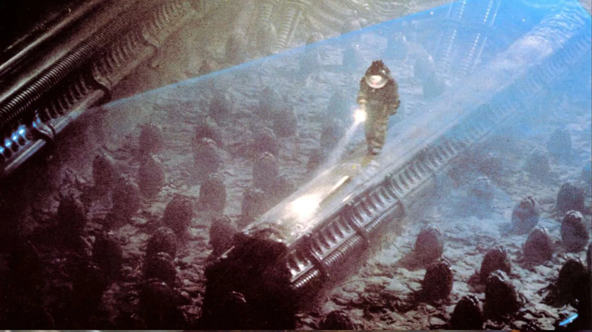
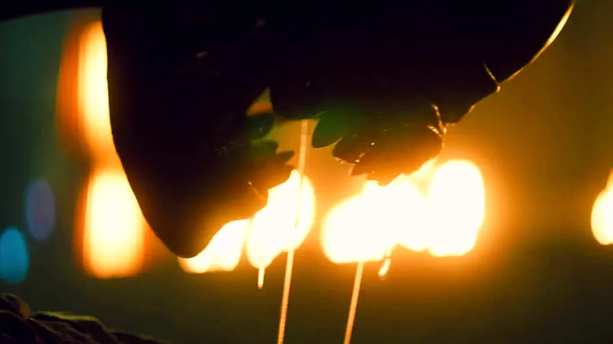
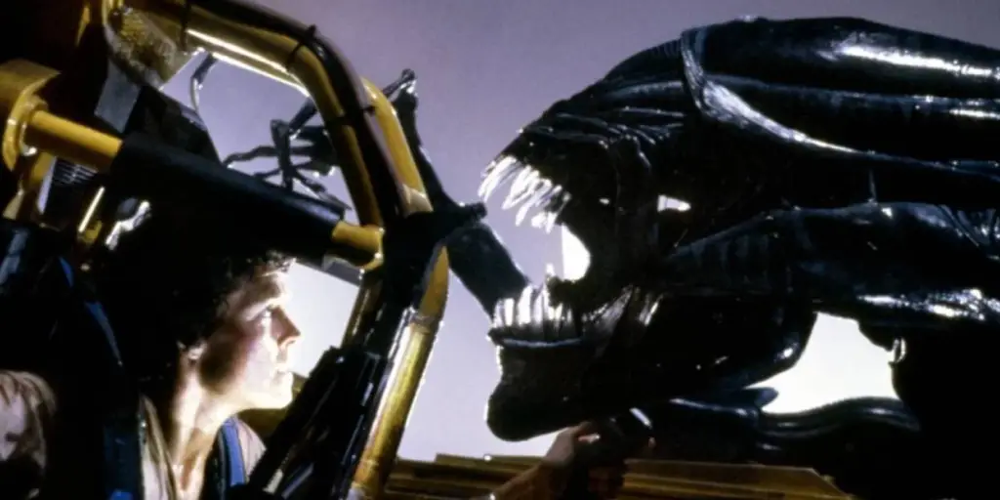
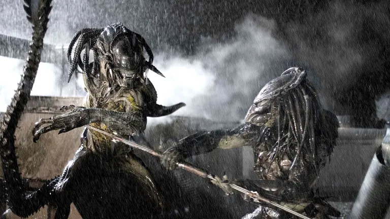

Com seu exoesqueleto biomecânico, sangue ácido e um ciclo de vida aterrorizante, o **Alien Xenomorfo** é uma das criaturas mais icônicas e temidas da ficção científica. Mas por trás do design assustador de [H. R. Giger](https://pt.wikipedia.org/wiki/H._R._Giger) existe uma **biologia ficcional** tão complexa e bem pensada que nos faz questionar: e se esse pesadelo fosse real?

O que torna o **Xenomorfo** um predador tão perfeito? A resposta está em sua biologia adaptativa, que se inspira em alguns dos mecanismos mais brutais da natureza. Do parasitismo extremo à estrutura social de colmeia, a criatura é um espelho sombrio e exagerado da própria evolução, nos forçando a encarar os limites da sobrevivência.

Neste texto, vamos dissecar a **biologia do Alien Xenomorfo**. Analisaremos seu ciclo de vida aterrorizante, suas características de adaptação genética e como a ciência do mundo real inspirou a criação desse monstro inesquecível.

## O que é um xenomorfo?

O xenomorfo, também conhecido como **Alien**, é uma criatura extraterrestre criada originalmente para o filme _Alien – O Oitavo Passageiro_ (1979). Seu nome vem do grego e significa algo como **“forma estranha”** o que combina perfeitamente com sua aparência e comportamento.

Mas o que realmente fascina na criatura é seu ciclo de vida e como ele é quase uma homenagem (meio bizarra) à natureza. Vamos entender isso melhor?

## O Ciclo de Vida Parasitário do Xenomorfo

A biologia do Alien Xenomorfo é mais assustadora em seu ciclo de vida, que imita o de parasitas reais de forma aterrorizante, como a vespa parasita ou o ciclope. Ele é composto por **quatro estágios principais**:

*   **Ovo**: Um casulo orgânico que se abre apenas quando detecta a presença de uma vítima por perto.
*   **Facehugger**: Um organismo aracnídeo que salta do ovo e se agarra ao rosto da vítima, inserindo um embrião.
*   **Chestburster**: O embrião cresce dentro do peito do hospedeiro e eventualmente o arrebenta por dentro (sim, é tão horrível quanto parece).
*   **Xenomorfo adulto**: Depois da saída dramática, a criatura cresce rápido e vira um predador altamente eficiente.

Parece saído de um pesadelo, né? Pois é, mas se você olhar com atenção, esse processo lembra o de vários organismos reais. A **[vespa esmeralda](https://butantan.gov.br/bubutantan/vespa-esmeralda-e-as-baratas-zumbis-conheca-o-inseto-que-parece-ter-saido-de-um-filme-de-terror)**, por exemplo, controla a mente de uma barata e deposita larvas no corpo dela. Bizarro, porém natural!

## Adaptação extrema: o que torna o xenomorfo tão perigoso?

O xenomorfo é uma máquina de matar quase perfeita e não é exagero. Ele foi feito com características que maximizam suas chances de sobrevivência e domínio do ambiente. Vamos explorar algumas delas:

### 1. Adaptação ao DNA do hospedeiro

Uma das coisas mais interessantes é que o xenomorfo **herda características genéticas do hospedeiro**. Se o embrião for incubado em um humano, o resultado será diferente do que se ele incubar, por exemplo, em um cachorro (como vemos em _Alien 3_).

Na prática, isso dá para o Alien uma **vantagem evolutiva absurda**, pois ele se adapta ao ambiente de maneira quase imediata. Imagina só se a gente tivesse essa capacidade? Cada um de nós poderia se adaptar ao clima de outra cidade em minutos!

### 2. Crescimento acelerado

Logo após sair do peito do hospedeiro, o chestburster **cresce de forma impressionante**. Em poucas horas, se transforma em uma criatura forte, rápida e altamente agressiva.

Os cientistas ficariam intrigados com esse metabolismo. Como ele consegue isso? Talvez com uma combinação de DNA altamente eficiente e um sistema de absorção de nutrientes hiperativo.

### 3. Sangue ácido

Já pensou em tentar matar um xenomorfo e acabar corroendo o próprio chão da nave? Pois é, o sangue da criatura é **altamente ácido**. Isso não só impede que predadores ataquem como também serve como uma forma de “vingança pós-morte”.

Na biologia real, algumas formigas e besouros têm mecanismos parecidos, usando ácidos ou substâncias químicas para se proteger, mas nada tão potente quanto o que a ficção imaginou para o Alien.

## A Inteligência do Xenomorfo: Predador ou Ser Senciente?

Apesar da aparência bestial, o xenomorfo é **inteligente e estratégico**. Ele aprende, se adapta e, muitas vezes, **age em grupo**, como vimos em _Aliens – O Resgate_. Ele não age só por instinto: sabe atacar de forma furtiva, desligar sistemas e até armar emboscadas. Assustador? Com certeza.

Isso faz muita gente pensar: será que ele é apenas um predador, ou algo mais? Em alguns filmes, a criatura parece agir como parte de uma colmeia, semelhante às abelhas, com uma **rainha xenomorfa** controlando os demais. Essa estrutura social remete muito ao mundo dos insetos.

**+ Leia mais:** [Como seria uma vacina contra o Cordyceps?](/como-seria-uma-vacina-contra-o-cordyceps/)

## A Inspiração na Natureza: A Biologia Real por Trás do Horror

Acredite ou não, muitos dos elementos da **biologia do Alien Xenomorfo** foram inspirados em criaturas e processos que existem na natureza. Quem já ouviu falar da larva de certa mosca (conhecido também como berne ou bicheira) que invade o cérebro do seu hospedeiro até matá-lo vai concordar: a natureza às vezes é mais cruel que a ficção.

Os criadores do Alien sabiam disso. Eles usaram elementos de:

*   Insetos parasitas
*   Répteis como cobras e lagartos
*   Mecanismos evolutivos reais
*   Comportamento de colmeias

O resultado? Um monstro que parece até plausível, dentro das regras malucas do universo sci-fi.

No fim das contas, o ponto forte do xenomorfo é que ele nos faz refletir sobre os **limites da biologia** e até onde a evolução pode chegar. E mais: ele é um espelho sombrio dos nossos próprios medos medo do desconhecido, da contaminação, da perda de controle.

O Alien é como uma febre sci-fi: uma vez dentro da mente, difícil esquecer. Afinal, ao unir elementos científicos com puro terror, a criatura ganhou um lugar eterno no imaginário nerd e cinéfilo.

## Curiosidade bônus: o xenomorfo já esteve em HQs, games e até enfrentou o Predador

Quem é fã de **comics** ou videogames provavelmente já viu o Alien fora dos cinemas. Ele já apareceu em:

*   Quadrinhos como _Alien vs Predator_
*   Jogos como _Alien: Isolation_ e _Aliens: Fireteam Elite_
*   Crossovers loucos com o universo do _Predador_

Isso mostra o quanto a criatura se tornou **um ícone cultural**. Mesmo décadas depois, continua relevante e assustadora.

## O Legado da Biologia Ficcional do Alien

O xenomorfo é uma aula ambulante de biologia imaginária. Mais do que um monstro de filme, ele representa o encontro assustador entre ciência, ficção e terror com pitadas generosas de criatividade.

Se você curte teorias científicas malucas, filmes de arrepiar e criaturas bizarras, o universo Alien é um prato cheio. E o melhor: sempre dá pra descobrir algo novo sobre sua complexa (e mortal) biologia.

E você, já pensou como seria o Alien incubado em uma espécie brasileira? Imagina um xenomorfo com o DNA de uma onça-pintada? Melhor parar de pensar nisso, né?

### Para saber mais

*   [Wikipedia: Xenomorph](https://en.wikipedia.org/wiki/Xenomorph_(Alien))
*   _Alien: Isolation_ – jogo que explora a tensão e inteligência do Alien

Gostou do conteúdo? Compartilhe com outros nerds curiosos e deixe seu comentário sobre qual criatura você gostaria de ver analisada aqui no blog do **Nerdático**!