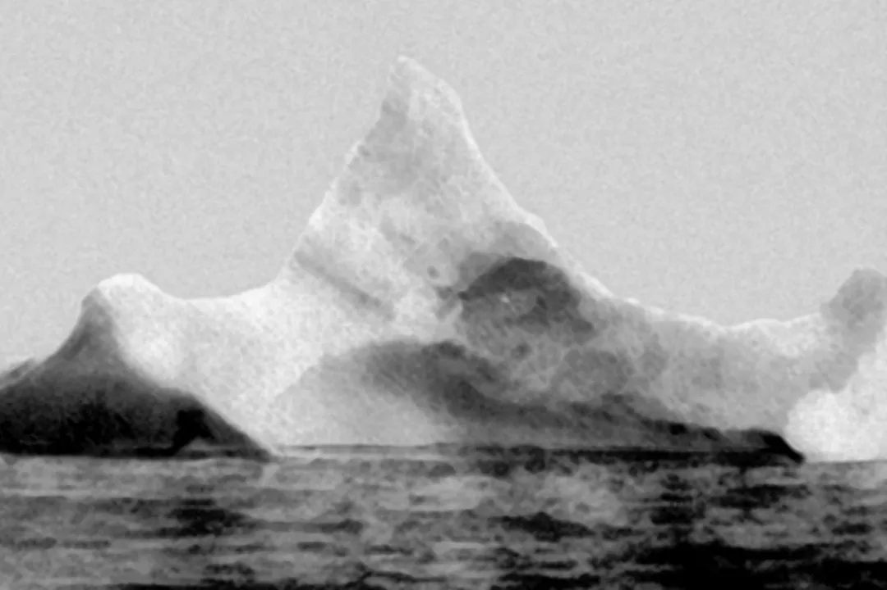
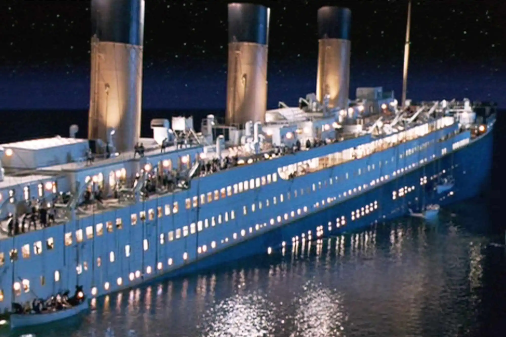

E se o Titanic navegasse hoje? Essa pergunta fascina milhões de pessoas ao redor do mundo desde 1912, quando o “navio dos sonhos” encontrou seu trágico fim nas águas geladas do Atlântico Norte. A catástrofe que tirou mais de 1.500 vidas continua sendo um dos maiores desastres marítimos da história.

De filmes épicos como o de James Cameron a teorias da conspiração na internet, o Titanic virou praticamente um mito moderno, aquele tipo de história que todo mundo conhece pelo menos um pouco. Mas aqui vai a provocação: será que os avanços tecnológicos de hoje evitariam o naufrágio? Ou melhor ainda, será que o Titanic sequer colidiria com aquele iceberg fatal?

Neste texto vamos mergulhar fundo (com o perdão do trocadilho) nas tecnologias de segurança marítima disponíveis atualmente e descobrir como cada uma delas poderia ter mudado completamente o destino do navio mais famoso do mundo. Prepare-se para entender por que viajar de navio hoje é infinitamente mais seguro do que era há um século.

## O que realmente causou o naufrágio do Titanic?

Antes de falarmos sobre tecnologia, é importante lembrar por que o Titanic afundou. Muita gente acredita que foi só o choque com o iceberg, mas a verdade é um pouco mais complexa.

A tragédia aconteceu por uma combinação de fatores:

*   **Alta velocidade:** o navio navegava muito rápido para a região, mesmo com alertas de gelo.
*   **Falta de equipamentos adequados:** o número de botes salva-vidas era muito menor do que o necessário.
*   **Erros humanos:** o aviso sobre o iceberg foi ignorado ou não chegou direito aos responsáveis pela navegação.
*   **Materiais e projeto:** a estrutura do navio tinha falhas que facilitaram o rompimento após o impacto.

Ou seja, foi uma série de escolhas erradas, limitações técnicas e ausência de protocolos de segurança, algo impensável hoje em dia.

## Como a tecnologia atual poderia ter salvado o Titanic?

Se o Titanic fosse construído e navegasse hoje, em pleno século 21, com certeza ele teria contado com recursos muito mais avançados. Vamos ver o que mudaria com alguns exemplos práticos?

### 1. Radar e GPS

O Titanic não tinha radar esse tipo de tecnologia só surgiu anos depois. Hoje em dia, radares de longo alcance e sistemas de **navegação por GPS** são padrão em qualquer navio. Eles permitem identificar obstáculos com muita antecedência, até mesmo à noite ou com neblina.

Se o Titanic tivesse um radar moderno a bordo, o iceberg teria sido detectado com bastante antecedência, dando tempo suficiente para alterar a rota com segurança.

### 2. Comunicação via satélite

Em 1912, as mensagens eram transmitidas por telégrafo, e muitas vezes os operadores ignoravam avisos (o que aconteceu com o Titanic). Hoje, temos:

*   **Rádio VHF** com alcance constante.
*   **Comunicação via satélite** em tempo real.
*   **Sistemas de alerta automático** como o AIS (Automatic Identification System).

Esses recursos garantem que qualquer aviso sobre gelo, tempestade ou problema mecânico chegue imediatamente ao capitão e equipe responsável.

### 3. Materiais modernos e design mais seguro

O Titanic era visto como um navio "inafundável", mas sua estrutura não era tão resistente quanto se imaginava. As chapas de aço da época eram frágeis ao frio, e os compartimentos de contenção não alcançavam toda a altura interna.

Hoje, os navios são construídos com aço naval mais resistente, testes rigorosos de impacto e divisão eficiente dos compartimentos internos. Além disso, o projeto naval moderno prioriza o **design hidrodinâmico e a estabilidade**.

### 4. Sistemas automatizados de desvio de rota

Imagine um carro com piloto automático que evita colisões. Os navios modernos também têm sistemas parecidos. Alguns cargueiros e cruzeiros contam com tecnologia que detecta obstáculos e muda a rota automaticamente, mesmo se a tripulação estiver distraída.

Se o Titanic tivesse esse tipo de recurso, o iceberg teria sido detectado antes mesmo de estar visível a olho nu e o desvio seria automático.

### 5. Mais botes salva-vidas e treinamentos obrigatórios

Outra falha grave: o Titanic não tinha botes suficientes para todos os passageiros. Hoje, isso seria ilegal. As leis marítimas internacionais exigem:

*   **Botes e coletes salva-vidas para 100% das pessoas a bordo**.
*   **Simulados de emergência** obrigatórios para toda a tripulação.
*   **Inspeções frequentes** de todos os equipamentos de segurança.

No cenário atual, mesmo que ocorresse um acidente parecido, a chance de salvar todos seria muito maior.

## E se o Titanic navegasse hoje?

Se o Titanic zarpar hoje com toda a tecnologia atual, dificilmente ele naufragaria. Mas além dos avanços técnicos, a **mudança de mentalidade** também faz toda a diferença.

Hoje, há uma **preocupação muito maior com segurança e prevenção**. Existe um esforço global para evitar acidentes em alto-mar, com agências reguladoras, satélites de monitoramento e protocolos de emergência super bem definidos.

Isso sem falar da **inteligência artificial** e **automação** que monitoram rotas, clima e integridade dos navios em tempo real. Aliás, tem até navio autônomo atualmente, sem tripulação!

Apesar de toda essa tecnologia, o Titanic continua sendo um alerta. Um lembrete de que a confiança exagerada pode custar vidas. Por isso, hoje se investe tanto em:

*   **Educação e treinamento da tripulação**.
*   **Redundância nos sistemas legais de segurança** — ou seja, várias camadas de proteção.
*   **Auditorias frequentes** nos navios, tanto comerciais quanto de passageiros.

Inclusive, se você já fez um cruzeiro, deve lembrar do exercício de evacuação no primeiro dia, né? Isso é reflexo direto das lições deixadas pelo Titanic.

## Curiosidade: o Titanic tem “irmãos” modernos

Navios como o **Symphony of the Seas**, da Royal Caribbean, são até 5 vezes maiores que o Titanic e navegando em segurança com milhares de passageiros justamente porque utilizam essas tecnologias avançadas.

Ou seja, se o Titanic fosse construído hoje, ele teria radar, internet por satélite, salas de controle automatizadas, inteligência artificial, coletes inteligentes e muito mais. Definitivamente, seria uma viagem muito mais segura!

Então, respondendo à pergunta: **sim, o Titanic poderia ter sido salvo com a tecnologia atual.** Mas mais que isso, ele provavelmente nem teria se arriscado a navegar em condições tão perigosas.

No fim, o avanço da tecnologia salva vidas não só nos mares, mas em todos os aspectos da nossa vida moderna. O que nos resta é aprender com o passado e continuar evoluindo.

Afinal, mais importante do que inventar tecnologias incríveis, é saber usá-las com responsabilidade.

### Quer saber mais?

*   [A Saga do Titanic](https://www.nationalgeographic.pt/historia/a-saga-do-titanic_2885)
*   [Conheça 7 fatos sobre o naufrágio do Titanic](https://www.nationalgeographicbrasil.com/historia/2023/04/conheca-7-fatos-sobre-o-naufragio-do-titanic)