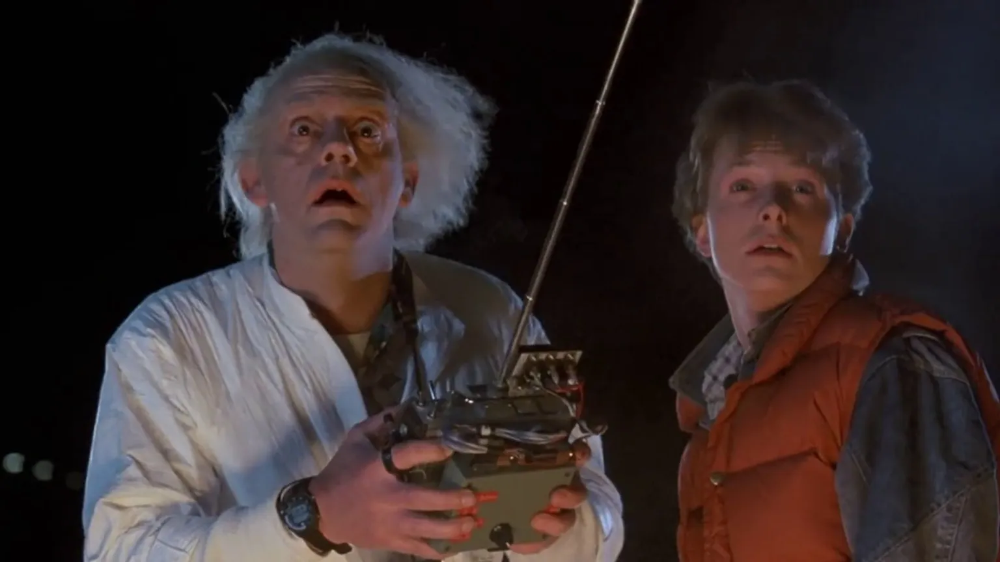
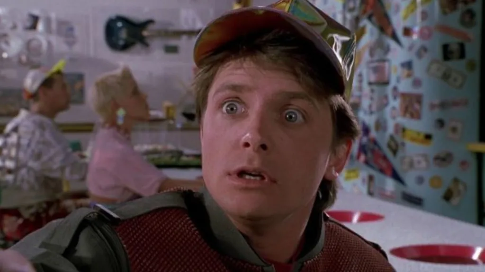

Se você gosta de **filmes de ficção científica dos anos 80**, com certeza já se aventurou em uma viagem no tempo com Marty McFly e o excêntrico Dr. Emmett Brown em **“De Volta para o Futuro”**. A trilogia marcou gerações misturando humor, ação e o fascínio pelas viagens temporais.

Mas por trás do charme da história, existem **paradoxos do tempo** e incoerências que até hoje intrigam fãs e cientistas. Afinal, o que realmente acontece quando alguém altera o passado? Como funcionam as regras da viagem no tempo em De Volta para o Futuro?

Prepare o DeLorean, ajuste o capacitor de fluxo e vem com a gente explorar os segredos e contradições que tornam essa saga um dos maiores clássicos da ficção científica.

## Como funciona a viagem no tempo em De Volta para o Futuro?

Antes de entrarmos nos paradoxos, vamos entender como a **viagem no tempo** em De Volta para o Futuro é apresentada no universo da franquia. O Dr. Emmett Brown inventa uma máquina do tempo usando um DeLorean (um carro super estiloso dos anos 80), que só funciona com plutônio e precisa atingir 88 milhas por hora.

Ao viajar para o passado, o personagem Marty McFly (vivido por Michael J. Fox) acaba interferindo em eventos importantes da juventude de seus pais. A partir daí, ele corre contra o tempo para corrigir as coisas e evitar que sua própria existência seja apagada.

Legal, né? Mas tem muita coisa nesse processo que não fecha. Vamos destrinchar isso.

## Paradoxos do tempo em De Volta para o Futuro

No papel, a ideia é simples: se você muda o passado, altera o futuro. Mas a prática é outra história. Vamos aos principais **paradoxos do tempo** que aparecem em “De Volta para o Futuro”.

### **1. O paradoxo do avô**

Esse é o clássico dos clássicos. O paradoxo funciona assim: se você volta no tempo e impede que seu avô conheça sua avó, você nunca nascerá mas, se você nunca nascer, como poderia ter voltado no tempo para impedir esse encontro?

No primeiro filme, Marty quase impede que seus pais se apaixonem. Ele interfere tanto na história que sua mãe quase se apaixona por ele (!) e não por George McFly, seu pai. Isso gera uma situação absurda que flerta com o tal paradoxo do avô.

### **2. Mudou, mas ninguém notou?**

No final do primeiro filme, quando Marty volta ao presente, sua família está completamente diferente. O pai se tornou bem-sucedido, o irmão tem um emprego digno, e até a casa está mais arrumada.

A grande dúvida é: **como Marty se lembra dos eventos antigos, mas seus pais (que tiveram a juventude reescrita por ele) não notam que seu filho mudou?** Em teoria, o Marty “dessa nova linha temporal” teria vivido uma infância e adolescência completamente diferentes. E ainda mais: se esse novo Marty ainda não voltou ao passado, terão dois Martys coexistindo?

### **3. O efeito borboleta não perdoa**

Se você já deixou de ir numa festa e, por isso, conheceu alguém importante em outro lugar, sabe como **uma pequena mudança pode causar grandes consequências**. É o famoso efeito borboleta, muito usado em histórias de ficção científica sobre viagem no tempo.

Em “De Volta para o Futuro”, Marty altera eventos importantes como o encontro dos pais, a carreira do pai e até impede um acidente grave com o Dr. Brown. Mas, curiosamente, o mundo não parece ter mudado TANTO quanto deveria. A cidade de Hill Valley continua bem parecida, com os mesmos lugares e pessoas ocupando papéis semelhantes, mesmo após tantas alterações.

Faz sentido? Talvez não muito.

## Linhas do tempo alternativas em De Volta para o Futuro: aqui começa o multiverso?

Uma das formas de explicar essas incoerências seria pensar em **linhas do tempo alternativas**. Algo como o que vemos hoje no MCU (Universo Cinematográfico da Marvel) ou até em Flashpoint, da DC.

Quando Marty muda o passado, ele criaria uma **linha temporal paralela**, diferente da original. Isso explicaria por que ele mantém suas memórias mesmo após o mundo ter mudado ao seu redor. Mas o filme nunca deixa isso claro o roteiro sugere que tudo acontece em **uma única linha do tempo**, o que só complica ainda mais a matemática temporal.

Aliás, se voltarmos ao segundo filme, as coisas ficam ainda mais caóticas. Biff Tannen do futuro rouba o almanaque esportivo e volta aos anos 50 para entregá-lo a si mesmo, criando uma realidade em que ele é milionário. Isso daria origem a **um novo universo alternativo**, certo? Mas, então, por que os outros personagens continuam existindo da mesma forma?

## Viagem no tempo: ficção, ciência ou loucura?

Apesar das incoerências, “De Volta para o Futuro” é respeitado até entre físicos. Stephen Hawking, por exemplo, já elogiou o bom humor com que a franquia trata conceitos científicos difíceis. A verdade é que os próprios cientistas ainda debatem se viajar no tempo é possível.

De acordo com a **teoria da relatividade de Einstein**, o tempo pode sim ser afetado pela velocidade e até desacelerar dependendo do campo gravitacional. Mas **voltar ao passado** ainda não saiu do campo das ideias.

Ou seja: o filme está mais para um “e se?” do que para um manual científico.

No fim das contas, os paradoxos temporais e incoerências da viagem no tempo em De Volta para o Futuro fazem parte do charme da saga. Elas alimentam teorias, despertam debates em fóruns e grupos de fãs e nos fazem refletir sobre como o tempo funciona (ou não funciona).

Se você gosta de filmes com viagens no tempo, vai se divertir ainda mais sabendo que, mesmo com todos esses furos, o roteiro se esforça para ter uma “lógica interna”. E é esse equilíbrio entre, fantasia, ciências e emoção que faz essa trilogia ser tão querida até hoje.

## Mexer no tempo vale a pena?

Vai dizer que você nunca pensou em como seria voltar no tempo? Talvez dar aquele empurrãozinho em uma prova, evitar um “fora” no colégio ou até **mudar o rumo da sua carreira**...

Mas será que isso traria o futuro que você espera? “De Volta para o Futuro” é uma lembrança divertida de que **nós somos o resultado de pequenas decisões** e talvez o melhor que podemos fazer é viver o presente com mais consciência.

Então, da próxima vez que assistir à trilogia, repare nesses detalhes e pense: será que eu também criaria um paradoxo?

### Quer saber mais?

*   **[A Máquina do Tempo](https://amzn.to/4n92evo)** – H.G. Wells (romance clássico sobre viagens temporais)
*   **[Stephen Hawking – Uma Breve História do Tempo](https://amzn.to/4n9lrx4)**
*   **O Efeito Borboleta** – Filme que trata de mudanças nas linhas do tempo

Curtiu essa viagem no tempo com a gente? Deixe nos comentários qual momento da trilogia mais mexeu com sua cabeça!