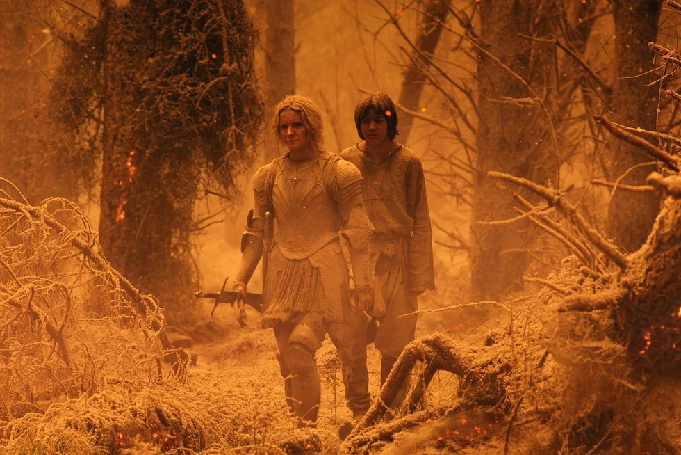

Quem assistiu **O Senhor dos Anéis** tem a imagem de Mordor gravada na mente: um reino sombrio, sufocado por fumaça, lava e uma desolação sem vida. Mas o que aconteceria se esse cenário apocalíptico da ficção existisse no nosso mundo real? Qual seria o i**mpacto ambiental de Mordor** em nossos biomas, transformando florestas exuberantes em cinzas e desertos?

A resposta nos leva a uma reflexão preocupante. As nuvens tóxicas, o solo estéril e a completa ausência de vida em Mordor espelham, em escala magnificada, os efeitos devastadores da poluição industrial, do desmatamento e das mudanças climáticas que enfrentamos hoje. A tirania de Sauron, nesse sentido, é uma metáfora poderosa para a exploração desenfreada da natureza.

Neste artigo, faremos uma análise ecológica e detalhada do que significa ter um lugar como Mordor. Exploraremos o colapso da biodiversidade, a poluição atmosférica, a desertificação e os impactos no ciclo da água. Prepare-se para ver como a fantasia de Tolkien pode nos ensinar lições urgentes sobre a preservação do nosso próprio planeta.

## Mordor: O Retrato de um Desastre Ambiental Permanente



Para entender o impacto ambiental de Mordor, precisamos visualizá-lo como o cenário de um desastre ecológico em escala máxima. Pra quem não lembra, **Mordor é uma terra devastada, vulcânica e dominada por Sauron**. O céu é sempre escuro, cheio de nuvens densas, e não existe sequer uma árvore saudável por lá. No centro de tudo, o famoso vulcão Monte da Perdição cospe lava o tempo todo. Ou seja, é basicamente uma versão turbinada de um **desastre ambiental permanente**.

Se colocássemos Mordor em algum canto do nosso mundo real, poderíamos compará-lo a um local industrial altamente poluído como algumas áreas afetadas por mineração desenfreada ou regiões com intensa queima de combustíveis fósseis. Só que em Mordor não há 'fiscal do meio ambiente'. Lá, é destruição total e sem pausas.

## 1. Poluição Atmosférica: O Céu Sombrio e Seus Efeitos

Um dos primeiros impactos da existência de Mordor seria a poluição atmosférica, transformando o céu em uma nuvem densa e tóxica. Vamos imaginar que Mordor estivesse no Brasil, próximo à Floresta Amazônica. O impacto seria imediato. As nuvens negras que bloqueiam o sol iriam interferir no processo de **fotossíntese** das plantas ali por perto. Sem luz solar, árvores teriam dificuldade pra crescer, o que comprometeria:

*   A produção de oxigênio
*   A absorção de gás carbônico
*   A alimentação pra milhares de animais

Além disso, a fuligem constante no ar traria problemas de saúde parecidos com os observados em centros urbanos poluídos — só que muito pior. Respirar o ar de Mordor é tipo viver numa chaminé!

## 2. O Solo de Mordor: Estéril e Sem Vida

O solo em Mordor é um espelho da devastação, onde a ausência de vida comprometeria completamente a recuperação ambiental. É seco, rachado, coberto por cinzas e resquícios de lava. Em termos reais, esse ambiente pode ser comparado a áreas que sofreram **erupções vulcânicas recentes** ou foram desertificadas por atividades humanas. Em lugares assim, a recuperação da vegetação pode levar séculos, ou nunca acontecer, dependendo do dano. Tudo ali seria estéril:

*   Sem vegetação para segurar o solo, vem a erosão
*   Rios secam ou se contaminam
*   Animais fogem ou morrem

### Sem vegetação, sem biodiversidade

A diversidade da fauna e flora é completamente apagada. Mordor é o contrário de um bioma sustentável. E nem precisa ter Olho de Sauron vigiando: o próprio ambiente já é hostil por si só.

## 3. O Colapso da Biodiversidade e da Cadeia Alimentar

Com a destruição da vegetação e do solo em Mordor, o impacto na cadeia alimentar seria imediato e catastrófico, eliminando a biodiversidade local. Sem plantas, não tem herbívoros. Sem herbívoros, não tem carnívoros. O ciclo da vida vai por água abaixo. Imagine se Mordor fosse colocado bem no meio do Pantanal ou da Mata Atlântica. Os animais iriam perder seus habitats, não encontrariam comida, e acabariam migrando (se conseguirem) ou sendo extintos. É como dar um "CTRL+ALT+DEL" na natureza daquela região.

## 4. O Ciclo da Água: Seca e Contaminação

Com tanto calor irradiado pela lava e sem vegetação, a **evaporação da água** seria afetada. O ar seco e quente criaria um microclima desértico ao redor de Mordor, secando nascentes, lagos e até desviando chuvas de lugares próximos. Quem vive em regiões que já sofrem com a seca, como o semiárido nordestino, sabe o quanto a água é essencial para manter o equilíbrio. Esse tipo de dano altera até os ventos e o comportamento das nuvens!

## O Efeito Dominó: A Degradação da Terra-Média

O impacto ambiental de Mordor não se limitaria às suas fronteiras; ele se espalharia como uma praga, afetando ecossistemas de toda a Terra-Média. Agora pensa em como isso afetaria os reinos próximos na Terra-Média: Gondor, Rohan e os outros. Sem florestas saudáveis, lagos limpos e ar puro, essas regiões também acabariam sentindo os efeitos do caos de Mordor. É como se a destruição fizesse “efeito dominó”, espalhando-se pouco a pouco até engolir todas as fronteiras ao redor.

## Mas e se Mordor fosse regenerada?

Esse é outro ponto interessante. Em “O Retorno do Rei”, com a queda de Sauron, a ideia é que a destruição cesse. Mas quanto tempo levaria para a natureza se recuperar? Na vida real, locais afetados por desastres vulcânicos ou guerras ambientais levam **até séculos** para se regenerar por completo — se é que isso realmente acontece.

### Dá pra viver depois do fim?

Talvez Elfos e Ents pudessem ajudar essa recuperação, plantando novas florestas e purificando o chão com sua magia. Mas no mundo real, nem sempre contamos com soluções mágicas. Dependemos de políticas ambientais, reflorestamento, educação e, claro, a **consciência coletiva** sobre os efeitos da destruição sem controle.

## O Impacto Ambiental de Mordor no Nosso Planeta

Para resumir o impacto ambiental de Mordor, estaríamos falando de uma catástrofe ecológica sem precedentes. Se Mordor existisse no nosso mundo, os impactos seriam:

*   Destruição completa da biodiversidade local
*   Desertificação e poluição do solo
*   Contaminação da água e interrupção do ciclo hídrico
*   Ar fatalmente poluído, prejudicando a saúde
*   Colapso de cadeias alimentares

Parece exagerado? Pois saiba que tudo isso acontece, em menor escala, quando há desmatamento intenso, mineração desalinhada e poluição industrial sem freio em vários lugares do planeta. Sauron pode até ser ficção... mas os impactos que ele representa são muito reais por aqui.

Mordor é o retrato extremo da destruição ambiental. Uma metáfora poderosa e infelizmente, bem atual do que acontece quando o poder ignora o equilíbrio com a natureza. Se a Terra-Média precisou da coragem de Frodo, Sam e toda a Sociedade do Anel para enfrentar o mal, talvez nosso mundo também precise de heróis do cotidiano lutando contra a degradação ambiental. A boa notícia? Você pode ser um deles.

### Quer saber mais?

*   Documentário “[Before the Flood](https://youtu.be/zbEnOYtsXHA?si=ZrhahExVULVso6NY)” (Antes do Dilúvio) – disponível em plataformas de streaming
*   [Relatórios do IPCC](https://www.gov.br/mcti/pt-br/acompanhe-o-mcti/sirene/publicacoes/relatorios-do-ipcc) (Painel Intergovernamental sobre Mudanças Climáticas)
*   Instituto SOS Mata Atlântica – estudos sobre impactos ambientais no Brasil

Agora conta pra gente: se você morasse perto de Mordor, o que faria pra salvar seu bioma? Compartilha aqui nos comentários!