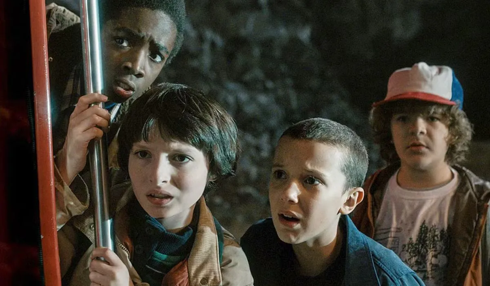
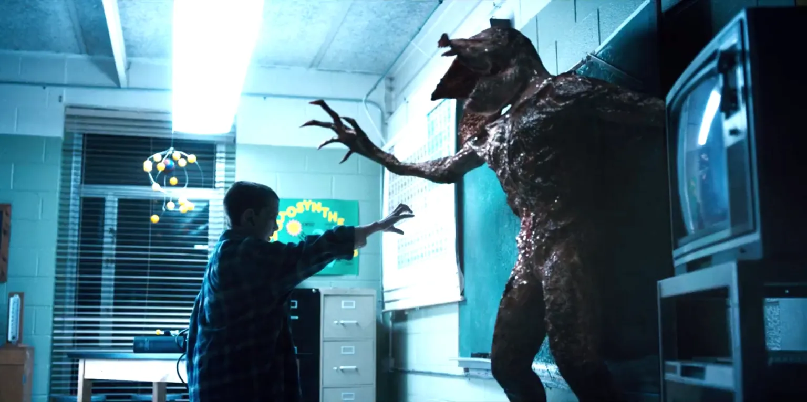
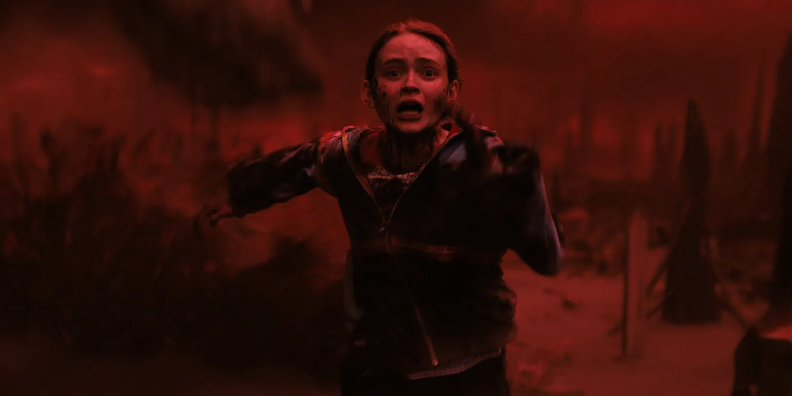

A série **Stranger Things** nos apresentou o aterrorizante **Mundo Invertido**, uma cópia sombria e decadente da nossa realidade. Mas por trás dos monstros e do suspense oitentista, existe uma base na física real? A pergunta que não quer calar é: a ciência poderia, de alguma forma, explicar a existência de um lugar como esse?

A ideia de **dimensões paralelas** não é apenas coisa de ficção. Conceitos como o multiverso e os buracos de minhoca são explorados seriamente pela física quântica e pela teoria da relatividade. A série, de forma brilhante, transforma essas teorias complexas em um pesadelo tangível, nos fazendo questionar os limites do nosso próprio universo.

Hoje vamos mergulhar na **física do Mundo Invertido**. Analisaremos as teorias sobre dimensões paralelas, se os portais de Hawkins poderiam ser buracos de minhoca e o que a ciência real tem a dizer sobre o universo de **Stranger Things**.

## O que é o Mundo Invertido?

Na série, o Mundo Invertido é uma versão paralela sombria da nossa realidade. Uma espécie de espelho macabro da cidade de Hawkins. Ele está sempre tomado por neblina, criaturas estranhas e um clima bem assustador.

Mas será que isso poderia existir de verdade? A resposta não é tão simples, mas a **física teórica** já brinca com essa ideia há muito tempo.

## A Ciência das Dimensões Paralelas

A ideia de dimensões paralelas é um dos pilares da ciência de Stranger Things, e encontra eco na física quântica real. Imagina que o nosso universo seja como uma folha de papel. A teoria das dimensões paralelas sugere que podem existir outras folhas outros universos empilhadas lado a lado. Eles podem estar super perto, só que a gente não consegue enxergar nem tocar. Meio assustador, né?

Cientistas já discutem isso há décadas. Uma teoria popular é a do **Multiverso**, que sugere que existem múltiplas realidades coexistindo. Tipo quando você pensa em todas as decisões que já tomou e se pergunta: “E se eu tivesse feito diferente?” Em outro universo, talvez você tenha tomado outro caminho!

A ideia de realidades paralelas aparece na **interpretação de muitos mundos da física quântica**. Segundo ela, para cada escolha que fazemos, o universo “se divide”, criando versões diferentes de realidade. Bem estilo filme de super-herói, como vimos em **Doutor Estranho** ou **Homem-Aranha: Sem Volta Para Casa**.

Claro, é tudo ainda muito teórico, sem provas sólidas. Mas a física teórica adora brincar com essas possibilidades.

## Buracos de Minhoca: Os Portais Para o Mundo Invertido?

Na série, os personagens descobrem uma passagem secreta entre o nosso mundo e o Mundo Invertido. Isso lembra muito o conceito de **buracos de minhoca** na física teórica.

Os buracos de minhoca seriam como túneis que ligam dois pontos distantes do universo ou até dois mundos diferentes. Você já viu isso em filmes como **Interestelar**, lembra?

Pense que o espaço-tempo é como uma folha de papel, de novo, em que você desenha dois pontos distantes. Se você dobrar essa folha até que os dois pontos se toquem, criou uma ligação direta isso seria um buraco de minhoca.

Apesar de matematicamente possível dentro da teoria da **relatividade de Einstein**, ninguém nunca encontrou um buraco de minhoca na vida real. Ou seja, ainda é ficção... mas uma ficção com uma pitada de ciência.

**+ Leia mais:** [A ciência do multiverso nos quadrinhos é possível?](/a-ciencia-do-multiverso-nos-quadrinhos-e-possivel/)

## Viajando entre mundos: e a ciência disso?

Se existissem mundos paralelos e buracos de minhoca, será que poderíamos atravessá-los como a Eleven e sua turma fazem na série?

Bom, mesmo que existissem, os cientistas dizem que esses túneis seriam **extremamente instáveis**. Eles poderiam colapsar antes mesmo de dar tempo de passar por eles. Além disso, a radiação e outras forças poderiam tornar essa viagem... letal.

Ou seja, por enquanto, o jeito mais seguro de explorar universos alternativos é mesmo pela Netflix.

## Como Stranger Things Inspira a Curiosidade

A série pode ser cheia de exageros, mas a ciência de Stranger Things é uma porta de entrada fantástica para despertar a curiosidade sobre a física de muita gente. Afinal, quem nunca ficou se perguntando “e se isso fosse possível?”

E essa é justamente a função da ficção científica: provocar, imaginar, estimular a ciência a ir mais longe. Muitos físicos de hoje se apaixonaram pela área depois de assistir filmes como **2001: Uma Odisseia no Espaço** ou ler autores como Isaac Asimov.

No fim das contas, o Mundo Invertido talvez nunca seja encontrado por um cientista. Mas ele nos ajuda a imaginar, questionar e buscar respostas para perguntas fundamentais sobre o universo.

### Principais conceitos da série relacionados à ciência:

*   **Dimensões paralelas:** Ideia de múltiplos universos coexistindo com o nosso.
*   **Física quântica:** Área da ciência que estuda o comportamento das partículas em nível microscópico.
*   **Buracos de minhoca:** Túneis teóricos que conectariam diferentes pontos do espaço-tempo.

### Quer saber mais?

Se você curte explorar a ciência por trás da ficção, aqui vão algumas dicas de fontes e leituras extras:

*   **[O Universo Numa Casca de Noz](https://amzn.to/4oeTS5x)** - Stephen Hawking
*   **Canal Nerdologia** - Explica ciência com exemplos da cultura pop
*   **Podcast Física e Afins** - Conversas leves sobre temas cabeludos da ciência