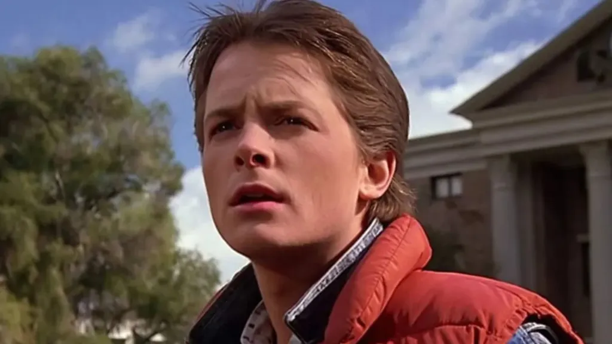
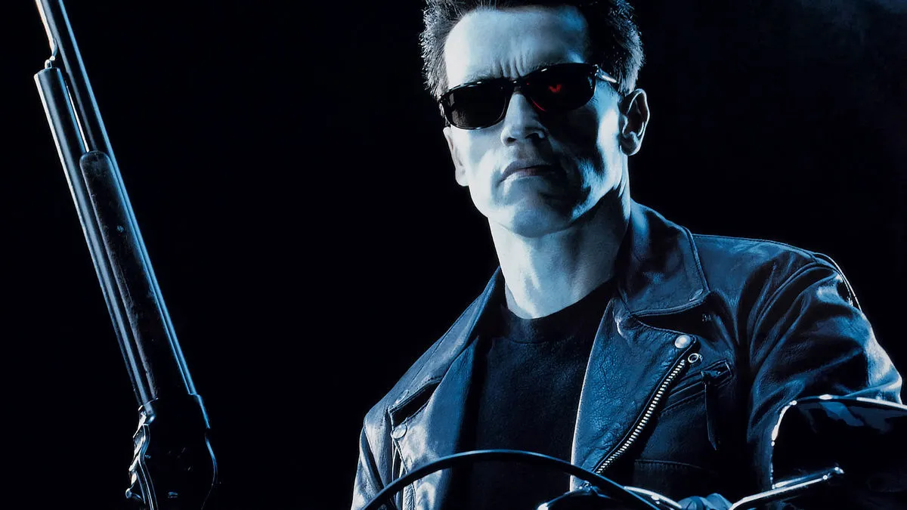
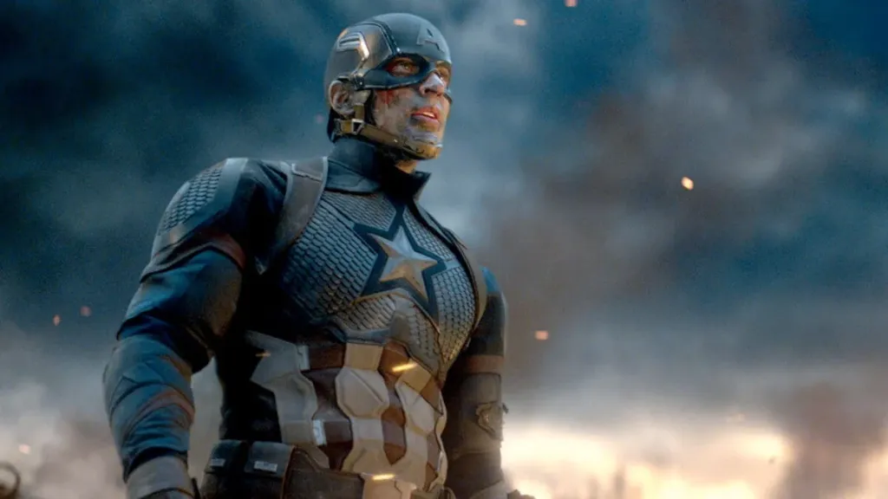

Viagens no tempo são um dos temas mais fascinantes da ficção científica, alimentando nosso desejo de corrigir o passado ou espiar o futuro. Dos DeLoreans voadores aos Vingadores quânticos, o cinema nos presenteou com inúmeras aventuras temporais. Mas por trás da emoção, surge a pergunta inevitável: a lógica dessas histórias se sustenta, ou são apenas um emaranhado de paradoxos temporais?

Afinal, cada filme de viagem no tempo parece criar suas próprias regras, muitas vezes se contradizendo ou ignorando consequências óbvias. De De Volta para o Futuro a O Exterminador do Futuro, somos frequentemente deixados coçando a cabeça, tentando entender se a lógica temporal foi respeitada ou convenientemente esquecida em nome do espetáculo.

Neste dossiê, vamos analisar a lógica (ou a falta dela) por trás de alguns dos filmes de viagem no tempo mais icônicos. Vamos desvendar os principais paradoxos, explorar as diferentes teorias que eles usam e descobrir se alguma obra cinematográfica conseguiu a proeza de viajar no tempo sem tropeçar na própria coerência.

## As Regras da Viagem no Tempo no Cinema

Antes de sair apontando furos de roteiro, vale lembrar: a ciência ainda não comprovou se viajar no tempo é realmente possível. Mas a ficção já testou diversas teorias. Algumas das principais abordagens são:

*   **Linha do tempo única:** tudo está predestinado, e mesmo que você tente mudar o passado, você acaba apenas reforçando o que já aconteceu. É o famoso “loop fechado”.
*   **Realidades alternadas:** cada ação cria uma nova linha temporal, como se abrisse uma bifurcação na estrada da história.
*   **Paradoxo do avô:** se você volta no tempo e impede algum ancestral de nascer, como você existiria para voltar no tempo e impedir isso?

Vamos ver como tudo isso aparece nos filmes e onde a lógica vai por água abaixo?

## De Volta para o Futuro: a diversão vale mais que a lógica

Começamos com um clássico: **De Volta para o Futuro** (“Back to the Future”). Marty McFly, um adolescente comum, volta ao passado com uma máquina do tempo feita de um DeLorean e atrapalha o primeiro encontro dos pais. Se eles não ficarem juntos, ele deixará de nascer. Mas ele conserta tudo... e ainda volta para um presente “melhorado”.

Legal, né? Mas aí começam os problemas. Se ele alterou o passado, como ele lembra do futuro original? E os pais dele não achariam MUITO estranho reencontrar, 30 anos depois, alguém idêntico ao cara que uniu os dois? Meio forçado, né?

Apesar desses furos, o filme acerta num ponto: ele assume uma **linha do tempo que pode ser alterada**, mas cuida pouco das consequências disso. É divertido, mas não passa num teste lógico mais rigoroso.

**+ Leia mais:** [O paradoxo do tempo em De Volta para o Futuro](/o-paradoxo-do-tempo-em-de-volta-para-o-futuro/)

## O Exterminador do Futuro: um ciclo sem fim

Agora vamos falar de **O Exterminador do Futuro**. A premissa é bem doida: o futuro é dominado por máquinas, e um robô é enviado ao passado para matar Sarah Connor, mãe de quem vai liderar a resistência humana. Só que outro enviado do futuro protege Sarah... e vira, sem saber, o pai do futuro líder.

Ué?! Se o pai só passou a existir porque foi enviado do futuro, como o futuro existia para enviá-lo antes dele nascer? Isso se chama **paradoxo causal**: um efeito criando sua própria causa. Complicado? Pensa assim: é como se você entregasse um bolo para você mesmo no passado... que você nunca chegou a cozinhar. De onde veio o bolo?

Esse tipo de enredo cria um **loop** onde tudo se retroalimenta, e pode parecer sem saída. Mas aí vem as continuações, bagunçando ainda mais a linha do tempo. Algumas versões tentam seguir a lógica da “linha que se altera”, e outras voltam para o loop, ou seja, cada filme parece seguir uma regra diferente.

## Efeito Borboleta: toda escolha tem um peso

Em **Efeito Borboleta**, um jovem descobre que pode voltar no tempo para momentos específicos da vida e tentar consertar traumas ou falhas. Só que, cada vez que ele faz isso, o presente muda e geralmente, piora.

Esse é um bom exemplo da lógica das **linhas temporais divergentes**: cada escolha cria uma nova realidade. Parece mais plausível, né?

O problema aqui é outro: como alguém conseguiria manter memórias de linhas do tempo em que “nunca existiu”? Isso também não tem uma explicação muito clara. Mas, pelo menos, o filme mergulha de cabeça nas consequências psicológicas disso tudo. E convenhamos: já pensou se toda decisão que você tomou pudesse ser desfeita... com um efeito colateral gigantesco?

## Vingadores: Ultimato e a teoria das multiversos

Quando a Marvel resolveu usar **viagem no tempo em Vingadores: Ultimato**, o cuidado foi maior. Bruce Banner, o Hulk cientista, explica: “Se você mudar o passado, não altera o seu presente. Só cria uma nova linha temporal.”

Ou seja, nada de paradoxo do avô aqui. Se o Capitão América volta, vive uma vida com a Peggy e fica velhinho, é porque ele foi para uma outra linha paralela. Isso é bacana, mas...

...então por que Steve Rogers aparece no mesmo banco da linha original no fim do filme? Cadê a coerência, Marvel?

Apesar de tudo, a ideia de **multiversos** começou a ganhar força e virou base para futuras histórias do MCU. É uma forma elegante (ou complicada) de dizer: toda decisão pode criar um novo universo. Assim, os roteiristas podem fazer quase qualquer coisa, sem precisar explicar demais.

## Mas afinal: algum filme acerta 100%?

A grande verdade é que **nenhum filme de viagem no tempo é 100% coerente**. Sempre vai existir alguma brecha, algum efeito colateral ou caos lógico. Mas isso não quer dizer que eles são ruins!

O segredo está em duas coisas:

*   **Respeitar as próprias regras internas**: se o filme cria um conjunto de regras, ele precisa segui-las. Mesmo que essa lógica não seja cientificamente real, a história precisa ser consistente.
*   **Focar na experiência do personagem**: as melhores obras usam a viagem no tempo como pano de fundo para contar histórias emocionais, de escolhas, perdas, arrependimentos e segundas chances.

E cá entre nós: às vezes, a emoção de ver o Marty tocando guitarra nos anos 50 ou o Tony Stark se despedindo do pai no passado vale mais que qualquer furo temporal, né?

## Curiosidades e mais exemplos que valem o play

*   **Dark (Netflix):** série alemã com altíssima complexidade de linhas temporais. Prepare o caderninho de anotações!
*   **Looper:** Bruce Willis e Joseph Gordon-Levitt interpretam a mesma pessoa em tempos diferentes. Um dos filmes mais criativos do gênero.
*   **Donnie Darko:** mistura de viagem no tempo, filosofia e coelho gigante. Obrigatório para fãs de teorias mentais.
*   **O Predestinado**: trama instigante sobre identidade e paradoxos temporais, com um dos finais mais surpreendentes e inteligentes do cinema.

Viagens no tempo fazem parte do nosso imaginário porque nos permitem brincar com a ideia de mudar o que já aconteceu ou de imaginar futuros diferentes. E embora a lógica muitas vezes fique pra trás, **a magia está na jornada**.

E aí, qual filme de viagem no tempo é o seu preferido? Já achou algum sem furos? Conta pra gente nos comentários e bora viajar juntos pelas possibilidades temporais! 

### Quer saber mais?

*   [Paradoxo Temporal – Wikipédia](https://pt.wikipedia.org/wiki/Paradoxo_temporal)