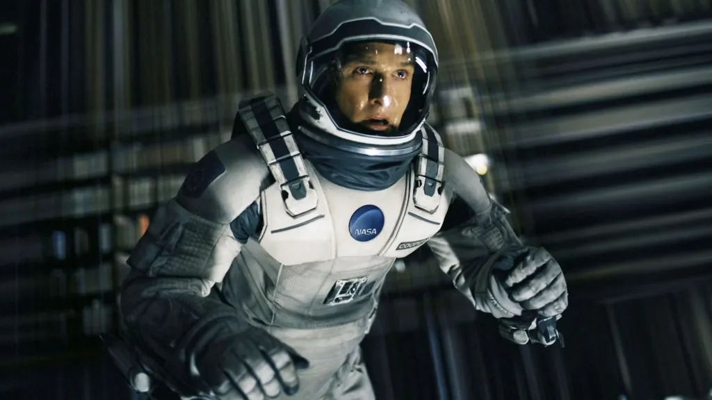

Desde seu lançamento, **Interestelar** se tornou um dos filmes de ficção científica mais debatidos quando o assunto é tempo, relatividade e física moderna. A obra dirigida por Christopher Nolan apresenta conceitos científicos complexos, como dilatação temporal e gravidade extrema, de forma visualmente impactante e intrigante. Não à toa, muita gente sai do filme com mais perguntas do que respostas sobre como o tempo realmente funciona naquele universo.

Quem nunca ficou tentando calcular mentalmente quantos anos se passaram na Terra enquanto os personagens estavam presos em um planeta distante? Interestelar mexe com algo que todo mundo sente no dia a dia: a percepção do tempo. Às vezes ele voa, às vezes se arrasta e o filme leva essa sensação comum a um nível cósmico, misturando ciência pesada com emoções humanas profundas.

Hoje, vamos explicar de forma simples a lógica do tempo em Interestelar, mostrando como a dilatação temporal funciona, o que a ciência real diz sobre isso e onde o filme usa licença poética. Também vamos explorar o papel das emoções, dos paradoxos temporais e por que essa história vai muito além de buracos negros, falando diretamente sobre amor, escolhas e o impacto do tempo na vida.

## Dilatação do tempo em Interestelar: como a física explica o filme

Sabe quando a vó fala que o tempo voa quando a gente tá se divertindo? Pois é, no caso de **Interestelar**, isso não é só modo de dizer é física pura! O filme usou um conceito da [teoria da relatividade](https://www.todamateria.com.br/teoria-da-relatividade-2/) de Einstein que se chama **dilatação temporal**.

### Como a dilatação temporal funciona na prática

Funciona assim: de acordo com [Einstein](https://pt.wikipedia.org/wiki/Albert_Einstein), o tempo pode passar de formas diferentes dependendo de duas coisas:

*   **Velocidade** com que você está se movendo
*   **Intensidade da gravidade** ao seu redor

Quanto mais perto você estiver de algo com muita gravidade como um buraco negro, mais devagar o tempo passa pra você comparado a alguém que está longe daquele campo gravitacional.

É como se todo mundo tivesse seu próprio “relógio interno”, e esse relógio muda conforme o ambiente. Agora imagina: você passa 1 hora num planeta próximo de um buraco negro e, quando volta pra nave, descobrem que passaram 23 anos por lá. Exatamente o que acontece no planeta de Miller em **Interestelar**.

## A ciência real por trás do tempo em Interestelar

Na real, faz sim. Claro que o filme usa uma **liberdade criativa** aqui e ali, mas muitas das ideias vêm direto da física moderna. O próprio **[Kip Thorne](https://pt.wikipedia.org/wiki/Kip_Thorne)**, físico renomado que ajudou a idealizar o roteiro, garantiu que tudo fosse plausível (dentro de certos limites).

E mais: esse lance de dilatação temporal não é só teoria. Isso já foi provado em experimentos com satélites e relógios atômicos. Inclusive, os [cientistas precisam ajustar o GPS](https://www.uol.com.br/tilt/ultimas-noticias/redacao/2013/03/20/teoria-da-relatividade-e-usada-para-calibrar-gps-e-observar-o-universo.htm) por causa disso. Ou seja, se você já chegou no lugar certo usando o Waze, agradeça à relatividade!

## Ciência e emoção: por que Interestelar funciona tão bem

Ok, a ciência é incrível, mas não é só ela que prende nossa atenção em Interestelar. O que torna o filme tão impactante é o **equilíbrio entre ciência e emoção**. O tempo que nos afasta das pessoas que amamos pesa mais do que a matemática de qualquer equação.

A relação do Cooper com a filha Murphy é um ótimo exemplo. Mesmo viajando por galáxias distantes, o vínculo entre eles não se rompe. Inclusive, a cena em que ele assiste às mensagens dos filhos mais velhos depois de anos é de apertar o coração. 

### O amor como elemento central na narrativa de Interestelar

No momento mais filosófico do filme, a personagem de Anne Hathaway levanta uma bola polêmica: e se o **amor** também for uma força capaz de atravessar o tempo e o espaço?

Pode parecer papo de romance, mas pense bem: nossas emoções moldam nossas decisões, nossas lembranças e até nossa noção de tempo. O tempo em si pode ser relativo, mas o que sentimos por alguém é o que nos ancora, mesmo que tudo ao nosso redor esteja mudando.

Num mundo onde planetas envelhecem décadas em minutos e viajamos por buracos de minhoca, **o amor é o que mantém a bússola emocional apontada para casa**.

**+ Leia mais:** [O multiverso anula o livre-arbítrio?](o-multiverso-anula-o-livre-arbitrio/)

## O paradoxo temporal de Interestelar explicado

A parte mais doida de tudo talvez seja o final do filme. Cooper entra em um buraco negro e vai parar num espaço que parece uma livraria do infinito. Ali, ele consegue mandar mensagens para o passado usando... gravidade.

Como assim?! Então ele influenciou os acontecimentos da sua própria história...? Parece coisa de viagem no tempo, mas o filme dá uma explicação elegante.

Aquele lugar é uma representação de uma dimensão além da nossa: passado, presente e futuro **existem ao mesmo tempo**. Não é que ele viajou no tempo como em [De Volta para o Futuro](/o-paradoxo-do-tempo-em-de-volta-para-o-futuro/). Ele simplesmente acessou um ponto diferente da linha do tempo usando outra dimensão.

Confuso? Muito. Mas também é poético. A gravidade, a única força que consegue atravessar dimensões, se torna a ponte entre pai e filha. E de novo, é o amor traduzido em ações que resolve o grande paradoxo da história.

## O tempo em Interestelar e nossa percepção na vida real

Interestelar não é só sobre buracos negros e planetas distantes. É sobre aquilo que todos nós sentimos: **a dor e a beleza de ver o tempo passar**.

Quem nunca sentiu que os anos voaram? Ou que um minuto esperando uma mensagem parece uma eternidade? O tempo é relativo até na nossa rotina. O filme só amplia isso numa escala cósmica.

O mais bonito é que, mesmo diante dos desafios da ciência, o que dá sentido à história são as emoções humanas. Entre todas as equações sobre galáxias e linhas temporais, o filme grita uma verdade simples: **quem amamos é o que realmente importa**.

Ao misturar conceitos de relatividade com relações humanas profundas, **Interestelar** entrega uma experiência completa daquelas que fazem a gente pensar por dias depois do filme ter acabado.

É um lembrete de que, embora o universo seja enorme e misterioso, existem coisas que atravessam qualquer barreira. E aí, pronto pra rever o filme agora com outros olhos?

### Resumo do que aprendemos

*   **Dilatação temporal** é um conceito real da teoria da relatividade
*   **O tempo passa mais devagar em locais com gravidade extrema**, como buracos negros
*   **Interestelar usa ciência de forma precisa**, com ajuda de físicos reais
*   **O filme também fala sobre laços afetivos** e como o amor é uma constante além do tempo

### Quer saber mais?

*   [Site da NASA](https://www.nasa.gov) — Explicações reais sobre buracos negros e relatividade
*   [A Ciência de Interestelar - Kip Thorne](https://amzn.to/45g4PNh) (livro em português, super interessante)
*   Vídeos no YouTube como os de _Manual do Mundo_ ou _Canal Ciência Todo Dia_

Se curtiu esse mergulho no tempo e quer ver mais sobre filmes de ficção científica e suas loucuras, fica de olho no **Nerdático**!